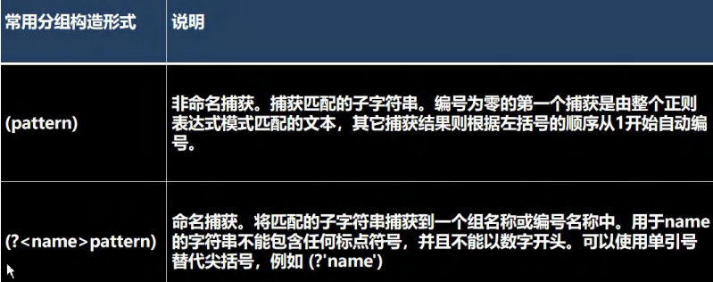

# Java

## 编程基础

#### 第1章 内容介绍

##### 1.1-1.6 就业方向、开发场景、应用领域。

#### 第2章 概述

##### 2.1

​	**程序**：有序指令的集合

##### 2.2 诞生

​	最早的版本-2005

##### 2.3 技术体系平台

Java SE

Java EE

Java ME

##### 2.4 特点

- 面向对象的(oop)
- 健壮的（强类型机制、异常处理、垃圾的自动收集）
- 跨平台的(一个编译好的.class文件可以在多个系统下运行)
- 解释型的(解释性语言 : javascript , PHP , java;编译姓语言 : c / c++. 解释性语言编译后不能直接被语言执行,需要解释器来执行;编译性语言编译后的代码可以直接被机器执行.

##### 2.5 开发工具

editplus、notepad++

Sublime Text

IDEA

eclipse

##### 2.6 运行机制与运行过程

###### 2.6.1 Java-跨平台性

###### 2.6.2 核心机制-Java虚拟机

- ​	 JVM是一个虚拟的计算机，具有指令集并使用不同的存储区域。负责执行指令，管理数据、内存、寄存器，包含在JDK中.
-  	对于不同的平台，有不同的虚拟机.
- ​	Java虚拟机机制屏蔽了底层运行平台的差别，实现了“一次编译，到处运行” .

##### 2.7 JDK , JRE

​	JDK ( Java Development Kit    Java开发工具包 ) = JDK = JRE + java的开发工具

​	JRE ( Java Runtime Environment     Java运行环境 ) = JVM + Java的核心类库

##### 2.8--2.10 下载、安装&配置环境变量

///////////////////////

##### 2.11 入门

Java代码编写到Hello.java , 然后使用javac命令编译生成.class文件，用java命令运行class文件

**注意事项：**

​	区分大小写，不要漏了”;“，括号成对[],{}。

​	一个源文件中最多只有一个public类，其他类个数不限

​	如果源文件包含一个public类，则文件名必须按该类名命名

​	也可以将main方法卸载非public类中，然后指定运行非public类，这样入口方法就是非public的main方法。

##### 	2.15 Java转义字符

- 常用的转义字符

  \t : 制表位

  \n ： 换行符

  \ \  ： 一个\

  \ " : 一个"

  \ ' ： 一个'

  \r : 一个回车

##### 2.16 易错点（语法错误，理解编译器报告的错误信息）

- ​	找不到文件：源文件名不存在或者写错，或者路径错误
- ​	主类名和文件名不一致：声名为public的主类应与文件名一直，否则编译失败
- ​	缺少分号：编译失败，报错中定位错误行去改错

​	

##### 2.17 注释(comment)-良好的编程习惯

​	提高可读性，先将思路通过注释整理出来，再用代码去体现

- 被注释的文字不会被JVM解释执行
- 多行注释里面不允许有多行注释嵌套

单行注释：//注释文字

多行注释/*  注释文字  */

文档注释/**    */ 		：javadoc -d 文件夹名 -xx -yy abc.java		(xx,yy可以包含author、version等等内容)

##### 2.18 代码规范

- 对于类、方法的注释，要以javadoc的方式来写
- 非java doc的注释，往往给维护者看，告诉读者为什么这么写、如何修改、注意事项 
- 运算符和 = 两边习惯加一个空格，运用tab实现缩进
- 源文件使用utf-8编码
- 行宽度不要超过80字符
- 代码编写**次行风格**（换行再用大括号）和**行尾风格**（更为推荐!!大括号在行尾）-看个人习惯，两种方式都可以。

##### 2.19 DOS命令

基本原理：

​	cmd指令------回车------>Dos系统（接受、解析、执行指令）----->作用于windows文件系统

**相对路径&绝对路径**

相对路径：从当前目录开始定位--> ..\ ..\abc\123.txt

绝对路径：从顶级目录开始定位-->c:\abx\123.txt

**常用的dos命令：**

- 查看当前目录是有什么内容 - dir : d:\abc\test200
- 切换到其他盘下 - cd : change directory
- 切换到当前盘的其他目录下，..\表示上一级目录 - cd .. \ ..  \abc2\test200
- 切换到上一级 - cd ..
- 切换到根目录 : cd \
- 查看指定目录下所有的子集目录 -  tree
- 清屏 - cls
- 退出DOS - exit
- 其他指令 ： md [创建目录], rd[删除目录] , copy[拷贝文件] , del[删除文件] , echo[输入内容到文件] , type , move[剪切]


#### 第3章 变量

##### 3.1 变量是程序的基本组成单位

变量有三个基本要素(类型+名称+值)

int a = 1 ; //定义了一个变量，类型int整型，名称a ，值1。

##### 3.2 变量的介绍

**变量相当于内存中一个数据存储空间**的表示

 变量使用 : 声明 - int a ; 赋值 : a = 60;

##### 3.3 变量快速入门 - chapter03.java

##### 3.4 变量使用注意事项

- 变量表示内存中的一个存储区域（不同变量、类型、占用空间）
- 该区域有自己的名称
- 变量必须先声明后使用
- 该区域的数据(值)可以在**同一类型**范围内不断变化
- 变量在同一个作用域内不能重名
- 变量 = 变量名 + 值 + 数据类型，变量**三要素**

##### 3.5 程序中 + 号的使用

1. 当左右利郎便都是数值，则做加法运算
2. 左右两边有一方为字符串，则做拼接运算
3. 运算顺序从左到右

##### 3.6 数据类型

每一种数据都定低了明确的数据类型，在内存中分配了不同大小的内存空间(字节)。

**基本数据类型**  * * * * *

- 数值型
  - 整数类型,存放整数(byte[1],short[2],int[4],long[8])
  - 浮点(小数)类型(float[4],double[8])
- 字符型(char[2]) , 存放单个字符 ’a‘
- 布尔型(boolean[1])，存放 true , false

引用数据类型 

- 类(class)
- 接口(interface)
- 数组([])

##### 3.7 整数类型

用于存放整数值

- byte[字节] 		
  - 1字节，-128~127
- short[短整型]
  - 2字节，-32768~32767		(即-(2^15)~(2^15-1))
- int[整型]
  - 4字节，-(2^31)~(2^31-1)
- long[长整型]
  - 8字节，-(2^63)~(2^63-1)

**使用细节**

1. Java各整数类型有固定的范围和字段长度，不受操作系统的影响，保证java程序的可移植性。
2. Java的整型常量（具体值）默认为int型，声明long型常量须加'l'或'L'
3. Java程序中变量经常声名为int型，除非不足以表示大数，才使用long
4. bit : 计算机中的最小存储单位。byte : 计算机中基本存储单元。1 byte = 8 bit


#### 3.8 浮点类型

表示一个小数

分类：

- 单精度float
  - 4字节
- 双精度double
  - 8字节

浮点数 = 符号位 + 指数位 + 尾数位

**使用细节**

- 有固定的范围和字段长度，不受具体OS影响
- Java的浮点型常量默认为double型，声明float常量须后加'f' , 'F'。
- **两种**表示形式：十进制数形式，科学计数法形式
- 通常情况下，应该使用double型，因为它比float型更精确。
- 浮点数使用陷阱：2.7 和 8.1 / 3
  - 当我们对运算结果是小数的进行相等判断时，要小心
  - 应该是以两个数的差值的绝对值，在某个精度范围内判断

##### 3.9 Java API 文档

API 是 Java 提供的基本编程接口

中文在线文档：https://www.matools.com

Java类的组织形式 JDK 8,11

- 包1
  - 接口
  - 类(...)
    - 字段...
    - 构造器(构造方法)
    - 成员方法(方法)
  - 异常
- 包2
- 包...

如何使用ArrayList类有哪些方法：

- 包->类->方法
- 直接索引。Math

##### 3.10 字符类型（char）

可以表示单个字符，char是两个字节（可以存放汉字）

**使用细节：**

- 字符常量使用单引号( '' )括起来的单个字符。
  - 例如：char c = 'a'；
- Java中还允许使用转义字符' \ '来将其后的字符换变为特殊字符常量
  - 例如：char c = ' \n ' ;//'\n'表示换行符
- 在java中，char的本质是一个整数，输出时是unicode码对应的字符
- 可以直接给char赋一个整数，然后输出时会按照对应的unicode字符输出[97-》a]
- char类型是可以进行运算的，相当于一个整数，因为它都对应有Unicode码。


字符型存储到计算机中，需要将字符对应的码值（整数）找出来。例：

​	存储 : 'a' ==> 码值97 ==> 二进制(1100001) ==> 存储

​	读取 : 二进制(1100001) ==> 97 ===> 'a' =>显示

字符和码值的对应关系是通过字符编码表决定的（是规定好的）

字符编码表

​	ASCII（一个字节表示，一个128个字符，实际上一个字节可以表示256 个字符，只使用128个）

​	Unicode（固定大小的编码表，字母和汉字都使用两个字节来表示）

​	utf-8（编码表，大小可变的编码，字母1字节，汉字3字节）

​	gbk（可以表示汉字，而且范围广，字母1个字节，汉字2个字节）

​	gb2312（可以表示汉字，gb2312 < gbk）

​	big5（繁体中文，香港，台湾）

##### 3.11 ASCII码

##### 3.12 Unicode编码

##### 3.13 UTF-8编码

##### 3.14 布尔类型：boolean

- 布尔类型，也叫boolean类型，只允许取值true和false，无null
- 占1个字节
- 适用于逻辑运算，一般用于流程控制
  - if条件
  - while循环
  - do-while循环
  - for循环


##### 3.15 基本数据类型转换

**自动类型转换**:当java程序在进行赋值或者运算时，精度小的类型自动转换为精度大的数据类型

数据类型按精度（容量）大小排序为：（背，规则）

char-int-long-float-double

byte-short-int-long-float-double

**自动类型转换注意和细节**

1. 多种类型混合运算，首先将所有数据转换成容量最大的那种数据类型再计算
2. 把精度（容量）大的数据型赋值给精度（容量）小的数据类型时，会报错
3. （byte，short）和 char之间不会相互自动转换
4. byte，short，char三者可以计算，首先转换为int类型
5. boolean不参与转换
6. 自动提升原则：表达式结果的类型自动提升为操作数中最大的类型

**强制类型转换**

**将容量大的数据类型转换为容量小的数据类型**，使用时要加上强制转换符（），但可能造成**精度降低或溢出**

**强制类型转换细节说明：**

数据大小从大--->小

强转符号只针对于最近的操作数游侠，往往会使用小括号提升优先级

char类型keyi保存int的常量值，但不能保存int的变量值，需要强转

byte和short，char类型在进行运算时，当作int类型处理

##### 3.17 基本数据类型和String类型的转换

在程序开发中，我们经常需要将基本数据类型转成String类型（语法：将基本类型的值+""即可）

或者将String类型转成基本数据类型（语法：通过基本类型的包装类调用parseXX方法）

**注意事项：**

- 在将 String 类型转成基本数据类型时，**要确保String类型能够转成有效的数据** 。比如我们可以把 "123" , 转成一个整数，但是不能把 "hello"转成一个整数
- 如果合适不正确，就会**抛出异常，程序就会终止**

#### 第4章

##### 4.1 运算符

运算符是一种特殊的符号，用以表示数据的运算、赋值和比较等。 

1. 算术运算符 
2. 赋值运算符
3. 关系运算符 [比较运算符] 
4. 逻辑运算符 
5. 位运算符 [需要二进制基础] 
6. 三元运算符 

##### 4.2 算数运算符

| 运算符       | 运算                                       | 例子               | 结果             |
| ------------ | ------------------------------------------ | ------------------ | ---------------- |
| +            | 正好                                       | +7                 | 7                |
| -            | 负号                                       | b=11；-b           | -11              |
| +            | 加                                         | 9+9                | 18               |
| -            | 减                                         | 10-8               | 2                |
| *            | 乘                                         | 7+8                | 56               |
| /            | 除                                         | 9/9                | 1                |
| %            | 取模（取余）                               | 11%9               | 2                |
| ++（前、后） | 自增（前：先运算后取值；后：先取值后运算） | a=2;b=++a;(b=a++;) | a=3;b=3;(b=2;)   |
| --（前、后） | 自减（前：先运算后取值；后：先取值后运算） | a=2;b=--a;(b=a--;) | a=1;b=1；（b=2） |
| +            | 字符串相加                                 | "cyq"+"nb"         | "cyq nb"         |

##### 4.3 关系运算符

==, ！=, <, >, <=, >=, instanceof(检查是否是类的对象)

**细节：**

1）结果都是boolean型，要么是true要么是false

2）关系运算符组成的表达式，为关系表达式：a>b

3）比较运算符"=="不能误写成"="


##### 4.4 逻辑运算符

&，&&，|，||，!a，a^b

&&和&的区别：

1. &&短路与：第一个条件为false，则第二个条件不会判断，效率高
2. &逻辑与：不管第一个条件是什么，第二个条件都要判断，效率低
3. 开发中，我们使用的基本都是短路与&&，效率高

##### 4.5 赋值运算符

=，+=，-+，*=，/=，%=

1. 运算顺序从右往左。 
2. 赋值运算符的左边只能是变量,右边可以是变量、表达式、常量值。
3. 复合赋值运算符会进行类型转换 。

##### 4.6 三元运算符

基本语法：

​	条件表达式？表达式1：表达式2

运算规则：

​	如果条件表达式为true，运算后的结果是表达式1；

​	如果条件表达式为false，运算后的结果是表达式2；

细节：

1. ​	 表达式1和表达式2要为可以赋给接受变量的类型（或可以自动转换）
2. ​	三元运算符可以转成if--else语句

​			int res = a > b ? a+ + : --b;

##### 4.7  运算符优先级


1. (),{}等
2. 单目运行 ++，--
3. 算术运算符
4. 位移运算符
5. 比较运算符
6. 逻辑运算符
7. 三元运算符
8. 赋值运算符

##### 4.8 标识符的命名规则与规范

标识符的概念：Java对各种变量、方法和类等命名时使用的字符序列成为标识符

命名规则（必须遵守）：

1. 有26个英文字母大小写、0-9、_或$组成
2. 数字不可以开头
3. 不可以使用关键字和保留字，但能包含关键字和保留字
4. Java中严格区分大小写，长度无限制
5. 标识符不能包含空格

命名规范（更加专业）：

1. 包名：多单词组成时所有字母都小写：aaa.bbb.ccc 。
2. 类名、接口名：多单词组成时，所有单词的首字母大写：XxxYyyZzz [大驼峰] 。 
3. 变量名、方法名：多单词组成时，第一个单词首字母小写，第二个单词开始每个单词首字母大写：xxxYyyZzz [小驼峰， 简称 驼峰法]  
4. 常量名：所有字母都大写。多单词时每个单词用下划线连接：XXX_YYY_ZZZ 。
5. 后面我们学习到 类，包，接口，等时，命名规范要这样遵守，更加详细的看文档。

##### 4.9&4.10 关键字&保留字

**关键字：**


**保留字：**现有 Java 版本尚未使用，但以后版本可能会作为关键字使用，要避免使用：byValue、cast、future、 generic、 inner、 operator、 outer、 rest、 var 、 goto 、const

##### 4.11 键盘输入语句

在编程中，需要接收用户输入的数据，就可以使用键盘输入语句来获取。Input.java , 需要一个扫描器(对象), 就是Scanner

步骤：

1. 导入该类的所在包, java.util.*
2. 创建该类对象（声明变量）
3. 调用里面的功能

##### 4.12&4.13 进制&图示

对于整数，有四种表示方式： 

二进制：0,1 ，满 2 进 1.以 0b 或 0B 开头。

十进制：0-9 ，满 10 进 1。

八进制：0-7 ，满 8 进 1. 以数字 0 开头表示。 

十六进制：0-9 及 A(10)-F(15)，满 16 进 1. 以 0x 或 0X开头表示，此处的A-F不分大小写

##### 4.14 进制转换（略）

##### 4.27 原码、反码、补码

1. 二进制的最高位是符号位: 0表示正数,1表示负数
2. 正数的原码，反码，补码都一样(三码合一)
3. 负数的反码=它的原码符号位不变，其它位取反(0->1,1->0)
4. 负数的补码=它的反码+1，负数的反码 =负数的补码 - 1
5. 0的反码，补码都是0
6. java没有无符号数，换言之，java中的数都是有符号的
7. 在计算机运算的时候，都是以**补码的方式来运算**的.
8. 当我们看运算结果的时候，要看他的**原码(**重点)

##### 4.28 位运算符

&、|、^、~、>>、<<、>>>

按位与&	   ：	两位全为1，结果为1，否则为0

按位或|		：	两位有一个为1，结果为1，否则为0

按位异或^	：	两位一个为0,一个为1，结果为1，否则为0

按位取反~	：	0->1,1->0

算术右移 >>：低位溢出,符号位不变,并用符号位补溢出的高位

算术左移 <<：符号位不变,低位补 0

逻辑右移>>>：也叫无符号右移,运算规则是: 低位溢出，高位补 0


特别说明：没有 <<< 符号


#### 第5章 程序控制结构

##### 5.1 介绍

在程序中，程序运行的流程控制决定程序是如何执行的，是我们必须掌握的，主要有三大流程控制语句：顺序、循环、分支

##### 5.2 顺序控制

程序从上到下逐行执行

##### 5.3 分支控制if-else

单分支 if

双分支 if-else

多分支if-else if -...-else

##### 5.5 嵌套分支

**在一个分支结构中又完整的嵌套了另一个完整的分支结构**，里面的分支的结构称为内层分支外面的分支结构称为外 层分支。建议:不超过3层，可读性不好。

##### 5.6 switch分支结构

```java
switch(表达式){
    case 常量1:
    语句块1;
    break;
    case 常量2; 
    语句块2;
    break;
    ...
    case 常量n;
    语句块1;
    break;
    default:
    default语句块;
    break;
}
```

1. switch 关键字，表示swtich分支
2. 表达式对应一个值
3. case 常量1:当表达式的值等于常量1，就执行 语句块1
4. break : 表示退出swtich
5. 如果和 case 常量1 匹配，就执行语句块1，如果没有匹就继续匹配 case 常量2
6. 如果一个都没有匹配上，执行default


###### switch和if比较：

1. 如果判断的具体数值不多，而且符合 byte、short、int、char,enum[枚举], String 这 6 种类型。虽然两个语句都可以使用，建议使用 swtich 语句。
2. 其他情况：对区间判断，对结果为 boolean 类型判断，使用 if，if 的使用范围更广。

##### 5.7 循环控制

```java
for(循环变量初始化；循环条件；循环变量迭代){
    循环操作(可以多条语句)；
}
```

1. for 关键字，表示循环控制 
2. for 有四要素: (1)循环变量初始化(2)循环条件(3)循环操作(4)循环变量迭代 
3. 循环操作 , 这里可以有多条语句，也就是我们要循环执行的代码 
4. 如果 循环操作(语句) 只有一条语句，可以省略 {}, 建议不要省略

**注意事项和细节说明**

1. 循环条件是返回一个布尔值的表达式 
2. for(;循环判断条件;) 中的初始化和变量迭代可以写到其它地方，但是两边的分号不能省略。 
3. 循环初始值可以有多条初始化语句，但要求类型一样，并且中间用逗号隔开，循环变量迭代也可以有多条变量迭代 语句，中间用逗号隔开。

##### 5.8 while循环控制

```java
循环变量初始化;
while(循环条件){
    循环体(语句);
    循环变量迭代;
}
```

注意：

1. 循环条件是返回一个布尔值的表达式 
2. while 循环是先判断再执行语句


##### 5.9 do..while循环控制

```java
循环变量初始化;
do{
    循环体(语句); 
    循环变量迭代;
}while(循环条件);
```

注意：

1. 循环条件是返回一个布尔值的表达式 
2. do..while 循环是先执行，再判断， 因此它至少执行一次


##### 5.10 多重循环控制

1. 将一个循环放在另一个循环体内，就形成了嵌套循环。其中，for ,while ,do…while 均可以作为外层循环和内层循环。一般不超过三层否则代码可读性很差。
2. 实质上，嵌套循环就是把内层循环当成外层循环的循环体。当只有内层循环的循环条件为 false 时，才会完全跳出内 层循环，才可结束外层的当次循环，开始下一次的循环。
3. 设外层循环次数为 m 次，内层为 n 次，则内层循环体实际上需要执行 m*n 次。


##### 5.11 跳转控制语句-break

**break 语句用于终止某个语句块的执行**，一般使用在 switch 或者循环[for , while , do-while]中.

##### 5.12 跳转控制语句-continue

介绍

1. continue 语句用于结束本次循环，继续执行下一次循环。
2. continue 语句出现在多层嵌套的循环语句体中时，可以通过标签指明要跳过的是哪一层循环 , 这个和前面的标签的 使用的规则一样

##### 5.13 跳转控制语句-return

return 使用在方法，表示跳出所在的方法.


#### 第6章 数组、排序和查找

##### 6.1 数组

数组可以存放多个同一类型的数据。数组也是一种数据类型，是引用类型。

##### 6.2 使用

1）动态初始化

定义、引用

```java
//定义：方法一：
数据类型 数组名[] = new 数据类型[大小]
int a[] = new int[5];
//方法二：先声明数组，再new分配空间
int a[];int[]a;//这俩都可，声明数组，此时a是null
a = new int[5];//分配内存空间，可以存放数据
//创建了一个数组，名字a，存放5个int
//引用：
数组名[下表/索引/index]
    a[3]
```

2）静态初始化

```java
数据类习惯 数组名[] = {元素值,元素值,元素值...}
int a[] = {2,5,6,7,8,89,34,23,12};
```

##### 6.3 注意事项和细节

1. 数组是多个相同类型数据的组合，实现对这些数据的统一管理
2. 数组中的元素可以是任何数据类型，包括基本类型和引用类型，但是不能混用。
3. 数组创建后，如果没有赋值，有默认值：int 0，short 0，byte 0，long 0，float 0.0，double 0.0，char \u0000，boolean false，String null。
4. 使用数组的步骤：1. 声明数组并开辟空间 2 给数组各个元素赋值 3 使用数组 
5. 数组的**下标是从 0 开始的**。
6. 数组下标必须在指定范围内使用，否则报：下标越界异常，比如int [] arr=new int[5]; 则有效下标为 0-4 
7. 数组属引用类型，数组型数据是对象(object)

##### 6.4 数组应用案例

##### 6.5 数组赋值机制

1. 基本数据类型赋值，这个值就是具体的数据，而且相互不影响。 int n1 = 2; int n2 = n1; 
2. 数组在默认情况下是引用传递，赋的值是地址。 
   看一个案例，并分析数组赋值的内存图(重点, 难点. )。
   int[] arr1 = {1,2,3}; 
   int[] arr2 = arr1;

##### 6.6-6.7 数组拷贝、反转

##### 6.8 数组添加/扩容

##### 6.9 排序

排序是将多个数据，依指定的顺序进行排列的过程。

内部排序：指将需要处理的所有数据都加载到内部存储器中进行排序。包括(交换式排序法、选择 式排序法和插入式排序法。

外部排序：数据量过大，无法全部加载到内存中，需要借助外部存储进行排序。包括(合并排序法和直接合并排序法）。

##### 6.10-6.11 冒泡排序法

冒泡排序（Bubble Sorting）的基本思想是：通过对待排序序列从后向前（从下标较大的元素开始），依次比较相邻元素 的值，若发现逆序则交换，使值较大的元素逐渐从前移向后部，就象水底下的气泡一样逐渐向上冒。

##### 6.12 查找

在 java 中，我们常用的查找有两种:

1. 顺序查找
2. 二分查找


#####  6.13-6.14 多维数组-二维数组&使用

使用：

```java
//动态初始化，方法1
	类型[][] 数组名 = new 类型[大小][大小]
	//例如：
	int a[][] = new int [2][3]
//动态初始化，方法2
	先声明：类型 数组名[][];
	再定义(开辟空间):数组名 = new 类型[大小][大小]
	赋值(有默认值，比如int类型的就是0)
//动态初始化，当列数不确定
	int[][] arr = new int[3][]; 
	//再通过循环等其他方式对每一个一维数组开数据空间
//静态初始化
	定义 类型 数组名[][] = {{值1,值2,...},{值1,值2,...},{值1,值2,...}};
	//举例：
	 int[][]arr = {{1,1,1},{8,8,9},{100}};

```

##### 6.15 二维数组应用案例（略）

##### 6.16 二维数组使用细节和注意事项：

一维数组的声明方式：

```java
int[]x;
int x[];
```

二维数组的声明方式：

```java
int [][] y;
int[]y[];
int y[][]
```

二维数组实际上是由多个一维数组组成的，它的各个一维数组的长度可以相同，也可以不相同。
比如：

```java
//map[][] 是 一个二维数组
int map[][] = {{1,2},{3,4,5}};
//由 map[0] 是一个含有两个元素的一维数组 ，map[1] 是一个含有三个元素的一维数组构成，我们也称为列数不等的二维数组

```


#### 第7章 面向对象编程(基础部分)

##### 7.1 类和对象

使用单独的变量解决、使用数组解决=>不利于数据的管理、效率低，因此引入类与对象(OOP)

```java
//定义一个猫类Cat -> 自定义数据类型
class Cat {
    //属性
    String name;
    int age;
    String color;
}
public class md{
	public static void main(String[] args){
        Cat cat1 = new Cat();
        //创建一只猫，并赋给cat1
        cat1.name = "丁真"；
        cat1.age = 3;
        cat1.color = "白色"；
        cat2.name = "我测";
        cat2.age = 100;
        cat2.color = "黄色"；
            
        //访问对象属性：
        System.out.println("name="+cat1.name+"age="+cat1.age+"color"+cat1.color);
}
```

1. 类是抽象的，概念的，代表一类事物,比如人类,猫类.., 即它是数据类型。
2. 对象是具体的，实际的，代表一个具体事物, 即 是实例。
3. 类是对象的模板，对象是类的一个个体，对应一个实例。

**属性、成员变量、字段：**

1. 从概念或叫法上看： 成员变量 = 属性 = field(字段) （即成员变量是用来表示属性的）
2. 属性是类的一个组成部分，一般是基本数据类型,也可是引用类型(对象，数组)。比如我们前面定义猫类 的 int age 就 是属性

**注意事项和细节说明**

1. 属性的定义语法同变量，示例：访问修饰符 属性类型 属性名; 
   访问修饰符： 控制属性的访问范围 
   有四种访问修饰符 public, proctected, 默认, private 
2. 属性的定义类型可以为任意类型，包含基本类型或引用类型
3. 属性如果不赋值，有默认值，规则和数组一致。
   具体说: int 0，short 0, byte 0, long 0, float 0.0,double 0.0，char \u0000， boolean false，String null

**类和对象的内存分配机制**

Java 内存的结构分析 

1. 栈： 一般存放基本数据类型(局部变量) 
2. 堆： 存放对象(Cat cat , 数组等) 
3. 方法区：常量池(常量，比如字符串)， 类加载信息 
4. 示意图 [Cat (name, age,price)]

Java 创建对象的流程简单分析

1. 先加载 Person 类信息(属性和方法信息, 只会加载一次)
2. 在堆中分配空间, 进行默认初始化(看规则)
3. 把地址赋给 p , p 就指向对象
4. 进行指定初始化， 比如 p.name =”jack” p.age = 10


##### 7.2 成员方法

在某些情况下，我们要需要定义成员方法(简称方法)。比如人类:除了有一些属性外( 年龄，姓名..),我们人类还有一 些行为比如:可以说话、跑步..,通过学习，还可以做算术题。这时就要用**成员方法**才能完成。现在要求对 Person 类完善。

```java
public class Method01 { 
	//编写一个main方法
	public static void main(String[] args) {
		//方法使用
		//1. 方法写好后，如果不去调用(使用)，不会输出
		//2. 先创建对象 ,然后调用方法即可
		Person p1 = new Person();
		p1.speak(); //调用方法
		p1.cal01(); //调用cal01方法
		p1.cal02(5); //调用cal02方法，同时给n = 5
		p1.cal02(10); //调用cal02方法，同时给n = 10
		
		//调用getSum方法，同时num1=10, num2=20
		//把 方法 getSum 返回的值，赋给 变量 returnRes
		int returnRes = p1.getSum(10, 20); 
		System.out.println("getSum方法返回的值=" + returnRes);
	}
}

class Person {
	
	String name;
	int age;
	//方法(成员方法)
	//添加speak 成员方法,输出 “我是一个好人”	
	public void speak() {
		System.out.println("我是一个好人");
	}
	//1. public 表示方法是公开
	//2. void ： 表示方法没有返回值
	//3. speak() : speak是方法名， () 形参列表
	//4. {} 方法体，可以写我们要执行的代码
	//5. System.out.println("我是一个好人"); 表示我们的方法就是输出一句话
    
	//添加cal01 成员方法,可以计算从 1+..+1000的结果
	public void cal01() {
		//循环完成
		int res = 0;
		for(int i = 1; i <= 1000; i++) {
			res += i;
		}
		System.out.println("cal01方法 计算结果=" + res);
	}
	//添加cal02 成员方法,该方法可以接收一个数n，计算从 1+..+n 的结果
	
	//1. (int n) 形参列表， 表示当前有一个形参 n, 可以接收用户输入
	public void cal02(int n) {
		//循环完成
		int res = 0;
		for(int i = 1; i <= n; i++) {
			res += i;
		}
		System.out.println("cal02方法 计算结果=" + res);
	}

	//添加getSum成员方法,可以计算两个数的和
	public int getSum(int num1, int num2) {
		int res = num1 + num2;
		return res;
	}
}
//1. public 表示方法是公开的
	//2. int :表示方法执行后，返回一个 int 值
	//3. getSum 方法名
	//4. (int num1, int num2) 形参列表，2个形参，可以接收用户传入的两个数
	//5. return res; 表示把 res 的值， 返回
```

###### **方法的调用机制**


###### **成员方法的好处、必要性**

1. 提高代码的复用性 
2. 可以将实现的细节封装起来，然后供其他用户来调用即可

###### **成员方法的定义**

```java
访问修饰符 返回数据类型 方法名（形参列表..） {//方法体
	语句；
	return 返回值;
}
```

1. 形参列表：表示成员方法输入 cal(int n) ， getSum(int num1, int num2)
2. 返回数据类型：表示成员方法输出, void 表示没有返回值 
3. 方法主体：表示为了实现某一功能代码块 
4. return 语句不是必须的

###### **访问修饰符** 

(作用是控制 方法使用的范围) 

如果不写默认访问，[有四种: public, protected, 默认, private],

###### **返回数据类型**

一个方法最多有一个返回值 [思考，如何返回多个结果 返回数组 ] 

返回类型可以为任意类型，包含基本类型或引用类型(数组，对象) 

如果方法要求有返回数据类型，则方法体中最后的执行语句必须为 return 值; 而且要求返回值类型必须和 return 的 值类型一致或兼容 

如果方法是 void，则方法体中可以没有 return 语句，或者只写 return;

###### **方法名**

遵循驼峰命名法，最好见名知义，表达出该功能的意思即可, 比如 得到两个数的和 getSum, 开发中按照规范

###### **形参列表**

1. 一个方法可以有0个参数，也可以有多个参数，中间用逗号隔开,比如 getSum(int n1，int n2)
2. 参数类型可以为任意类型，包含基本类型或引用类型，比如 printArr(int[] [] map)
3. 调用带参数的方法时，一定对应着参数列表传入相同类型或兼容类型 的参数![getSum]
4. 方法定义时的参数称为形式参数，简称形参;方法调用时的传入参数称为实际参数，简称实参实参和形参的类型要一致或兼容、个数、顺序必须一致!

###### **方法体**

里面写完成功能的具体的语句，可以为输入。输出、变量、运算、分支、循环、方法调用，但里面不能再定义方法!即: 方法不能嵌套定义。

###### **方法调节细节说明**

1. 同一个类中的方法调用: 直接调用即可。比如 print(参数);
   案例演示: A类 sayok 调用 print0
2. 跨类中的方法A类调用B类方法: 需要通过对象名调用。比如 对象名方法名(参数);
   案例演示: B类 sayHello 调用 print()
3. 特别说明:跨类的方法调用和方法的访问修饰符相关，访问修饰符细说。


**类定义的完善**

略：）

##### 7.3 成员方法传参机制！

基本数据类型，传递的是值 (值拷贝)，形参的任何改变不影响实参

引用类型传递的是地址（传递也是值，但是值是地址），可以通过形参影响实参！


##### 7.4 方法递归调用

简单的说: **递归就是方法自己调用自己**,每次调用时传入不同的变量.递归有助于编程者解决复杂问题,同时可以让代码变 得简洁

**递归重要规则**

1. 执行一个方法时，就创建一个新的受保护的独立空间(栈空间)
2. 方法的局部变量是独立的，不会相互影响,比如n变量
3. 如果方法中使用的是引用类型变量(比如数组，对象)，就会共享该引用类型的数据
4. 递归必须向退出递归的条件逼近，否则就是无限递归,出现StackOverflowError，死龟了:)
5. 当一个方法执行完毕，或者遇到return，就会返回，遵守谁调用，就将结果返回给谁，同时当方法执行完毕或者返回时，该方法也就执行完毕

方法递归举例题目

```java
//p220-p227
//递归斐波那契数列
//老鼠出迷宫
//汉诺塔
//八皇后
```


##### 7.5 方法重载

java 中允许同一个类中，多个同名方法的存在，但要求 形参列表不一致

好处在于：

1. 减轻了起名的麻烦 
2. 减轻了记名的麻烦

**注意事项和使用细节**

1. 方法名：必须相同
2. 形参列表：必须不同（形参类型或个数顺序，至少有一样不同，参数名无要求）
3. 返回类型：无要求


##### 7.6 可变参数

java 允许将同一个类中**多个同名同功能**但**参数个数不同**的方法，封装成一个方法。 就可以通过可变参数实现

基本语法：

```java
/*
访问修饰符 返回类型 方法名(数据类型... 形参名){
}
*/
public int sum(int... nums){
    int res = 0;
    for(int i = 0; i<nums; i++){
        res += nums[i];
    }
    return res;
}

```

注意事项和使用细节

1. 可变参数的实参可以为0个或任意多个
2. 可变参数的实参可以为数组。
3. 可变参数的本质就是数组
4. 可变参数可以和普通类型的参数一起放在形参列表，但必须保证可变参数在最后
5. 一个形参列表中只能出现一个可变参数


##### 7.7 作用域

1. 在java编程中，主要的变量就是属性(成员变量)和局部变量。
2. 我们说的局部变量一般是指在成员方法中定义的变量。
   [举例 Cat类: cry]
3. java中作用域的分类：
   全局变量: 也就是属性，作用域为整个类体 Cat类: cry eat 等方法使用属性[举例]
   局部变量:也就是除了属性之外的其他变量，作用域为定义它的代码块中!
4. 全局变量(属性)可以不赋值，直接使用，因为有默认值，局部变量必须赋值后才能使用，因为没有默认值。


注意事项和使用细节

1. 属性和局部变量可以重名，访问时遵循就近原则。
2. 在同一个作用域中，比如在同一个成员方法中，两个局部变量，不能重名。
3. **属性生命周期较长**伴随着对象的创建而创建，伴随着对象的销毁而销毁。局部变量，**生命周期较短**，伴随着它的代码块的执行而创建，伴随着代码块的结束而销毁.即在一次方法调用过程中。
4. 作用域范围不同：
   全局变量/属性:可以被本类使用，或其他类使用(通过对象调用)
   局部变量:只能在本类中对应的方法中使用
5. 修饰符不同：
   全局变量/属性可以加修饰符
   局部变量不可以加修饰符


##### 7.8 构造方法/构造器

构造方法又叫构造器(constructor)，是类的一种特殊的方法，它的主要作用是完成对新对象的初始化。

特点：

1. 方法名和类名相同
2. 没有返回值
3. 在创建对象时，系统会自动的调用该类的构造器完成对象的初始化。

基本语法:

```java
[修饰符] 方法名(形参列表){
    方法体;
}
/*
1)构造器的修饰符可以默认，也可以是 public protected private
2)构造器没有返回值
3)方法名和类名字必须一样
4)参数列表和成员方法一样的规则
5)构造器的调用，由系统完成
*/
```

注意事项和使用细节

1. 一个类可以定义多个不同的构造器，即构造器重载
   比如: 我们可以再给Person类定义一个构造器,用来创建对象的时候,只指定人名不需要指定年龄
2. 构造器名和类名要相同
3. 构造器没有返回值
4. 构造器是完成对象的初始化，并不是创建对象
5. 在创建对象时,系统自动的调用该类的构造方法
6. 如果程序员没有定义构造器，系统会自动给类生成一个默认无参构造器(也叫默认构造器)，比如 Dog(){},使用 **javap指令** 反编译看看
7. 一旦定义了自己的构造器+,默认的构造器就覆盖了，就不能再使用默认的无参构造器，除非显式的定义一下,即: (){} 写(**这点很重要**)


##### 7.9 对象创建的流程

加载Person类信息(Person.class)，只会加载一次

再堆中分配空间(地址)

**完成对象初始化**[默认初始化--显式初始化--构造器初始化]

把对象在堆中的地址返回给对象名（也可以理解成是对象的引用）

##### 7.10 this关键字

java虚拟机会给每个对象分配this，代表当前对象，即哪个对象调用，this就代表哪个对象。

**this注意事项和使用细节**

1. this 关键字可以用来访问本类的属性、方法、构造器
2. this 用于区分当前类的属性和局部变量
3. 访问成员方法的语法: this.方法名(参数列表)；
4. 访问构造器语法: this(参数列表)
   注意**只能在构造器中使用(即只能在构造器中访问另外一个构造器。必须放在第一条语句)**
5. this 不能在类定义的外部使用，只能在类定义的方法中使用。


#### 第8章 面向对象编程（中级部分）

##### 8.1 IDEA

##### 8.2 Eclipse

##### 8.3 IDEA使用

快捷键(自用)

Ctrl+D		 复制当前行

Alt +D		  删除当前行

Alt + / 		 补全代码

Ctrl + / 	    添加/取消注释

Alt + Enter  		导入改行需要的类

Ctrl + Alt + L 	   快速格式化代码(调整用)

Alt+R//Shift+F10 	快速运行程序

Alt+insert		生成构造器等

Ctrl+H			查看一个类的层级关系

Ctri+B			定位到方法

.var				自动的分配变量名

##### 8.4 包

**作用**

1. 区分相同名字的类
2. 当类很多时,可以很好的管理类 [看Java API 文档]
3. 控制访问范围

**基本语法**

```java
package com.cccccyq;
//1 package 关键字，表示打包
//2 com.cccccyq：表示包名
```

**包的本质实际上就是创建不同的个文件夹/目录来保存类文件**

命名规则：只能包含数字、字母、下划线、小圆点，但是不能用数字开头，不能是关键字或保留字

命名规范：一般是小写字母+小圆点，一般是com.公司名.项目名.业务模块名

例如：com.sina.crm.order / com.sina.crm.user

###### **常用的包**

```java
java.lang.*
//是基本包，默认引入，不需要再引入
java.util.*
//util包，系统提供的工具包，工具类，使用Scanner
java.net.*
//网络包，网络开发
java.awt.*
//是做java的界面开发，GUI
```

引入包：

```java
com.cccccyq.pkg:import1.java
   
//package 的作用是声明当前类所在的包，需要放在类的最上面，一个类中最多只有一句package
package com.cccccyq.pkg
//import指令 位置放在package的下面，在类定义前面,可以有多句且没有顺序要求
import java.util.Scanner;
public class test001{
    public static void main(String[] args){
        ...
    }
}
```


##### 8.5 访问修饰符

java 提供四种访问控制修饰符号，用于控制方法和属性(成员变量)的访问权限（范围）:

1. 公开级别:用 public 修饰,对外公开
2. 受保护级别:用 protected 修饰,对子类和同一个包中的类公开
3. 默认级别:没有修饰符号,向同一个包的类公开
4. 私有级别:用 private 修饰,只有类本身可以访问,不对外公开

###### **访问范围**

| 访问级别 | 访问控制修饰符 | 同类 | 同包 | 子类 | 不同包 |
| -------- | -------------- | ---- | ---- | ---- | ------ |
| 公开     | public         | √    | √    | √    | √      |
| 受保护   | protected      | √    | √    | √    | X      |
| 默认     | 没有修饰符     | √    | √    | X    | X      |
| 私有     | private        | √    | X    | X    | X      |

注意事项

1. 修饰符可以用来修饰类中的属性，成员方法以及类
2. 只有默认的和public才能修饰类!，并且遵循上述访问权限的特点
3. 因为没有学习继承，因此关于在子类中的访问权限
4. 成员方法的访问规则和属性完全一样。


##### 8.6 面向对象编程三大特征

封装、继承和多态

##### 8.7**封装**

封装(encapsulation)就是把抽象出的数据[**属性**]和对数据的操作[**方法**]封装在一起，数据被保护在内部,程序的其它部分只有通过被授权的操作作[**方法**],才能对数据进行操作。

好处：

1. 隐藏实现细节 : 方法(连接数据库)<--调用(传入参数..)
2. 可以对数据进行验证，保证安全合理

实现步骤：

将属性进行私有化private[不能直接修改属性]

1. 提供一个公共的(public)set方法，用于对属性判断并赋值
   public void setXxx(类型 参数名){//Xxx 表示某个属性
   	//加入数据验证的业务逻辑
   	属性 = 参数名;
   }
2. 提供一个公共的(public)get方法，用于获取属性的值
   public 数据类型 getXxx()[ //权限判断,Xxx 某个属性
   	return xx;
3. }

##### 8.8**继承**

继承可以解决代码复用,让我们的编程更加靠近人类思维.当多个类存在相同的属性(变量)和方法时,可以从这些类中 抽象出父类,在父类中定义这些相同的属性和方法，所有的子类不需要重新定义这些属性和方法，只需要通过 extends 来 声明继承父类即可。

基本语法：

```java
class子类 extends 父类{
}
```

1. 子类就会自动拥有父类定义的属性和方法
2. 父类又叫 超类，基类
3. 子类又叫派生类

继承的好处：

1. 代码的复用性提高了
2. 代码的扩展性和维护性提高了

细节：

1. 子类继承了所有的属性和方法，非私有的属性和方法可以在子类直接访问，但是私有属性和方法不能在子类直接访问，要通过父类提供公共的方法去访问。
2. 子类必须调用父类的构造器，完成父类的初始化
3. 当创建子类对象时，不管使用子类的哪个构造器，默认情况下总会去调用父类的无参构造器，如果父类没有提供无参构造器，则必须在子类的构造器中用 super 去指定使用父类的哪个构造器完成对父类的初始化工作，否则，编译不会通过。
4. 如果希望指定去调用父类的某个构造器，则显式的调用一下 : super(参数列表)
5. super 在使用时，必须放在构造器第一行(super 只能在构造器中使用)
6. super() 和 this() 都只能放在构造器第一行，因此这两个方法不能共存在一个构造器
7. java 所有类都是 Object 类的子类,Object 是所有类的基类
8. 父类构造器的调用不限于直接父类!将一直往上追溯直到 Obiect 类(顶级父类)
9. 子类最多只能继承一个父类(指直接继承)，即 java 中是单继承机制.
   思考: 如何让 A 类继承 B 类和 C类? [A 继承 B，B 继承 C]
10. 不能滥用继承，子类和父类之间必须满足 is-a 的逻辑关系

继承的**本质**&&内存布局  

```java
package com.hspedu.extend_;

/**
 * 讲解继承的本质
 */
public class ExtendsTheory {
    public static void main(String[] args) {
        Son son = new Son();//内存的布局
        //?-> 这时注意，要按照查找关系来返回信息
        //(1) 首先看子类是否有该属性
        //(2) 如果子类有这个属性，并且可以访问，则返回信息
        //(3) 如果子类没有这个属性，就看父类有没有这个属性(如果父类有该属性，并且可以访问，就返回信息..)
        //(4) 如果父类没有就按照(3)的规则，继续找上级父类，直到Object...
        System.out.println(son.name);//返回就是大头儿子
        //System.out.println(son.age);//返回的就是39
        //System.out.println(son.getAge());//返回的就是39
        System.out.println(son.hobby);//返回的就是旅游
    }
}

class GrandPa { //爷类
    String name = "大头爷爷";
    String hobby = "旅游";
}

class Father extends GrandPa {//父类
    String name = "大头爸爸";
    private int age = 39;

    public int getAge() {
        return age;
    }
}

class Son extends Father { //子类
    String name = "大头儿子";
}


```

​                                                   

##### 8.9 super关键字

super 代表父类的引用，用于**访问父类的属性、方法、构造器**

基本语法：

1. 访问父类的属性，但不能访问父类的private属性
   super.属性名;
2. 访问父类的方法，不能访问父类的private方法
   super.方法名(参数列表);
3. 访问父类的构造器:
   super(参数列表);	//只能放在构造器的第一句，只能出现一句!

好处：

1. 调用父类的构造器的好处 (分工明确,父类属性由父类初始化，子类的属性由子类始化)
2. 当子类中有和父类中的成员(属性和方法)重名时，为了访问父类的成员，必须通过super。如果没有重名使用super、this、直接访问是一样的效果!
3. super的访问不限于直接父类，如果爷爷类和本类中有同名的成员，也可以使用super去访问爷爷类的成员;如果多个基类(上级类)中都有同名的成员，，使用super访问遵循就近原则。A->B->C，当然也需要遵守访问权限的相关规则


super和this比较：

| No.  | 区别点     | this                                                 | super                              |
| ---- | ---------- | ---------------------------------------------------- | ---------------------------------- |
| 1    | 访问属性   | 访问本类中的属性，如果本来没有此属性则从父类继续查找 | 从父类开始查找属性                 |
| 2    | 调用方法   | 访问本类中的方法，如果本来没有此方法则从父类继续查找 | 从符类开始查找方法                 |
| 3    | 调用构造器 | 本类构造器，必须放在构造器的首行                     | 符类构造器，必须放在子类构造器首行 |
| 4    | 特殊       | 表示当前对象                                         | 子类中访问父类对象                 |


##### 8.10 方法重写/覆盖(override)

方法覆盖(重写)就是子类有一个方法,和父类的某个方法的名称、返回类型、参数一样,那么我们就说子类的这个方法覆盖了父类的方法。

注意事项和使用细节：

1. 子类的方法的形参列表,方法名称,要和父类方法的形参列表,方法名称完全一样。
2. 子类方法的返回类型和父类方法返回类型一样，或者是父类返回类型的子类比如父类 返回类型是 Object,子类方法返回类型是String
3. 子类方法不能缩小父类方法的访问权限
    public > protected > 默认>private

比较：

| 名称           | 发生范围 | 方法名   | 形参列表                         | 返回参数                                                     | 修饰符                             |
| -------------- | -------- | -------- | -------------------------------- | ------------------------------------------------------------ | ---------------------------------- |
| 重载(overload) | 本类     | 必须一样 | 类型，个数或者顺序至少有一个不同 | 无要求                                                       | 无要求                             |
| 重写(override) | 父子类   | 必须一样 | 相同                             | 子类重写的方法，返回的类型和父类返回的类型一致，或者是其子类 | 子类方法不能缩小父类方法的访问范围 |

##### 8.11 多态

方法或对象具有多种形态。是面向对象的第三大特征，多态是建立在封装和继承基础之上的。

多态的具体体现：

- 方法的多态-重写和重载就体现多态
- 对象的多态(多态的核心)

```java
举例说明：
1）一个对象的编译类型和运行类型可以不一致:
Animal animal = new Dog();
//animal编译类型是Animal,运行类型Dog。

2）编译类型在定义对象时，就确定了，不能改变
    
3）运行类型是可以变化的。
animal = new Cat();
//animal的运行类型变成了Cat,编译类型仍然是Animal

4）编译类型看定义时=号的左边，运行类型看=号的右边
```

**注意事项和讨论细节**：

 多态的**前提**是：两个对象(类)存在继承关系

多态的向上转型：

1. 本质:父类的引用指向了子类的对象
2. 语法:父类类型引用名 = new 子类类型();
3. 特点: 编译类型看左边，运行类型看右边
   可以调用父类中的所有成员(需遵守访问权限)，不能调用子类中特有成员;（因为在编译阶段，能调用哪些成员吗，是由编译类型来决定的）
   最终运行效果看子类的具体实现（调用方法的时候，按照子类开始查找方法，然后调用，规则和前面的方法调用规则一致）

多态向下转型：

1. 语法: 子类类型 引用名 = (子类类型)  父类引用
2. 只能强转父类的引用，不能强转父类的对象
3. 要求父类的引用必须指向的是当前目标类型的对象
4. 当向下转型后，可以调用子类类型中所有的成员


注意：

1. 属性没有重写之说，属性的值看编译类型
2. instanceOf比较操作符，用于判断对象的类型是否为XX类型或者XX类型的子类型

###### **java的动态绑定机制**：

1. 当调用对象方法的时候，**该方法会和该对象的内存地址/运行类型**绑定
2. 当调用对象属性时，**没有动态绑定机制**，哪里声明，那里使用

应用：

1. 多态数组-数组的定义类型为父类类型，里面保存的实际元素类型为子类类型

2. 多态参数-方法定义的形参类型为父类类型，实参类型允许为子类类型

   

//多态这俩运用学习得不是很理想，改日再听！！！

↑↑↑↑↑↑↑↑↑↑↑↑↑↑↑↑↑↑↑↑↑↑↑↑↑↑↑↑↑↑↑↑↑↑↑↑↑↑↑↑

##### 8.12 Object类详解

###### **equals方法**

==和equals对比：

1. ==既可以判断基本类型，又可以判断引用类型
2. ==如果判断基本类型，判断的是值是否相等。
3. ==如果判断引用类型，判断的是地址是否相等，即判定是不是同一个对象
4. equals:是Object类中的方法，只能判断引用类型
5. equals默认判断的是地址是否相等，子类中往往重写该方法，用于判断内容是否相等。比如Integer,String。

###### **hashCode方法**

public int hashCode()

返回该对象的哈希码值，支持此方法是为了提高哈希表的性能。

实际上，由Object类定义的hashCode方法确实会针对不同对象返回不同的整数(这一般是通过将该对象的内部地址转换成一个整数来实现的，但是Java编程语言不需要这种实现技巧)


1. 提高具有哈希结构的容器的效率!
2. 两个引用，如果指向的是同一个对象，则哈希值肯定是一样的!
3. 两个引用，如果指向的是不同对象，则哈希值是不一样的
4. 哈希值主要根据地址号来的!， 不能完全将哈希值等价于地址。
5. 如果需要也会重写。

###### toString方法

默认返回：全类名+@+哈希值的十六进制

1. 子类往往重写 toString 方法，用于返回对象的属性信息
2. 重写 toString 方法，打印对象或拼接对象时，都会自动调用该对象的 toString 形式.
3. 当直接输出一个对象时，toString 方法会被默认的调用, 比如 System.out.println(monster)； 就会默认调用monster.toString()

###### finalize方法

1. 当对象被回收时，系统自动调用该对象的 finalize 方法。子类可以重写该方法，做一些释放资源的操作
2. 什么时候被回收：当某个对象没有任何引用时，则 jvm 就认为这个对象是一个垃圾对象，就会使用垃圾回收机制来 销毁该对象，在销毁该对象前，会先调用 finalize 方法。
3. 垃圾回收机制的调用，是由系统来决定(即有自己的 GC 算法), 也可以通过 System.gc() 主动触发垃圾回收机制。

实际开发中，几乎不会运用 finalize ,（所以更多就是为了应付面试)

##### 8.13 断点调试(debug)

1. 断点调试是指在程序的某一行设置一个断点，调试时，程序运行到这一行就会停住，然后你可以一步一步往下调试，调试过程中可以看各个变量当前的值，出错的话，调试到出错的代码行即显示错误，停下。进行分析从而找到这个Bug
2. 断点调试是程序员必须掌握的技能。
3. 断点调试也能帮助我们查看java底层源代码的执行过程，提高程序员的Java水平

快捷键：

F7 : 跳入方法内

F8 : 逐行执行代码

shift + F8 : 跳出方法

F9 : resume，执行到下一个断点（断点可以在Debug过程中动态地下断点。）


#### 第9章 项目-房屋出租系统

///

#### 第10章 面向对象编程(高级部分)

##### 10.1 类变量和类方法

类变量也叫静态变量静态属性，是该类的所有对象共享的变量,任何一个该类的对象去访问它时,取到的都是相同的值,同样任何一个该类的对象去修改它时,修改的也是同一个变量。

###### 类变量

```java
//定义类变量：
访问修饰符 static 数据类型 变量名；（这个更好）
static 访问修饰符 数据类型 变量名；
    
//访问类变量：
类名.类变量名（更推荐）
对象名.类变量名
    
//静态变量的访问修饰符的访问权限和范围和普通属性是一样的
```

###### 类变量的内存布局

- 不管静态变量是放在堆里面还是方法区的静态域里面的，这个静态变量是被对象共享的，放在哪不影响堆静态变量的使用。
- jdk8之前放在方法区，jdk8以后是放在堆里面，有一个class对象，会在类加载过后生成这个class对象，通过这个对象可以拿到很多类的信息。因此，有两个共识：
  - static变量是同一个类所有对象共享
  - static类变量，在类加载的时候就生成了

###### 类变量使用注意事项和细节讨论

1. 什么时候需要用类变量当我们需要让某个类的所有对象都共享一个变量时，就可以考虑使用类变量(静态变量): 比如:定义学生类，统计所有学生共交多少钱。Student (name, staticfee)
2. 类变量与实例变量(普通属性) 区别类变量是该类的所有对象共享的，而实例变量是每个对象独享的.
3. 加上static称为类变量或静态变量，否则称为实例变量/普通变量/非静态变量
4. 类变量可以通过 类名.类变量名 或者 对象名类变量名 来访问，但iava设计者推荐我们使用 类名.类变量名方式访问。[前提是 满足访问修饰符的访问权限和范围]
5. 实例变量不能通过 类名.类变量名 方式访问
6. 类变量是在类加载时就初始化了，也就是说，即使你没有创建对象，只要类加载了就可以使用类变量了。
7. 类变量的生命周期是随类的加载开始随着类消亡而销毁

###### 类方法

```java
//类方法也叫静态方法

//定义形式如下:
访问修饰符 static 数据返回类型 方法名(){ }  //(更推荐)
static 访问修饰符 数据返回类型 方法名(){ }

//调用形式如下:
类名.类方法名
对象名.类方法名  //（这个的前提是满足访问修饰符地访问权限）
    
//当方法中不涉及到任何和对象相关的成员，则可以将方法设计成静态方法,提高开发效率。比如: 工具类中的方法 utilsMath类、Arrays类、Collections 集合类
//在程序员实际开发，往往会将一些通用的方法，设计成静态方法，这样我们不需要创建对象就可以使用了，比如打印一维数组，冒泡排序, 完成某个计算任务 等... 
```

###### 类方法使用注意事项和细节讨论

1. 类方法和普通方法都是随着类的加载而加载，将结构信息存储在方法区
   - 类方法中无this的参数
   - 普通方法中隐含着this的参数
2. 类方法可以通过类名调用，也可以通过对象名调用。
3. 普通方法和对象有关，需要通过对象名调用，比如对象名.方法名(参数)，不能通过类名调用
4. 类方法中不允许使用和对象有关的关键字，比如this和super。普通方法(成员方法)可以
5. 类方法(静态方法)中只能访问静态变量或静态方法
6. 普通成员方法，既可以访问非静态成员，也可以访问静态成员。

小结:：静态方法，只能访问静态的成员，非静态的方法，可以访问静态成员和非静态成员（必须遵守访问权限）

##### 10.2 理解main方法语法


提示：

1. 在main()方法中，我们可以直接调用 main 方法所在类的静态方法或静态属性
2. 但是，不能直接访问该类中的非静态成员，必须创建该类的一个实例对象后，才能通过这个静态成员

##### 10.3代码块

代码化块又称为**初始化块**，属于类中的成员[即是类的一部分]，类似于方法，将逻辑语句封装在方法体中，通过{}包围起来。

但和方法不同，没有方法名，没有返回，没有参数，只有方法体，而且不用通过对象或类显式调用，而是加载类时，或创建对象时隐式调用。

代码：

```java
[修代码饰符]{
	代码
};
/*说明注意：
1)修饰符可选，要写的话，也只能写static
2)代码块分为两类，使用static修饰的叫静态代码块，没有static修饰的，叫普通代码块/非静态代码块
3)逻辑语句可以为任何逻辑语句(输入、输出、方法调用、循环、判断等)
4);号可以写上，也可以省略。*/
//其实代码块就相当于另一种形式的构造器(队构造器的补充机制)，可以做初始化操作，如果多个构造器中都有重复语句，可以抽取到初始化块中，提高代码的重用性
```

代码块使用注意事项和细节讨论

1）static代码块也叫静态代码块，作用就是对类进行初始化，而且它随着**类的加载**而执行，并且**只会执行一次**。如果是普通代码块，每创建一个对象，就执行。

2）类什么时候被加载	**[重要，背!]**

- 创建对象实例时(new)
- 创建子类对象实例，父类也会被加载2
- 使用类的静态成员时(静态属性，静态方法)
  案例演示: A类 extends B类 的静态块

3）普通的代码块，在创建对象实例时，会被隐式的调用。
		被创建一次，就会调用一次。
		如果只是使用类的静态成员时，普通代码块并不会执行

这里的小结：

1. static代码块是**类加载**时，执行，只会执行一次
2. 普通代码块是在创建对象时调用的，创建一次，调用一次
3. 类加载的3种情况，需要记住

4）创建一个对象时，在**一个类**调用顺序是:(**重点，难点**):

1. 调用静态代码块和静态属性初始化（注意：静态代码块和静态属性初始化调用的优先级一样，如果有多个静态代码块和多个静态变量初始化，则按他们定义的顺序调用)
2. 调用普通代码块和普通属性的初始化（注意：普通代码块和普通属性初始化调用的优先级一样，如果有多个普通代码块和多个普通属性初始化，则按定义顺序调用）
3. 调用构造方法。

这里的小结：在类被加载的时候，首先挑选静态的成员按照定义顺序依次调用，在没有静态成员的时候寻找普通成员按照定义顺序调用，最后再调用构造器

5）构造器的最前面其实隐含了 super()和调用普通代码块，新写一个类演示，静态相关的代码块，属性初始化，在类加载时，就执行完毕，因此是优先于构造器和普通代码块执行的。

6）创建一个子类对象时(继承关系)，他们的静态代码块，静态属性初始化，普通代码块，普通属性初始化，构造方法的调用顺序如下：	父类的静态代码块和静态属性(优先级一样，按定义顺序执行)
	子类的静态代码块和静态属性(优先级一样，按定义顺序执行)
	父类的普通代码块和普通属性初始化(优先级一样，按定义顺序执行)
	父类的构造方法
	子类的普通代码块和普通属性初始化(优先级一样，按定义顺序执行)
	子类的构造方法 

7）静态代码块只能直接调用静态成员(静态属性和静态方法)，普通代码块可以调用任意成员。学习比较麻烦，工作轻松。

##### 10.4 单例设计模式

采取一定方法保证在整个软件系统中，对某个类只能存在一个对象实例，并且该类只提供一个取得其对象实例的方法。

两种方式：**饿汉式，懒汉式**

实现步骤：

1. 构造器私有化 => 防止直接new
2. 类的内部创建对象
3. 向外暴露一个静态的公共方法

两者相比：

1. 二者最主要的区别在于创建对象的**时机**不同：饿汉式是在类加载就创建了对象实例，而懒汉式是在使用时才创建。
2. 饿汉式不存在线程安全问题，懒汉式存在线程安全问题。（学习线程后，会完善）
3. 饿汉式存在浪费资源的可能。因为如果程序员一个对象实例都没有使用，那么饿汉式创建的对象就浪费了，懒汉式是使用时才创建，就不存在这个问题。
4. 在我们javaSE标准类中，java.lang.Runtime就是经典的单例模式


##### 10.5 final关键字

在某些情况下有以下需求，就会用到final:

1. 当不希望类被继承时,可以用final修饰。
2. 当不希望父类的某个方法被子类覆盖/重写(override)时,可以用final关键字修饰。
3. 当不希望类的的某个属性的值被修改,可以用final修饰。
4. 当不希望某个局部变量被修改，可以使用final修饰。

**注意事项**

1. final修饰的属性又叫常量，一般用XX_XX_XX 来命名。
2. final修饰的属性在定义时，必须赋初值，并且以后不能再修改，赋值可以在如下位置之一[选择一个位置赋初值即可]：
   1. 定义时: 如 public final double TAX RATE=0.08;
   2. 在构造器中
   3. 在代码块中
3. 如果final修饰的属性是静态的，则初始化的位置只能是
   1. 定义时 
   2. 在静态代码块 
   3. 不能在构造器中赋值
4. final类不能继承，但是可以实例化对象。
5. 如果类不是final类，但是含有final方法，则该方法虽然不能重写，但是可以被继承。
6. 一般来说，如果一个类已经是final类了，就没有必要再将方法修饰成final方法
7. final不能修饰构造方法(即构造器)
8. final 和 static 往往搭配使用，效率更高，不会导致类加载.底层编译器做了优化处理。
9. 包装类(Integer,Double,Float,Boolean等都是final),String也是final类。


##### 10.6 抽象类

当父类的某些方法，需要声明，但是又不确定如何实现时，可以将其声明为抽象方法，那么这个类就是抽象类。

1. 用abstract 关键字来修饰一个类时，这个类就叫抽象类
   访问修饰符 abstract 类名{
   }
2. 用abstract关键字来修饰一个方法时,这个方法就是抽象方法
   访问修饰符 abstract 返回类型 方法名(参数列表)://没有方法体
3. 抽象类的价值更多作用是在于设计，是设计者设计好后，让子类继承并实现抽象类()
4. 抽象类，是考官比较爱问的知识点，在框架和设计模式使用较多

**注意事项**

1. 抽象类不能被实例化。
2. 抽象类不一定要包含abstract方法。也就是说，抽象类可以没有abstract方法
3. 一旦类包含了abstract方法，则这个类必须声明为abstract
4. abstract 只能修饰类和方法，不能修饰属性和其它的。
5. 抽象类可以有任意成员[抽象类本质还是类]，比如:：非抽象方法构造器、静态属性等等
6. 抽象方法不能有主体
7. 如果一个类继承了抽象类，则它必须实现抽象类的所有抽象方法，除非它自己也声明为abstract类。
8. 抽象方法不能使用private、final和 static来修饰，因为这些关键字都是和重写相违背的。

##### 10.7 抽象类最佳实践-模板设计模式

p401（未听）

抽象类体现的就是一种模板模式的设计，抽象类作为多个子类的通用模板，子类在抽象类的基础上进行扩展、改造，但子类总体上会保留抽象类的行为方式。

能够解决的问题：

1. 当功能内部一部分实现是确定，一部分实现是不确定的。这时可以把不确定的部分暴露出去，让子类去实现。
2. 编写一个抽象父类，父类提供了多个子类的通用方法，并把一个或多个方法留给其子类实现，就是一种模板模式.


##### 10.8 接口

接口就是给出一些没有实现的方法，封装到一起，到某个类要使用的时候，再根据具体情况把这些方法写出来：

```java
interface 接口名{
	//属性
	//抽象方法
}
class 类名 implements 接口{
	自己属性;
	自己方法;
	必须实现的接口的抽象方法
}
//接口是更加抽象的抽象的类，抽象类里的方法可以有方法体，接口里的所有方法都没有方法体[jdk7.0]。接口体现了程序设计的多态和高内聚低偶合的设计思想。
//特别说明: Jdk8.0后接口类可以有静态方法，默认方法，也就是说接口中可以有方法的具体实现
```

注意事项：

1. 接口不能被实例化。（接口本身是抽象的概念，本身是希望其他类实现它，因此本身不可以被实例化）
2. 接口中所有的方法是 public方法，接口中抽象方法，可以不用abstract 修饰。
3. 一个普通类实现接口，就必须将该接口的所有方法都实现。
4. 抽象类实现接口，可以不用实现接口的方法。
5. 一个类同时可以实现多个接口
6. 接口中的属性，只能是final的，而且是public static final修饰符。比如int a=1: 实际上是 public static final int a=1:(必须初始化)
7. 接口中属性的访问形式: 接口名.属性名
8. 接口不能继承其它的类,但是可以继承多个别的接口 [举例]
   interface A extends B,C{}
9. 接口的修饰符 只能是 public 和默认，这点和类的修饰符是一样的。


接口&继承

子类继承了父类，就自动拥有父类的功能；如果子类需要拓展功能，就可以通过实现接口的方式扩展。
继承的价值主要在于：解决代码的**复用性和可维护性**
接口的价值主要在于：设计，设计好各种规范(方法)，让其它类去实现这些方法。

接口比继承更加灵活，继承是满足is - a的关系，而接口只需满足like - a的关系

接口在一定程度上实现代码解耦[即: 接口规范性+动态绑定机制]

接口存在**多态传递**现象


##### 10.9 内部类

一个类的内部又完整的嵌套了另一个类结构。被嵌套的类称为内部类(inner class),嵌套其他类的类称为外部类(outer class)。是我们类的第五大成员[思考: 类的五大成员是哪些?[属性、方法、构造器、代码块、内部类]]，内部类最大的特点就是可以直接访问私有属性，并且可以体现类与类之间的包含关系。

注意:内部类是学习的难点，同时也是重点，后面看底层源码时，有大量的内部类.

###### 基本语法

```java
class Outer{	//外部类
	class Inner{	//内部类
	}
}
class Other{	//外部其他类
}
```

###### 分类

定义在外部类局部位置上：

1. 局部内部类（有类名）
2. 匿名内部类（没有类名，这个是重点！）

定义在外部类的成员位置上

成员内部类（没用static修饰）

静态内部类（使用static修饰）

###### 局部内部类使用

说明：局部内部类是定义在外部类的局部位置，比如方法中，并且有类名

1. 可以直接访问外部类的所有成员，包含私有的
2. 不能添加访问修饰符,因为它的地位就是一个局部变量。局部变量是不能使用修饰符的。但是可以使用final 修饰，因为局部变量也可以使用final
3. 作用域: 仅仅在定义它的方法或代码块中。
4. 局部内部类---访问---->外部类的成员[访问方式: 直接访问]
5. 外部类---访问---->局部内部类的成员
   访问方式:创建对象，再访问(注意:必须在作用域内)
6. 外部其他类---不能访问----->局部内部类(因为局部内部类地位是一个局部变量
7. 如果外部类和局部内部类的成员重名时，默认遵循就近原则，如果想访问外部类的成员，则可以使用 (外部类名.this.成员)去访问
   System.out.println(“外部类的n2=”+ 外部类名.this.n2):

记住：

1. 局部内部类定义在方法中/代码块
2. 作用域在方法体或者代码块中
3. 本质仍然是一个类


###### 匿名内部类使用

```java
/*
(1)本质是类
(2)内部类
(3)该类没有名字
(4)同时还是一个对象
说明: 匿名内部类是定义在外部类的局部位置，比如方法中，并且没有类名
*/
//匿名内部类的基本语法：
new 类或接口(参数列表){
	类体	
};
//匿名内部类的语法比较奇特，因为匿名内部类既是一个类的定义，同时它本身也是一个对象，因此从语法上看，它既有定义类的特征，也有创建对象的特征，对前面代码分析可以看出这个特点，因此可以调用匿名内部类方法。
//可以直接访问外部类的所有成员，包含私有的
//不能添加访问修饰符,因为它的地位就是一个局部变量。
//作用域：仅仅在定义它的方法或代码块中。
//匿名内部类---访问---->外部类成员 [访问方式:直接访问]
//外部其他类---不能访问-----匿名内部类(因为 匿名内部类地位是一个局部变量)
//如果外部类和匿名内部类的成员重名时，匿名内部类访问的话，默认遵循就近原则如果想访问外部类的成员，则可以使用 (外部类名.this.成员)去访问
```

###### 成员内部类的使用

```java
//说明: 成员内部类是定义在外部类的成员位置，并且没有static修饰。
//1.可以直接访问外部类的所有成员，包含私有的

class Outer01{	//外部类
	private int n1 = 10;
	public String name = "张三";
	class Innter01{
		public void say(){
			System.out.println("Outer01的n1 = " + n1 + " outer01的name = " + name );
}}}

//2.可以添加任意访问修饰符(public、protected 、默认、private),因为它的地位就是一个成员
//3.作用域和外部类的其他成员一样，为整个类体比如前面案例，在外部类的成员方法中创建成员内部类对象，再调用方法.
//4.成员内部类---访问---->外部类成员(比如:属性)[访问方式:直接访问](说明)
//5.外部类---访问------>成员内部类(说明)访问方式:创建对象，再访问
//6.外部其他类---访问---->成员内部类
//7.如果外部类和内部类的成员重名时内部类访问的话，默认遵循就近原则，如果想访问外部类的成员，则可以使用(外部类名this.成员)去访问
```

###### 静态内部类的使用

说明:静态内部类是定义在外部类的成员位置，并且有static修饰

1. 可以直接访问外部类的所有静态成员，包含私有的，但不能直接访问非静态成员
2. 可以添加任意访问修饰符(public、protected 、默认、private),因为它的地位就是一个成员。
3. 作用域 : 同其他的成员，为整个类体
4. 静态内部类---访问---->外部类(比如:静态属性)[访问方式: 直接访问所有静态成员]
5. 外部类---访问------>静态内部类 访问方式:创建对象，再访问
6. 外部其他类---访问----->静态内部类
7. 如果外部类和静态内部类的成员重名时，静态内部类访问的时，默认遵循就近原则，如果想访问外部类的成员，则可以使用 (外部类名.成员)去访问

p424

#### 第11章 枚举和注解

##### 枚举(enumeration)

枚举（简写enum）是一组常量的集合，枚举属于一种特殊的类，里面只包含一组有限的特定的对象。

两种实现方式：
自定义类实现枚举
使用 enum关键字实现枚举

自定义类实现枚举：

- 不需要提供setXxx方法，因为枚举对象值通常为只读
- 对枚举对象/属性使用 final + static 共同修饰，实现底层优化
- 枚举对象名通常使用全部大写，常量的命名规范
- 枚举对象根据需要，也可以有多个属性

特点：

构造器私有化

本类内部创建一组对象[四个 春夏秋冬]

对外暴露对象(通过为对象添加 public final static 修饰符)

可以提供 get 方法，但是不要提供 set

**注意事项**：

- 当我们使用enum关键字开发一个枚举类时，默认会继承Enum类，而且是一个final类
  - a.java->a.class
    javap反编译：javap a.class
    会发现继承了java.lang.Enum，仍然有public static final...，还有隐藏的方法value()等等
- 传统的 public static final Season2 SPRING = new Season2("春天"，"温暖")；简化成 SPRING(”春天"，"温暖")， 这里必须知道，它调用的是哪个构造器。

- 如果使用无参构造器创建枚举对象，则实参列表和小括号都可以省略

- 当有多个枚举对象时，使用“,”间隔，最后有一个分号结尾

- 枚举对象必须放在枚举类的行首.

`课堂练习题记录`

```java
enum Gender{
    BOY,GIRL;//使用无参构造器，这时候是正确的
    
    private Gender(String name){}//如果有这句话，那么上面那句话就无效了，因为这时候有参数了，下面的无参构造器需要再写一遍：
    Private Gender{}
}
```


##### enum常用方法

enum常用方法说明：

使用关键字enum时，会隐式继承Enum类，这样我们就可以使用Enum类相关的方法。

```java
public abstract class Enum<E extends Enum<E>>
	implements Comparable<E>,Serializable{
	}
```


toString：Enum类已经重写过了，返回的是当前对象名，子类可以重写该方法，用于返回对象的属性信息

name：返回当前对象名 (常量名) ，子类中不能重写

ordinal：返回当前对象的位置号，默认从0开始

values：返回当前枚举类中所有的常量

valueOf：将字符串转换成枚举对象，要求字符串必须为已有的常量名，否则报异常!

compareTo：比较两个枚举常量，比较的就是编号!

`关于普通for循环和增强for循环----举例`

```java
int[] nums = {1,2,3,4,9,8,7,6};
//普通for循环
for (int i = 0; i < nums.length; i++) {
    System.out.println(nums[i]);
}
//增强for循环
for (int i : nums) {
    System.out.println("i"+ i);
}
```


##### enum实现接口

```java
//使用 enum 关键字后，就不能再继承其它类了，因为 enum 会隐式继承 Enum，而 Java 是单继承机制。

//枚举类和普通类一样，可以实现接口，如下形式：

enum 类名 implements 接口 1，接口2{}


```


##### 注解（Annotation）

- 注解(Anmotation)也被称为元数据(Metadata)，用于修饰解释 包、类、方法、属性、构造器、局部变量等数据信息。

- 和注释一样，注解不影响程序逻辑，但注解可以被编译或运行，相当于嵌入在代码中的补充信息.

- 在JavaSE中，注解的使用目的比较简单，例如标记过时的功能，忽略警告等。在JavaEE中注解占据了更重要的角色，例如用来配置应用程序的任何切面，代替java EE旧版中所遗留的繁冗代码和 XML 配置等。


**基本介绍：**

使用Annotation 时要在其前面增加 @ 符号并把该Anotation当成一个修饰符使用。用于修饰它支持的程序元素
	三个基本的 Annotation：
@Override：限定某个方法，是重写父类方法，该注解只能用于方法

```java
class Father{
	public void fly(){
		System.out.println("Father fly...")
    }
}
class Son extends Father {
    @Override //说明
    public void fly(){
        System.out.println("Son fly....");
    }
}
//关于@interface:
//@interface不是interface，是注解类，是jdk5.0之后加入的


//使用说明
//@Override表示指定重写父类的方法 (从编译层面验证)，如果父类没有fly方法，则会报错
//如果不写@Override注解, 而父类仍有 public void fly(){}，仍然构成重写
//@Override只能修饰方法，不能修饰其它类，包，属性等等
//查看@Override注解源码为@Target(ElementType.METHOD),说明只能修饰方法
//@Target是修饰注解的注解,称为元注解,记住这个概念


```

@Deprecated：用于表示某个程序元素(类，方法等)已过时

```
1.用于表示某个程序元素(类,方法等)已过时
2.可以修饰方法，类，字段,包,参数 等等
3.@Target(value={CONSTRUCTOR,FIELD,LOCAL_VARIABLE, METHOD,PACKAGE,PARAMETER,TYPE)}
4.@Deprecated 的作用可以做到新旧版本的兼容和过渡
```

@SuppressWarnings：抑制编译器警告

```
说明各种值
1)unchecked是忽略没有检查的警告
2)rawtypes是忽略没有指定泛型的警告(传参时没有指定泛型的警告错误)
3)unused是忽略没有使用某个变量的警告错误
4)SuppressWarnings可以修饰的程序元素为, 查看@Target
5)生成@SupperssWarnings时，不用背，直接点击左侧的黄色提示，就可以选择(注意可以指定生成的位置)

```

11.15 JDK的元Annotation

（元注解，了解即可，能够再看源码的时候知道他是干什么的）

JDK 的元 Annotation 用于修饰其他 Annotation

种类：

- Retention //指定注解的作用范围，三种：SOURCE,CLASS,RUNTIME
  - 只能用于修饰一个Annotation定义，用于指定该 Annotation 可以保留多长间，@Rentention包含一个RetentionPolicy类型的成员变量，使用@Rentention时必须为该 value成员变量指定值。
  - RetentionPolicy.SOURCE：编译器使用后，直接丢弃这种策略的注
  - RetentionPolicy.CLASS：编译器将把注解记录在class文件中，当运行Java程序时，JVM不会保留注解。这是默认值。
  - RetentionPolicy.RUNTIME：编译器将把注解记录在class文件中，当运行Java程序时JVM会保留注解。程序可以通过反射获取该注解。
- Target // 指定注解可以在哪些地方使用
  - 用于修饰Annotation定义，用于指定被修饰的Annotation能用于修饰哪些程序元素。@Target也包含一个名为value的成员变量。
- Documented //指定该注解是否会在javadoc体现
  - 用于指定被该元Annotation修饰的Annotation类将被javadoc工具提取成文档，即在生成文档时，可以看到该注解。
  - 定义为Documented的注解必须设置Retention值为RUNTIME
- Inherited //子类会继承父类注解
  - 被它修饰的Annotation将具有继承性。如果某个类使用了被@Inherited修饰的Annotation，则其子类将自动具有该注解。

#### 第12章 异常-EXCEPTION

**基本概念**

Java语言中，将程序执行中发生的不正常情况称为“异常”。(开发过程中的语法错误和逻辑错误不是异常)

执行过程中所发生的异常事件可分为两大类:
1）Error(错误)：Java虚拟机无法解决的严重问题。如:JVM系统内部错误资源耗尽等严重情况。比如：StackOverflowError[栈溢出]和OOM(out of memory)，Error是严重错误，程序会崩溃。
2）Exception：其它因编程错误或偶然的外在因素导致的一般性问题，可以使用针对性的代码进行处理。例如空指针访问，试图读取不存在的文件，网络连接中断等等，Exception分为两大类：**运行时异常**[程序运行时，发生的异常]和**编译时异常**[编程时，编译器检查出的异常]。

##### 异常体系图


1. 异常分为两大类，运行时异常和编译时异常。
2. 运行时异常，编译器检查不出来。一般是指编程时的逻辑错误，是程序员应该避免其出现的异常。java.lang.RuntimeException类及它的子类都是运行时异常
3. 对于运行时异常，可以不作处理，因为这类异常很普遍，若全处理可能会对程序的可读性和运行效率产生影响
4. 编译时异常，是编译器要求必须处置的异常

##### 运行时异常

**常见的运行时异常：**

- NullPointerException空指针异常
  - 当应用程序试图在需要对象的地方使用null时，抛出该异常
- ArithmeticException数学运算异常
  - 当出现异常的运算条件时，抛出此异常。例如，一个整数“除以零”时。
- ArrayIndexOutOfBoundsException数组下标越界异常
  - 用非法索引访问数组时抛出的异常。如果索引为负或大于等于数组大小，则该索引为非法索引
- ClassCastException类型转换异常
  - 当试图将对象强制转换为不是实例的子类时，抛出该异常。
- NumberFormatException数字格式不正确异常
  - 当应用程序试图将字符串转换成一种数值类型，但该字符串不能转换为适当格式时，抛出该异常，使用该异常我们可以确保输入是满足条件数字。

##### 编译异常

编译异常是指在编译期间，就必须处理的异常，否则代码不能通过编译。

**常见的编译异常：**

- SQLException //操作数据库时，查询表可能发生异常
- IOException //操作文件时，发生的异常
- FileNotFoundException //当操作一个不存在的文件时，发生异常
- ClassNotFoundException //加载类，而该类不存在时，异常
- EOFException // 操作文件，到文件未尾，发生异常
- lllegalArguementException //参数异常

##### 异常处理

1. try-catch-finally
   程序员在代码中捕获发生的异常，自行处理
   
2. throws
   将发生的异常抛出，交给调用者(方法)来处理，最顶级的处理者就是JVM
   


##### try-catch异常处理

```java
//Java提供try和catch块来处理异常。
//try块用于包含可能出错的代码。
//catch块用于处理try块中发生的异常。可以根据需要在程序中有多个try...catch块。
//基本语法:

try{
	//可疑代码
    //将异常生成对应的异常对象，传递给catch块
}catch(异常){
    //对异常的处理
}
//如果没有finally,语法是可以通过

```

注意事项：

- 如果异常发生了，则异常发生后面的代码不会执行，直接进入到catch块。
- 如果异常没有发生，则顺序执行try的代码块，不会进入到catch。
- 如果希望不管是否发生异常，都执行某段代码（比如关闭连接，释放资源等）则使用如下代码-finally{}
- 可以有多个catch语句，捕获不同的异常(进行不同的业务处理)，要求父类异常在后，子类异常在前，比如(Exception在后，NullPointerException在前)，如果发生异常，只会匹配一个catch。
- 可以进行try-finally配合使用，这种用法相当于没有捕获异常，因此程序会直接崩掉/退出。应用场景，就是执行一段代码，不管是否发生异常，都必须执行某个业务逻辑。


try-catch-finally执行顺序小结:

1. 如果没有出现异常，则执行try块中所有语句，不执行catch块中语句，如果有finally，最后还需要执行finally里面的语句
2. 如果出现异常，则try块中异常发生后，try块剩下的语句不再执行。将执行catch块中的语句，如果有finally，最后还需要执行finally里面的语句

##### throws异常处理

基本介绍：

- 如果一个方法(中的语句执行时)可能生成某种异常，但是并不能确定如何处理这种异常，则此方法应显示地声明抛出异常，表明该方法将不对这些异常进行处理，而由该方法的**调用者负责处理**。
- 在方法声明中用throws语句可以声明抛出异常的列表，throws后面的异常类型可以是方法中产生的异常类型，也可以是它的父类。

注意：

1. 对于编译异常，程序中必须处理，比如 try-catch 或者 throws
2. 对于运行时异常，程序中如果没有处理，默认就是throws的方式处理
3. 子类重写父类的方法时，对抛出异常的规定：子类重写的方法，所抛出的异常类型要么和父类抛出的异常一致，要么为父类抛出的异常的类型的子类型
4. 在throws 过程中，如果有方法 try-catch，就相当于处理异常，就可以不必throws

##### 自定义异常

当程序中出现了某些“错误”，但该错误信息并没有在Throwable子类中描述处理，这个时候可以自己设计异常类，用于描述该错误信息。

步骤:

1. 定义类：自定义异常类名(程序员自己写) 继承Exception或RuntimeException
2. 如果继承Exception，属于编译异常
3. 如果继承RuntimeException，属于运行异常(一般来说，继承RuntimeException)

```java


//自定义异常-举例
class wtfException extends RuntimeException{
    public wtfException(String message) {//构造器
        super(message);
    }
}
```

throw和throws的区别：


#### 第13章 常用类

##### 包装类

**分类**

针对八种基本数据类型相应的引用类型——包装类

有了类的特点，就可以调用类中的方法


**包装类和基本数据的转换**

这里以int和Integer演示

1. jdk5前的手动装箱和拆箱方式，**装箱**：基本类型->包装类型，反之，拆箱
2. jdk5以后(含idk5)的自动装箱和拆箱方式
3. 自动装箱底层调用的是valueOf方法，比如Integer.valueOf()
4. 其它包装类的用法类似，不一一举例

//关于Integer相关

-128~127，new Integer的时候是同一个对象，如果超出范围就会是一个新的对象

##### String类

String对象用于保存字符串，也就是一组字符序列

字符串常量对象是用双引号括起的字符序列。例如:“你好”、”12.97”、”boy”等

字符串的字符使用Unicode字符编码，一个字符(不区分字母还是汉字)占两个字节

String类较常用构造器(其它看手册)：

String s1 = new String();

String s2 = new String(String original);

String s3 = new String(char[] a);

String s4 = new String(char[] a,int startlndex,int count)

说明图：

//String实现了:
//Serializable->实现该接口String对象可以串行化
//Comparable->实现该接口String对象可以比较


创建String对象的两种方式：

- 直接赋值 String s ="cccccyq";
- 调用构造器 String s =new String("cccccyq");

区别：

方式一: 先从常量池查看是否有”cccccyq”数据空间，如果有，直接指向；如果没有则重新创建，然后指向。s最终指向的是常重池的空间地址。

方式二: 先在堆中创建空间，里面维护了value属性，指向常量池的cccccyq空间如果常量池没有”cccccyq”，重新创建，如果有，直接通过value指向。最终指向的是堆中的空间地址。

两种方式的内存分布图：


**字符串的特性**

1. String是一个final类，代表不可变的字符序列。
2. 字符串是不可变的。一个字符串对象一旦被分配，其内容是不可变的。

String类是保存字符串常量的。每次更新都需要重新开辟空间，效率较低，因此java设计者还提供了StringBuilder 和 StringBuffer 来增强String的功能并提高效率。


//略过P467&468的测试题，470的对象特性。


##### String类常见方法

- equals // 区分大小写，判断内容是否相等
- equalslgnoreCase //忽略大小写的判断内容是否相等
- length // 获取字符的个数，字符串的长度
- indexof //获取字符在字符串中第1次出现的索引,索引从0开始,如果找不到,返回-1
- lastIndexof//获取字符在字符串中最后1次出现的索引,索引从0开始,如找不到,返回-1
- substring //截取指定范围的子串trim //去前后空格
- charAt：获取某索引处的字符,注意不能使用Str[index] 这种方式


- toUpperCase	//转换成大写
- toLowerCase   //转换成小写
- concat    //拼接字符串
- replace   //替换字符串中的字符
- split分割字符串，对于某些分割字符，我们需要转义比如|| \\\等
  - 案例：String poem =“锄禾日当午,汗滴禾下土,谁知盘中餐,粒粒皆辛苦”；

- compareTo //比较两个字符串的大小
- toCharArray //转换成字符数组
- format //格式字符串,%s 字符串 %c 字符 %d 整型 %.2f 浮点型


##### StringBuffer类

直接父类是AbstarctStringBuilder，实现了Serializable，即可以串行化，父类中有属性char[] value ，不是final，StringBuffer类也是final类不能被继承。

- java.lang.StringBuffer代表可变的字符序列，可以对字符串内容进行增删。
- 很多方法与String相同，但StringBuffer是可变长度的。
- StringBuffer是一个容器


String与StringBuffer相比：

- String保存的是字符串常量，里面的值不能更改，每次String类的更新实防上就是更改地址，效率较低 //private final char value[];
- StringBuffer保存的是字符串变量，里面的值可以更改，每次StringBuffer的更新实际上可以更新内容，不用每次更新地址，效率较高//char[] value; // 这个放在堆


**StringBuffer方法**

```java
//append  增
a.append('c');

//delete  删
a.delete(6,8);//删除第6-8位字符（不包含8）

//replace  替换
a.replace(4,6,"cyq");
//使用“cyq”替换索引4-6的字符（不包含6）

//indexOf  寻找第一次出现的索引，找不到返回-1

//insert  插入
a.insert(8,"abc");
//在索引8的位置插入“abc”，后面的内容的后移

//length  长度
```

略过P477练习


##### StringBuilder类

- 一个可变的字符序列。此类提供一个与StringBuffer兼容的API，但不保证同步(StringBuilder不是线程安全)。该类被设计用作StringBuffer的一个简易替换，用在**字符串缓冲区被单个线程使用**的时候。如果可能，建议优先采用该类因为在大多数实现中，它比StringBuffer要快。
- 在StringBuilder上的主要操作是 append 和 insert 方法，可重载这些方法以接受任意类型的数据。

常用方法与Buffer一样


##### String、StringBuffer和StringBuilder比较：

1. StringBuilder和StringBuffer非常类似，均代表可变的字符序列，而且方法也一样
2. String：不可变字符序列，效率低，但是复用率高
3. StringBuffer：可变字符序列、效率较高(增删)、线程安全,看源码
4. StringBuilder：可变字符序列、效率最高、线程不安全
5. String使用注意说明：
   string s="a";//创建了一个字符串
   s += "b";//实际上原来的”a"字符串对象已经丢弃了，现在又产生了一个字符串s+"b”(也就是”ab”)。如果多次执行这些改变串内容的操作，会导致大量副本字符串对象存留在内存中，降低效率。如果这样的操作放到循环中，会极大影响程序的性能 =>**结论**: 如果我们对String 做大量修改,不要使用String（考虑Buffer，如果单线程可以考虑Builder）

##### 三者的效率

StringBuilder > StringBuffer > String

##### 三者的选择

1. 如果字符串存在大量的修改操作，一般使用 StringBuffer 或StringBuilder
2. 如果字符串存在大量的修改操作，并在单线程的情况,使用 StringBuilder
3. 如果字符串存在大量的修改操作，并在多线程的情况,使用 StringBuffer
4. 如果我们字符串很少修改，被多个对象引用，使用String,比如配置信息等

##### Math类

Math 类包含用于执行基本数学运算的方法，如初等指数、对数、平方根和三角函数

```java
//abs 绝对值
abs(-3)；
//pow 求幂
pow(2,4)//2的4次方
//ceil 向上取整
ceil(3.4);//4
//floor 向下取整
floor(3.4);//3
//round 四舍五入 floor(num+0.5)
round(3.7);//4
//sqrt 求开方
sqrt(9);//3
//random 随机数
//返回0~1之间的一个随机小数0<=x<1
```


##### Arrays类

Arrays里面包含了一系列静态方法，用于管理或操作数组(比如排序和搜索)

1. toString返回数组的字符串形式
   Arrays.toString(arr)
2. sort排序(自然排序和定制排序)
   Integer arr[] = (1, -1, 7, 0, 89};
3. binarySearch通过二分搜索法进行查找，要求必须排好序
   int index = Arrays.binarySearch(arr, 3);
4. copyOf数组元素的复制
   Integer[] newArr = Arrays.copyOf(arr,arr.length);
5. fill数组元素的填充
   Integer[] num = new Integer[]{9,3,2};
   Arrays.fill(num,99);
6. equals比较两个数组元素内容是否完全一致
   boolean equals = Arrays.equals(arr, arr2);
7. asList将一组值，转换成list
   List<Integer>asList = Arrays.asList(2,3,4,5,6,1);


//略过P484 Arrays练习


##### System类

常见方法

1. exit退出当前程序

   ```java
   System.exit(0);
   ```

2. arraycopy：复制数组元素，比较适合底层调用，一般使用Arrays.copyOf完成复制数组

   ```java
   int[] src={1,2,3};
   int[] dest = new int[3];
   System.arraycopy(src,0,dest,0,3);
   ```

3. currentTimeMillens：返回当前时间距离1970-1-1的毫秒数

   ```java
   a = System.currentTimeMillens();
   ```

4. gc：运行垃圾回收机制System.gc();

   ```java
   System.gc();
   ```


##### BigInterger & BigDecimal 类

- BigInteger适合保存比较大的整型
- BigDecimal适合保存精度更高的浮点型(小数)

进行加减乘除的时候，需要使用对应的方法，不能直接进行 + - * /

- add加
- subtract减
- multiply乘
- divide除

##### 日期类

**第一代：**

- Date: 精确到毫秒，代表特定的瞬间

- SimpleDateFormat： 格式和解析日期的类SimpleDateFormat格式化和解析日期的具体类。它允许进行格式化(日期 -> 文本)、解析 (文本 -> 日期)和规范化。

  ```java
  //这里的Data实在Java.util包
  Data d1 = new Date();//获取当前系统时间
  SimpleDateFormat sdf = new SimpleDateFormat("yyyy年MM月dd日 hh:mm:ss E");//指定相应格式
  //格式：可在JDK查询，见下图：;
  
  
  //格式化的String转换成对应的Date
  Date parse = sdf.parse(s);
  //指定格式输出：
  sdf.format(parse);
  //需要保证String和格式完全相同不然会报错
  ```

  

**第二代：**

第二代日期类，主要就是 Calendar类(日历)。
public abstract class Calendar extends Object implements Serializable，cloneable,，Comparable<Calendar>

Calendar 类是一个抽象类，它为特定瞬间与一组诸如 YEAR、MONTH、DAY_OF_MONTH、HOUR等**日历字段**之间的转换提供了一些方法，并为操作日历字段(例如获得下星期的日期)提供了一些方法。

```java
//Calendar实例
Calendar c = Calendar.getInstance();
//获取其中某个字段：
c.get(Calendar.XX);
//XX:字段，YEAR,MONTH(月份里面要+1，因为是从0开始的),DAY_OF_MONTH,HOUR,MINUTE,SECOND
//没有格式化的类，需要自己组合输出
```


**前面两代日期类的不足分析**
JDK 1.0中包含了一个java.util.Date类，但是它的大多数方法已经在JDK 1.1引Calendar类之后被弃用了。而Calendar也存在问题是:

1. 可变性: 像日期和时间这样的类应该是不可变的。
2. 偏移性: Date中的年份是从1900开始的，而月份都从0开始
3. 格式化: 格式化只对Date有用，Calendar则不行
4. 此外，它们也不是线程安全的;不能处理秒等 (每隔2天，多出1s)


**第三代**：

LocalDate(日期/年月日)、LocalTime(时间/时分秒)、LocalDateTime(日期时间/年月日时分秒)

**JDK8加入**

LocalDate只包含日期，可以获取日期字段
LocalTime只包含时间，可以获取时间字段
LocalDateTime包含日期+时间，可以获取日期和时间字段

```java
LocalDateTime ldt = LocalDateTime.now();
//.now()为当前日期时间的对象
Syetem.out.println(ldt);
//具体的某个值：
Syetem.out.println(ldt.getYear());
//getMonth(返回英文字母),getMonthValue(返回具体的数字),getDayOfMonth,getHour......

```

**DateTimeFormatter格式日期类**

格式参数参考jdk8文档。

```java
DateTimeFormat dtf = DateTimeFormatter.ofPattern(格式);
String str = dtf.format(日期对象);
```


**Instant时间戳**

类似于Date

提供了一系列和Date类转换的方式

```java
//Instant->Date:
Date date = Date.from(instant);

//Date->Instant:
Instant instant = date.tolnstant();
```


**第三代日期类更多方法**

- LocalDateTime类
- MonthDay类:检查重复事件
- 是否是闺年
- 增加日期的某个部分
- 使用plus方法测试增加时间的某个部分
- 使用minus方法测试查看一年前和一年后的日期
- ......其他各种方法在使用的时候自行查看API使用即可


#### 第14章 集合

数组：

1. 长度开始时必须指定，而且一旦指定，不能更改
2. 保存的必须为同一类型的元素
3. 使用数组进行增加/删除元素的示意代码 - 比较麻烦

集合：

1. 可以**动态保存**任意多个对象，使用比较方便
2. 提供了一系列方便的操作对象的方法：add、remove、set、get等
3. 使用集合添加，删除新元素的示意代码，简洁了

##### **集合的框架体系**

主要分为两大类，如图（背下来）


##### Collection接口

```java
public class test_collection {
    public static void main(String[] args) {
        List list = new ArrayList();
        //add添加元素
        list.add("cyq");
        list.add(66);
        list.add(true);
        System.out.println(list);
        //remove删除元素
        list.remove(0);
        list.remove(true);
        //contains查找元素
        list.contains("cyq");
        //size获取元素个数
        list.size();
        //isEmpty判断是否为空
        list.isEmpty();
        //清空clear
        list.clear();
        //addALL 添加多个元素
        ArrayList list6 = new ArrayList();
        list.addAll(list6);
        //containsALL:查找多个元素是否都存在
        list.containsAll(list6);
        //removeALL:删除多个元素
        list.removeAll(list6);
    }
}
```

特点：

1. collection实现子类可以存放多个元素，每个元素可以是Object
2. 有些Collection的实现类，可以存放重复的元素，有些不可以
3. 有些Collection的实现类，有些是有序的(List)，有些不是有序(Set)
4. Collection接口没有直接的实现子类，是通过它的子接口Set 和 List 来实现的


快速生成while => itit

显示所有快捷键 ctrl + j


遍历元素方式——1-使用Iterator（迭代器）

1. lterator对象称为迭代器，主要用于遍历 Collection 集合中的元素
2. 所有实现了Collection接口的集合类都有一个iterator0方法，用以返回一个实现了Iterator接口的对象, 即可以返回一个选代器
3. lterator 的结构
4. lterator 仅用于遍历集合，lterator 本身并不存放对象


遍历对象方式——2-for循环增强

增强for循环，可以代替iterator迭代器，

特点: 增强for就是简化版的iterator，本质一样。只能用于遍历集合或数组。

快捷方式 I（大写i）

```java
//基本语法：
for(元素类型 元素名:集合名或数组名){
	访问元素
}
```


##### List接口

List 接口是 Collection 接口的子接口

1. List集合类中元素有序(即添加顺序和取出顺序一致)、且可重复
2. List集合中的每个元素都有其对应的顺序索引，即支持索引
3. List容器中的元素都对应一个整数型的序号记载其在容器中的位置，可以根据序号存取容器中的元素
4. JDK API 中List接口的实现类常用的有：ArrayList、LinkedList和Vertoc。

```java
        List list = new ArrayList();
        list.add("张三丰");
        list.add("贾宝玉");
//        void add(int index, Object ele):在index位置插入ele元素
        //在index = 1的位置插入一个对象
        list.add(1, "韩顺平");
        System.out.println("list=" + list);
//        boolean addAll(int index, Collection eles):从index位置开始将eles中的所有元素添加进来
        List list2 = new ArrayList();
        list2.add("jack");
        list2.add("tom");
        list.addAll(1, list2);
        System.out.println("list=" + list);
//        Object get(int index):获取指定index位置的元素

//        int indexOf(Object obj):返回obj在集合中首次出现的位置
        System.out.println(list.indexOf("tom"));//2
//        int lastIndexOf(Object obj):返回obj在当前集合中末次出现的位置
        list.add("韩顺平");
        System.out.println("list=" + list);
        System.out.println(list.lastIndexOf("韩顺平"));
//        Object remove(int index):移除指定index位置的元素，并返回此元素
        list.remove(0);
        System.out.println("list=" + list);
//        Object set(int index, Object ele):设置指定index位置的元素为ele , 相当于是替换.
        list.set(1, "玛丽");
        System.out.println("list=" + list);
//        List subList(int fromIndex, int toIndex):返回从fromIndex到toIndex位置的子集合
        // 注意返回的子集合 fromIndex <= subList < toIndex
        List returnlist = list.subList(0, 2);
        System.out.println("returnlist=" + returnlist);
```

三种遍历方式ArrayList、LinkedList和Vertoc

```java
//方式一: 使用iterator
lterator iter = col.iterator();
while(iter.hasNext()){
	Object o = iter.next();
}
//方式二:使用增强for
for(Object o:col){
}
//方式三: 使用普通for
for(int i=0; i<listsize(); i++){
    Object object = list.get(i);
    System.out.println(object);
}
//说明:使用LinkedList完成使用方式和ArrayList一样
```


##### ArrayList底层结构和源码分析

注意事项

1. permits all elements，including null，ArrayList可以加入null，并且多个
2. ArrayList是由数组来实现数据存储的
3. ArrayList基本等同于Vector，除了 ArrayList是线程不安全(执行效率高)
   在多线程情况下，不建议使用ArrayList


**底层操作机制源码分析（重点&难点）**

- ArrayList中维护了一个Object类型的数组elementData.
  **transient** Object[] elementData; 
  //**transient 表示瞬间,短暂的,表示该属性不会被序列号**
- 当创建ArrayList对象时，如果使用的是无参构造器，则初始elementData容量为0，第1次添加，则扩容elementData为10，如需要再次扩容，则扩容elementData为1.5倍。
- 如果使用的是指定大小的构造器，则初始elementData容量为指定大小，如果需要扩容则直接扩容elementData为1.5倍。

`跳过了P510&511 Arraylist底层源码1&2，时长60+mins`


##### Vector底层结构和源码剖析

1. Vector类的定义说明

   ```java
   public class Vector<E>
   extends AbstractList<E>
   implements List<E>, RandomAccess, Cloneable, Serializable
   ```

2. Vector底层也是一个对象数组
   protected Object[] elementData；

3. Vector是线程同步的，即线程安全，Vector类的操作方法带有**synchronized**

   ```java
   public synchronized E get(int index){
       if (index >= elementCount)
           throw new ArraylndexOutOfBoundsException(index);
       return elementData(index);
   }
   ```

   

4. 在开发中，需要线程同步安全时，考虑使用Vector


**Vector和ArrayList比较**


```java
//1.new Vertor()底层:
public Vector(){
    this(10);
}
//2.vertor.add(i)
//执行添加数据到Vertor集合:
public synchronized boolean add(E e){
    ...
        //这里面会调用ensureCapacityHelper方法，方法内确定是否需要扩容:条件->(minCapacity - elementData.length>0)
        //如果要扩容，扩容算法核心
        //newCapacity = oldCapacity + ((CapacityIncrement>0)?CapacityIncremeng:oldCapacity);
        //该语句就是扩容2倍的大小，即2*oldCapacity
}
```


##### LinkedList底层结构

全面说明：

1. LinkedList底层实现了双向**链表**和双端**队列**特点
2. 可以添加任意元素(元素可以重复)，包括null
3. 线程不安全，没有实现同步

底层操作机制：

1. LinkedList底层维护了一个双向链表
2. LinkedList中维护了两个属性first和last分别指向首节点和尾节点
3. 每个节点(Node对象)，里面又维护了prev、next、item三个属性，其中通过prev指向前一个，通过next指向后一个节点。最终实现双向链表。
4. 所以LinkedList的元素的**添加和删除**，不是通过数组完成的，相对来说效率较高
5. 模拟一个**简单**的双向链表


`跳过P515 LinkedList源码图解，约30mins`

**ArrayList和LinkedList比较**


##### Set接口和常用方法

**set接口**

1. 无序(添加和取出的顺序不一致) ，没有索引
2. 不允许重复元素，所以最多包含一个null
3. JDK API中Set接口的实现类有（AbstractSet, ConcurrentSkipListSet, CopyOnWriteArraySet, EnumSet, **HashSet**, JobStateReasons, LinkedHashSet, **TreeSet** ）

**常用方法**

和 List 接口一样，Set 接口也是 Collection 的子接口，因此，常用方法和 Collection 接口一样。

**遍历方式**

同Collection的遍历方式一样，因为Set接口是Collection接口的子接口。

1. 可以使用迭代器
2. 增强for
3. **不能使用**索引的方式来获取

##### Set接口实现类-HashSet

1. HashSet实现了Set接口

2. HashSet实际上是HashMap

   ```java
   public HashSet(){
   	map = new HashMap<>();
   }
   ```

3. 可以存放null值，但是只能有一个null

4. HashSet不保证元素是有序的，取决于hash后，再确定索引的结果。(即，不保证存放元素的顺序和取出顺序一致)----(一旦取出，这个顺序就是固定的)

5. 不能有重复元素/对象。

```java
//举例
//如果是类，可以重名：
set.add(new Dog("Tom"));//ok
set.add(new Dog("Tom"));//ok
//上述可行√

//但是下面情况不行：
set.add(new String("cyq666"));//ok
set.add(new String("cyq666"));//加入不了
//看源码理解底层机制
```


**HashSet底层机制说明**

HashSetdic底层是HashMap，HashMap底层是(数组+链表+红黑树)

**添加元素底层实现**

- HashSet 底层是 HashMap
- 添加一个元素时，先得到hash值，会转成索引值
- 找到存储数据表table，看这个索引位置是否已经存放的有元素
- 如果没有， 直接加入
- 如果有，调用 equals 比较，如果相同，就放弃添加，如果不相同，则添加到最后
- 在Java8中,如果一条链表的元素个数到达 TREEIFY_THRESHOLD(默认是 8)，并且table的大小 >=MIN_TREEIFY_CAPACITY(默认64)就会进行树化(红黑树)

HashSet的**扩容和转成红黑树机制**

- HashSet底层是HashMap，第一次添加时，table 数组扩容到 16，临界值(threshold)是16 * 加载因子(loadFactor)是0.75 = 12
- 如果table数组使用到了临界值 12，就会扩容到 16 * 2 = 32，新的临界值就是32 * 0.75 = 24，依次类推
- 在Java8中，如果一条链表的元素个数到达 TREEIFY_THRESHOLD(默认是8),并且table的大小 >= MIN_TREEIFY_ CAPACITY(默认64),就会进行树化(红黑树)，**否则仍然采用数组扩容机制**

`跳过P521-524 HashSet源码解读1-4,120+MINS   &&&    跳过P529练习题            。`


##### Set接口实现类-LinkedHashSet

- 是HashSet的子类
- 底层是一个LinkedHashMap，底层维护了一个数组+双向链表
- 根据元素的hashCode值来决定元素的存储位置，同时使用链表维护元素的**次序**（图），这使得元素看起来是以插入顺序保存的
- 不允许添加重复元素

LinkedHashSet相关说明:

1. 维护了一个hash表和双向链表，有head和tail
2. 每一个节点有pre和next属性，形成双向链表
3. 添加一个元素的时候，先求hash值，再求索引，确定元素在hashtable的位置，然后将添加的元素加入到双向链表（已经存在就不添加，原则和hashset一样）
4. 遍历LinkedHashSet也能确保插入顺序和遍历顺序一致

`跳过P528 LinkedHashSet源码解读，大约30mins &&  P529练习`


Map接口和常用方法

特点（这里讲的是JDK8的Map接口特点，开发中很实用）：

1. Map与Collection并列存在。用于保存具有映射关系的数据：Key-Value(双列元素)
2. Map中的key和value可以是任何引用类型的数据，会封装到HashMap$Node对象中
3. Map中的key不允许重复，**原因和HashSet 一样**
4. Map中的value可以重复
5. Map的key可以为null，value也可以为null，注意 key 为null，只能有一个，value为null，可以多个
6. 常用String类作为Map的key
7. key和value之间存在单向一对一关系，即通过指定的key总能找到对应的value。
8. Map存放数据的key-value示意图，一对k-v是放在一个HashMap$Node中的，有因为Node实现了Entry接口，有些书上也说一对k-v就是一个Entry。


`P531 Map接口源码分析，mark一下，30mins     。。。。`


```java
//Map接口常用方法:
put添加
remove根据键删除映射关系
get根据键获取值
size获取元素个数
isEmpty判断个数是否为0
clear清除
containsKey查找键是否存在

```

**Map接口遍历方法**

key-values

1. 增强for
2. 迭代器Iterater


values：获取所有的值

```java
Collection values = map.values();
//这里可以使用所有的Collections使用的遍历方法
//1）增强for
//2）迭代器

```

entrySet：获取所有关系k-v

```java
Set entrySet = map.entrySet();
//1)增强for
//(将entry转成Map.Entry)：
Map.Entry m = (Map.Entry) entry;
//m.getKey()
//m.getValue
//2)迭代器
Object entry = interator.next();
Map.Entry m = (Map.Entry) entry;
//m.getKey()
//m.getValue
```

`P534 Map课堂练习 16mins    &&& P537-P538HsahMap源码解读&扩容树化触发 38mins+18mins              。`  


##### Map接口实现类-HashMap

**HashMap**

- Map接口的常用实现类: HashMap、Hashtable和Properties。
- HashMap是 Map 接口使用频率最高的实现类。
- HashMap 是以 key-val 对的方式来存储数据(HashMap$Node类型)
- key不能重复，但是值可以重复，允许使用null键和null值
- 如果添加相同的key，则会覆盖原来的key-val，等同于修改。(key不会替换，val会替换）
- 与HashSet一样，不保证映射的顺序，因为底层是以hash表的方式来存储的。(idk8的hashMap底层 数组+链表+红黑树)
- HashMap没有实现同步，因此是线程不安全的，方法没有做同步互斥的操作，没有synchronized
- 

**底层机制和源码剖析**

- HashMap底层维护了Node类型的数组table，默认为null
- 当创建对象时，将加载因子(loadfactor)初始化为0.75
- 当添加key-val时，通过**key**的哈希值得到在table的索引。然后判断该索引处是否有元素如果没有元素直接添加。如果该索引处有元素，继续判断该元素的key和准备加入的key相是否等，如果相等，则直接替换val; 如果不相等需要判断是树结构还是链表结构，做出相应处理。如果添加时发现容量不够，则需要扩容。
- 第1次添加，则需要扩容table容量为16，临界值(threshold)为12 (16*0.75)
- 以后再扩容，则需要扩容table容量为原来的2倍(32)，临界值为原来的2倍，即24，依次类推
- 在Java8中,如果一条链表的元素个数超过 TREEIFY_THRESHOLD(默认是 8)，并且table的大小 >= MIN_TREEIFY_CAPACITY(默认64)，就会进行树化(红黑树)


##### Map接口实现类-Hashtable

**HashTable**

1. 存放的元素是键值对: 即 K-V
2. hashtable的键和值都不能为null，否则会抛出NullPointerException
3. hashTable 使用方法基本上和HashMap一样
4. hashTable是线程安全的(synchronized)，hashMap 是线程不安全的
5. 简单看下底层结构

**Hashtable和HashMap对比**


Map接口实现类-Properties

1. Properties类继承自Hashtable类并且实现了Map接口，也是使用一种键值对的形式来保存数据。
2. 他的使用特点和Hashtable类似
3. Properties 还可以用于 从 xxxproperties 文件中，加载数据到Properties类对象并进行读取和修改
4. 说明: 工作后 xxx.properties 文件通常作为配置文件


##### 总结-开发中如何选择集合实现类（记住）

在开发中，选择什么集合实现类，主要取决于**业务操作特点**，然后根据集合实现类特性进行选择，分析如下:

1. 先判断存储的类型(一组对象[单列]或一组键值对[双列])
   1. 一组对象[单列]：Collection接口
       	允许重复：List
         				增删多：LinkedList[底层维护了一个双向链表]
         				改查多: ArrayList [底层维护 Object类型的可变数组]
         		不允许重复：Set
         				无序：HashSet [底层是HashMap ，维护了一个哈希表 即(数组+链表+红黑树)]
         				排序: TreeSet
         				插入和取出顺序一致: LinkedHashSet，维护数组+双向链表
2. 一组键值对[双列]: Map
    	     键无序: HashMap [底层是: 哈希表 jdk7: 数组+链表，jdk8: 数组+链表+红黑树]
            	   键排序: TreeMap
            		键插入和取出顺序一致: LinkedHashMap
            		读取文件 Properties

`跳过了P543-P544 TreeSet&TreeMap源码解读  分别为24&23mins         。`


##### Collections工具类

1. Collections 是个操作 Set、List 和 Map 等集合的工具类
2. Collections 中提供了一系列静态的方法对集合元素进行排序、查询和修改等操作

**排序操作**（均为static方法）

1. reverse(List): 反转 List 中元素的顺序
2. shuffle(List):对 List 集合元素进行随机排序
3. sort(List): 根据元素的自然顺序对指定 List 集合元素按升序排序
4. sort(List，Comparator): 根据指定的 Comparator 产生的顺序对 List 集合元素进行排序
5. swap(List，int，int): 将指定 list 集合中的i 处元素和j处元素进行交换

**查找、替换**

1. Object max(Collection): 根据元素的自然顺序，返回给定集合中的最大元素
2. Object max(Collection,Comparator): 根据 Comparator 指定的顺序返回给定集合中的最大元素
3. Object min(Collection)
4. Object min(Collection, Comparator)
5. int frequency(Collection，Object): 返回指定集合中指定元素的出现次数
6. void copy(List dest,List src): 将src中的内容复制到dest中
7. boolean replaceAll(List list，Object oldVal，bject newVal): 使用新值替换 List 对象的所有旧值


`作业P547-P551 集合作业   。`


#### 第15章 泛型

##### 泛型的理解和好处

**泛型解决的问题**

1. 不能对加入到集合ArrayList中的数据类型进行约束(不安全)
2. 遍历的时候，需要进行类型转换，如果集合中的数据量较大，对效率有影响

**好处**

1. 编译时，检查添加元素的类型，提高了安全性

2. 减少了类型转换的次数，提高效率

   ```
   不使用泛型:Dog -加入-> Object - 取出 -> Dog 
   	放入到ArrayList会先转成Object,在取出时,还需要转换成Dog
   
   使用泛型:Dog -> Dog -> Dog
   	放入时,和取出时,不需要类型转换,提高效率
   ```

3. 不再提示编译警告

##### **泛型介绍**

int a = 10；
泛(广泛)型(类型) => Integer，String，Dog

1. 泛型又称参数化类型，是Jdk5.0出现的新特性，解决数据类型的安全性问题
2. 在类声明或实例化时只要指定好需要的具体的类型即可。
3. Java泛型可以保证如果程序在编译时没有发出警告，运行时就不会产生ClassCastException异常。同时，代码更加简洁、健壮
4. 泛型的作用是:可以在类声明时通过一个标识表示类中某个属性的类型或者是某法的返回值的类型，或者是参数类型。

##### **语法**

- 声明

  ```java
  interface 接口 <T>{}
  class 类<K,V>{}
  //比如：List,ArrayList
  /*
  说明：
  1)其中T,K,V不代表值，而是表示类型
  2)任意字母都可以。常用T表示,是Type的缩写
  */
  
  ```

- 实例化

  ```java
  //要在类名后面指定类型参数的值（类型）。如：
  List<String> strList = new ArrayList<String>();
  
  Lterator<Customer> iterator = customers.iterator();
  ```


**注意事项和细节**

- interface List<T>{}，public class HashSet<E>{}..等等
  说明：T，E只能是引用类型
- 在给泛型指定具体类型后，可以传入该类型或者其子类类型
- 泛型使用形式
  List<Integer> list1 = new ArrayList<Integer>();
  List<Integer> list2 = new ArrayList<>();
- 如果我们这样写 List list3 = new ArrayList0; 默认给它的泛型是[<E> E就是 Object]

`跳过了P559 泛型课堂练习 27MINS`


##### **自定义泛型**

###### **自定义泛型类**

基本语法

```java
class 类名<T,R...>{//...表示可以有多个泛型
	成员
}
```

注意：

1. 普通成员可以使用泛型(属性、方法)
2. 使用泛型的数组，不能初始化
3. 静态方法中不能使用类的泛型
4. 泛型类的类型，是在创建对象时确定的(因为创建对象时需要指定确定类型)
5. 如果在创建对象时，没有指定类型，默认为Object

###### **自定义泛型接口**

```java
interface 接口名<T,R...>{
}
```

注意：

1. 接口中，静态成员也不能使用泛型(这个和泛型类规定一样)

2. 泛型接口的类型在**继承接口**或者**实现接口**时确定

3. 没有指定类型，默认为object(最好是把object写出来)


###### **自定义泛型方法**

基本语法

```java
修饰符 <T,R..>返回类型 方法名(参数列表){
}
```

注意：

1. 泛型方法，可以定义在普通类中，也可以定义在泛型类中
2. 当泛型方法被调用时，类型会确定
3. public void eat(E e){}，修饰符后没有<T,R..> eat方法不是泛型方法，而是使用了泛型


##### 泛型的继承和通配符

1. 泛型不具备继承性
2. <?>：支持任意泛型类型
3. <?extends A>：支持A类以及A类的子类，规定了泛型的上限
4. <? super A>：支持A类以及A类的父类，不限于直接父类，规定了泛型的下限


##### JUnit

**为什么需要**

1. 一个类有很多功能代码需要测试，为了测试，就需要写入到main方法中
2. 如果有多个功能代码测试，就需要来回注销，切换很麻烦
3. 如果可以直接运行一个方法，就方便很多，并且可以给出相关信息，就好了 -> JUnit

**基本介绍**

JUnit是一个Java语言的单元测试框架

多数Java的开发环境都已经集成了JUnit作为单元测试的工具


#### 第16章 项目-坦克大战-1

#### 第17章 多线程基础

##### 相关概念

程序

- 是为完成特定任务、用某种语言编写的一组指令的集合，简单的说:就是写的代码。

进程

- 进程是指运行中的程序，比如我们使用QQ，就启动了一个进程，操作系统就会为该进程分配内存空间。当我们使用迅雷，又启动了一个进程，操作系统将为迅雷分配新的内存空间。
- 进程是程序的一次执行过程，或是正在运行的一个程序。是动态过程:有它自身的产生、存在和消亡的过程

线程

- 线程由进程创建的，是进程的一个实体
- 一个进程可以拥有多个线程

单&多线程

- 单线程：同一个时刻，只允许执行一个线程
- 多线程：同一个时刻，可以执行多个线程，比如：一个qq进程，可以同时打开多个聊天窗口，一个迅雷进程，可以同时下载多个文件
- 并发：同一个时刻，多个任务交替执行，造成一种“貌似同时”的错觉，简单的说单核cpu实现的多任务就是并发。
- 并行：同一个时刻，多个任务同时执行。多核cpu可以实现并行。并发和并行，java

##### 线程基本使用

**创建线程的两种方式**

1. 继承Thread 类，重写 run方法
2. 实现Runnable接口，重写 run方法

说明：

- java是单继承的，在某些情况下一个类可能已经继承了某个父类,这时在用继承Thread类方法来创建线程显然不可能了。
- java设计者们提供了另外一个方式创建线程，就是通过实现Runnable接口来创建线程。


**继承Thread vs 实现 Runnable 的区别**

- 从java的设计来看，通过继承Thread或者实现Runnable接口来创建线程本质上没有区别，从idk帮助文档我们可以看到Thread类本身就实现了Runnable接口
- 实现Runnable接口方式更加适合多个线程共享一个资源的情况，并且避免了单继承的限制，建议使用Runnable

##### 线程终止

1. 当线程完成任务后，会自动退出
2. 还可以通过**使用变量**来控制run方法退出的方式停止线程，即**通知方式**

##### 线程常用方法

1. setName //设置线程名称，使之与参数 name 相同
2. getName //返回该线程的名称
3. start //使该线程开始执行; Java 虚拟机底层调用该线程的 start0 方法
4. run //调用线程对象 run 方法
5. setPriority //更改线程的优先级
6. getPriority //获取线程的优先级
7. sleep//在指定的毫秒数内让当前正在执行的线程休眠 (暂停执行)
8. interrupt //中断线程
9. yield：线程的礼让。让出cpu，让其他线程执行，但礼让的时间不确定，所以也不一定礼让成功
10. join：线程的插队。插队的线程一旦插队成功，则肯定先执行完插入的线程所有的任务案例: main线程创建一个子线程，每隔1s 输出 hello输出 20次,主线程每隔1秒，输出 hi，输出 20次.要求两个线程同时执行，当主线程输出 5次后，就让子线程运行完毕，主线程再继续


**注意事项和细节**

- start 底层会创建新的线程，调用run，run 就是一个简单的方法调用，不会启动新线程
- 线程优先级的范围
- interrupt，中断线程，但并没有真正的结束线程。所以一般用于中断正在休眠线程
- sleep:线程的静态方法，使当前线程休眠


**用户线程和守护线程**

1. 用户线程：也叫工作线程，当线程的任务执行完或通知方式结束
2. 守护线程：一般是为工作线程服务的，当所有的用户线程结束，守护线程自动结束
3. 常见的守护线程：垃圾回收机制

##### 线程的生命周期

JDK 中用 Thread.State 枚举表示了线程的几种状态

public static enum **Thread.State** extends Enum<Thread.State>

线程状态。线程可以处于下列状态之一： 

- [NEW]
  至今尚未启动的线程处于这种状态。 
- [RUNNABLE]
  正在  Java 虚拟机中执行的线程处于这种状态。 
- [BLOCKED]
  受阻塞并等待某个监视器锁的线程处于这种状态。 
- [WAITING]
  无限期地等待另一个线程来执行某一特定操作的线程处于这种状态。 
- [TIMED_WAITING]
  等待另一个线程来执行取决于指定等待时间的操作的线程处于这种状态。 
- [TERMINATED]
  已退出的线程处于这种状态。

**线程状态转换图**


##### 线程的同步

**机制**

- 在多线程编程，一些敏感数据不允许被多个线程同时访问，此时就使用同步访问技术，保证数据在任何同一时刻，最多有一个线程访问，以保证数据的完整性。
- 也可以这样理解：线程同步，即当有一个线程在对内存进行操作时，其他线程都不可以对这个内存地址进行操作，直到该线程完成操作，其他线程才能对该内存地址进行操作。

**具体同步方法-Synchronized**

1. 同步代码块

   ```java
   synchronized(对象)[ // 得到对象的锁，才能操作同步代码
       // 需要被同步代码;
   }    
   ```

2. synchronized还可以放在方法声明中，表示整个方法-为同步方法

   ```java
   public synchronized void m(String.name){
   	//需要被同步的代码
   }
   ```


##### 互斥锁

1. Java语言中，引入了对象互斥锁的概念，来保证共享数据操作的完整性。
2. 每个对象都对应于一个可称为“互斥锁”的标记，这个标记用来保证在任一时刻，只能有一个线程访问该对象。
3. 关键字synchronized 来与对象的互斥锁联系。当某个对象用synchronized修饰时表明该对象在任一时刻只能由一个线程访问
4. 同步的局限性:导致程序的执行效率要降低
5. 同步方法(非静态的)的锁可以是this,也可以是其他对象(要求是同一个对象)
6. 同步方法(静态的)的锁为当前类本身

**注意事项和细节**

- 同步方法如果没有使用static修饰: 默认锁对象为this
- 如果方法使用static修饰，默认锁对象:当前类.class
- 实现的落地步骤:
  - 需要先分析上锁的代码
  - 选择同步代码块或同步方法
  - 要求多个线程的锁对象为同一个即可!

##### 线程的死锁、释放锁

**线程死锁**：多个线程都占用了对方的锁资源，但不肯相让，导致了死锁，在编程是一定要避免死锁的发生

释放锁：

- 当前线程的同步方法、同步代码块执行结束
  案例:上厕所，完事出来
- 当前线程在同步代码块、同步方法中遇到break、return
  案例:没有正常的完事，经理叫他修改bug，不得已出来
- 当前线程在同步代码块、同步方法中出现了未处理的Error或Exception，导致异常结束发现忘带纸，不得已出来
- 案例:没有正常的完事，当前线程在同步代码块、同步方法中执行了线程对象的wait()方法，当前线程暂停，并释放锁。
  案例: 没有正常完事，觉得需要酝酿下，所以出来等会再进去

下面的操作不会释放锁：

- 线程执行同步代码块或同步方法时，程序调用Thread.sleep()、Thread.yield()方法暂停当前线程的执行，不会释放锁
  案例:上厕所，太困了，在坑位上眯了一会
- 线程执行同步代码块时，其他线程调用了该线程的suspend()方法将该线程挂起该线程不会释放锁。
  提示:应尽量避免使用suspend()和resume()来控制线程，方法不再推荐使用


#### 第18章 项目-坦克大战-2

#### 第19章 IO流

##### 文件

文件是保存数据的地方

文件在程序中以流的形式来操作

流:数据在数据源(文件)和程序(内存)之间经历的路径
输入流: 数据从数据源(文件)到程序(内存)的路径
输出流:数据从程序(内存)到数据源文件)的路径

##### 常用文件操作

创建文件对象相关构造器和方法

```java
new file(String pathname)//根据路径构建一个File对象
new file(File parent,String child)//根据父目录文件+子路径构建
new file(String parent,String child)//根据父目录+子路径构建
creatNewFile //创建新文件
```

获取文件相关信息

getName、getAbsolutePath、getParent、 length、exists、isFile、isDirectory

目录的操作和文件删除

- mkdir	创建一级目录
- mkdirs	创建多级目录
- delete	删除空目录或文件


##### IO流原理及流的分类

**原理**

1. l/O是Input/Output的缩写，I/0技术是非常实用的技术，用于处理数据传输如读/写文件，网络通讯等。
2. Java程序中，对于数据的输入/输出操作以”流(stream)” 的方式进行
3. java.io包下提供了各种“流”类和接口，用以获取不同种类的数据，并通过方法输入或输出数据
4. 输入input:读取外部数据(磁盘、光盘等存储设备的数据)到程序 (内存)中。
5. 输出output: 将程序(内存)数据输出到磁盘、光盘等存储设备中

**分类**

- 按操作数据单位不同分为: 字节流(8 bit) 二进制文件，字符流(按字符)文本文件
- 按数据流的流向不同分为: 输入流，输出流
- 按流的角色的不同分为:节点流，处理流/包装流


1. Java的IO流共涉及40多个类，实际上非常规则，都是从如上4个抽象基类派生的
2. 由这四个类派生出来的子类名称都是以其父类名作为子类名后缀。

##### IO流体系图-常用的类


###### FileInputStream

```java
//FileInputStream(字节输入流，文件->程序)

FileInputStream.read()
    //从输入流读一个字节的数据，返回-1表示到达末尾已经读取完。
//可以用这种方式：
    FileInputStream fileInputStream = new FileInputStream(filePath);
    while((Data = fileInputStream.read()) != -1){...}
//使用好要关闭(会导致多个流指向一个文件，造成资源浪费)
	fileInputStream.close();

//单个字节的读取，效率比较低，因此往往会使用read(byte[] b)
//从输入流读取最多b.length字节的数据到字节数组
int datalen = 0;
byte[] buf = new byte[8];//表示一次读取8个字节
while((datalen = fileInputStream.read(buf)) != -1){...}
//输出方法:
System.out.print(new String(buf, 0, datalen));
```


###### FileOutputStream

​	

```java
//FileOutputStream
//写入文件时如果文件不存在会创建文件
String filepath = "d:\\114514.txt";
FileOutputStream fileOutputStream = null;
try{
    fileOutputStream = new FileOutputStream(filepath);
    ...
    //(写入字节fileOutputStream.write())
    //str.getBytes()  字符串->字节数组  以此来写入字符串
}catch(IOException e){
    e.printStackTrace();
}finally{
    try{
        fileOutputStream.close();
    }catch(IOException e){
        e.printStackTrace();
    }
}


//new FileOutputStream(filepath)方式写入内容会覆盖原来的内容
//new FileOutputStream(filepath,true)方式，追加到文件的结尾


FileCopy//文件拷贝
//核心为:
byte[] buf = new byte[1024];
int readLen = 0;
while ((readLen = fileInputstream.read(buf)) != -1){
    fileQutputStream.write(buf, 0 readLen);
    //一定要用这个方法
}
```


###### FileReader

​	

FileReader相关方法

1. new FileReader(File/String)
2. read:每次读取单个字符，返回该字符，如果到文件未尾返回-1
3. read(char[]): 批量读取多个字符到数组，返回读取到的字符数，如果到文件未尾返回相关API:
   1. new String(char[]):将char[]转换成String
   2. new String(char[],off,len):将char[]的指定部分转换成String


```java

String filePath = "d:\\1919810.txt";
FileReader fileReader = null;
int data = 0;
//字符数组读取上面一行换成下面两行
int readLen = 0;
char[] buf = new char[8];

try{
    fileReader = new FileReader(filePath);
    //循环读取使用read,单个字符读取
    while ((data = fileReader.read()) != -1){
        //字符数组使用while ((readLen = fileReader.read(buf)) != -1)
        System.out.print((char)data);
        //字符数组输出：
        System.out.print(new String(buf, 0, readLen));
    }
}catch(IOException e){
    e.printStackTrace();
}finally{
    try{
        if(fileReader != null){
        	fileReader.close();
    	}
    }catch(IOException e){
        e.printStackTrace();
    }
}
```


###### FileWriter

​	

FileWriter常用方法

1. new FileWriter(File/String): 覆盖模式，相当于流的指针在首端
2. new FileWriter(File/String,true): 追加模式，相当于流的指针在尾端
3. write(int):写入单个字符
4. write(char[]):写入指定数组
5. write(char[],off,len):写入指定数组的指定部分
6. write (string) : 写入整个字符串
7. write(string,off,len):写入字符串的指定部分
   相关API: String类: toCharArray:将String转换成char[]

 **注意:**
FileWriter使用后，必须要关闭(close)或刷新(flush)，否则写入不到指定的文件!


##### 字节流和处理流

- 节点流可以从一个特定的数据源**读写数据**，如FileReader、FileWriter
- 处理流(也叫**包装流**)是“连接”在已存在的流(节点流或处理流)之上，为程序提供更为强大的读写功能，也更加灵活, 如BufferedReader、BufferedWriter


一览图


**节点流和处理流的区别和联系**

- 节点流是底层流/低级流,直接跟数据源相接
- 处理流(**包装流**)包装节点流，既可以消除不同节点流的实现差异，也可以提供更方便的方法来完成输入输出。
- 处理流(也叫包装流)对节点流进行包装，使用了修饰器设计模式，不会直接与数据源相连[模拟修饰器设计模式]

**处理流的功能**

- 性能的提高:主要以增加缓冲的方式来提高输入输出的效率。
- 操作的便捷: 处理流可能提供了一系列便捷的方法来一次输入输出大批量的数据，使用更加灵活方便

**处理流-BufferedReader和BufferedWriter**

- 都属于字符流，是anz凹字符来读取数据的
- 关闭时处理流，只需要关闭外层流即可

BufferedReader

```java
//BufferedReader
        String filepath = "d:\\test.java";
        BufferedReader bufferedReader = new BufferedReader(new FileReader(filepath));
        //读取
        String line;//按行读取效率高
        //bufferedReader.readLine() 按行读取文件
        while ((line = bufferedReader.readLine()) != null) {
            System.out.print(line);
        }
        //关闭流只需要关闭BufferedReader，因为底层的文件会关闭节点流
        bufferedReader.close();
```

BufferedWriter

```java
//BufferedWriter
        String filepath = "d:\\test.txt";
        //覆盖方式
        BufferedWriter bufferedWriter = new BufferedWriter(new FileWriter(filepath));
        //加一个true表示追加模式
        //BufferedWriter bufferedWriter = new BufferedWriter(new FileWriter(filepath,true));
        bufferedWriter.write("我测，丁真");
        bufferedWriter.newLine();//插入一个和系统相关的换行符
        bufferedWriter.write("just because you so beautiful");
        bufferedWriter.close();
```

Buffered拷贝

```java
//Buffered拷贝
//按照字符操作，不要操作二进制文件，否则可能造成文件损坏
        String srcFilePath = "d:\\原文件.txt";
        String destFilePath = "d:\\目标文件.txt";
        BufferedReader br = null;
        BufferedWriter bw = null;
        String line;
            
        try {
            br = new BufferedReader(new FileReader(srcFilePath));
            bw = new BufferedWriter(new FileWriter(destFilePath));
            //
            while ((line = br.readLine()) != null){
                //读一行就写入，readLine只读取一行内容，但是没有换行
                bw.write(line);
                bw.newLine();
            }
            System.out.println("ok");
            
        } catch (IOException e) {
            throw new RuntimeException(e);
        } finally {
            //关闭流
            try {
                if (br != null){
                    br.close();
                }
                if (bw != null) {
                    bw.close();
                }
            } catch (IOException e) {
                throw new RuntimeException(e);
            }
        }
```


**处理流-BufferedInputStream和BufferedOutputStream**

- BufferedInputStream是字节流，在创建BufferedInputStream时会创建一个内部缓冲区数组。
- BufferedOutputStream是字节流，实现缓冲的输出流，可以将多个字节写入底层输出流中，而不必对每次字节写入调用底层系统

```java
//演示:二进制文件copy
//字节流既可以操作二进制文件，也可以操作文本文件        
		String srcFilePath = "e:\\Koala.jpg";
        String destFilePath = "e:\\hsp.jpg";
        //创建BufferedOutputStream对象BufferedInputStream对象
        BufferedInputStream bis = null;
        BufferedOutputStream bos = null;

        try {
            //因为 FileInputStream  是 InputStream 子类
            bis = new BufferedInputStream(new FileInputStream(srcFilePath));
            bos = new BufferedOutputStream(new FileOutputStream(destFilePath));
            //循环的读取文件，并写入到 destFilePath
            byte[] buff = new byte[1024];
            int readLen = 0;
            //当返回 -1 时，就表示文件读取完毕
            while ((readLen = bis.read(buff)) != -1) {
                bos.write(buff, 0, readLen);
            }
            System.out.println("文件拷贝完毕~~~");
        } catch (IOException e) {
            e.printStackTrace();
        } finally {
            //关闭流 , 关闭外层的处理流即可，底层会去关闭节点流
            try {
                if(bis != null) {
                    bis.close();
                }
                if(bos != null) {
                    bos.close();
                }
            } catch (IOException e) {
                e.printStackTrace();
            }
        }
```


**对象流-ObjectInputStream和ObjectOutputStream**

序列化和反序列化

- 序列化就是在保存数据时，保存**数据的值**和**数据类型**
- 反序列化就是在恢复数据时，恢复**数据的值**和**数据类型**
- 需要让某个对象支持序列化机制，则必须让其类是可序列化的，为了让某个类是可序列化的，该类必须实现如下两个接口之一:
  - Serializable // 这是一个标记接口,没有方法
  - Externalizable // 该接口有方法需要实现，因此我们一般实现上面的 Serializable接口

对象流：提供了对基本类型或对象类型的序列化和反序列化的方法

ObjectInputStream提供序列化功能

```java
//完成数据的序列化
		//序列化后，保存的文件格式，不是存文本，而是按照他的格式来保存
        String filePath = "e:\\data.dat";
        ObjectOutputStream oos = new ObjectOutputStream(new FileOutputStream(filePath));
        //序列化数据到 e:\data.dat
        oos.writeInt(100);// int -> Integer (实现了 Serializable)
        oos.writeBoolean(true);// boolean -> Boolean (实现了 Serializable)
        oos.writeChar('a');// char -> Character (实现了 Serializable)
        oos.writeDouble(9.5);// double -> Double (实现了 Serializable)
        oos.writeUTF("韩顺平教育");//String
        //保存一个dog对象
        oos.writeObject(new Dog("旺财", 10, "日本", "白色"));
        oos.close();
        System.out.println("数据保存完毕(序列化形式)");
```

ObjectOutputStream提供反序列化功能

```java


        //指定反序列化的文件
        String filePath = "e:\\data.dat";
        ObjectInputStream ois = new ObjectInputStream(new FileInputStream(filePath));
        //1. 读取(反序列化)的顺序需要和你保存数据(序列化)的顺序一致
        //2. 否则会出现异常
        System.out.println(ois.readInt());
        System.out.println(ois.readBoolean());

        System.out.println(ois.readChar());
        System.out.println(ois.readDouble());
        System.out.println(ois.readUTF());
        //dog 的编译类型是 Object , dog 的运行类型是 Dog
        Object dog = ois.readObject();
        System.out.println("运行类型=" + dog.getClass());
        System.out.println("dog信息=" + dog);//底层 Object -> Dog
        //这里是特别重要的细节:
        //1. 如果我们希望调用Dog的方法, 需要向下转型
        //2. 需要我们将Dog类的定义，放在到可以引用的位置
        Dog dog2 = (Dog)dog;
        System.out.println(dog2.getName()); //旺财..
        //关闭流, 关闭外层流即可，底层会关闭 FileInputStream 流
        ois.close();
```

**使用事项和注意说明**

1. 读写顺序要一致

2. 要求序列化或反序列化对象 ，需要实现Serializable

3. 序列化的类中建议添加SerialVersionUID，为了提高版本的兼容性

4. 序列化对象时，默认将里面所有属性都进行序列化，但除了static或transient修饰的成员

5. 序列化对象时，要求里面属性的类型也需要实现序列化接口

6. 序列化具备可继承性,也就是如果某类已经实现了序列化，则它的所有子类也已经默认实现了序列化

   

**标准输入输出流**

- System.in.标准输，类型：InputStream，默认设备：键盘
- System.out 标准输出，类型：PrintStream，默认设备：显示器


**转换流-InputStreamReader 和 OutputStreamWriter**

1. InputStreamReader:Reader的子类，可以将InputStream(字节流)包装成(**转换**)Reader(字符流)
2. OutputStreamWriter:Writer的子类，实现将OutputStream(字节流)包装成Writer(字符流)
3. 当处理纯文本数据时，如果使用字符流效率更高，并且可以有效解决中文问题，所以建议将字节流转换成字符流
4. 可以在使用时指定编码格式(比如 utf-8，gbk，gb2312，ISO8859-1等)

InputStreamReader

```java
		String filePath = "e:\\a.txt";

        //1. 把 FileInputStream 转成 InputStreamReader
        //2. 指定编码 gbk
        //InputStreamReader isr = new InputStreamReader(new FileInputStream(filePath), "gbk");
        //3. 把 InputStreamReader 传入 BufferedReader
        //BufferedReader br = new BufferedReader(isr);

        //将2 和 3 合在一起:
        BufferedReader br = new BufferedReader(new InputStreamReader(new FileInputStream(filePath), "gbk"));

        //4. 读取
        String s = br.readLine();
        System.out.println("读取内容=" + s);
        //5. 关闭外层流
        br.close();
```

OutputStreamReader

```java
        String filePath = "e:\\hsp.txt";
        String charSet = "utf-8";
        OutputStreamWriter osw = new OutputStreamWriter(new FileOutputStream(filePath), charSet);
        osw.write("hi, 韩顺平教育");
        osw.close();
        System.out.println("按照 " + charSet + " 保存文件成功~");
```


**打印流-PrintStream和PrintWriter**

打印流只有输出流没有输入流

演示PrintStream

```java
//PrintStream
//最基础的用法：
PrintStream out = System.out;
//在默认情况下，PrintStream 输出数据的位置是 标准输出，即显示器
out.print("114514");        
//因为print底层使用的是write , 所以我们可以直接调用write进行打印/输出
out.write("韩顺平,你好".getBytes());

out.close;

//修改打印流输出的位置/设备
System.setOut(new PrintStream("e:\\1919819.txt"));
System.out.println("fk114514~");
```

演示PrintWriter

```java
//PrintWriter
//PrintWriter printWriter = new PrintWriter(System.out);//=>直接输出到显示器
PrintWriter printWriter = new PrintWriter(new FileWriter("e:\\f2.txt"));//=>输出到指定位置
printWriter.print("hi,fku");
printWriter.close();//flush + 关闭流, 才会将数据写入到文件..
```


##### Properties类

**基本介绍**

1. 专门用于读写配置文件的集合类
   配置文件的格式:
   键=值
   键=值

2. 注意: 键值对不需要有空格，值不需要用引号一起来。默认类型是String

3. Properties的常见方法：

   - load:加载配置文件的键值对到Properties对象

   - list:将数据显示到指定设备

   - getProperty(key):根据键获取值

   - setProperty(key,value):设置键值对到Properties对象

   - store:将Properties中的键值对存储到配置文件,在idea 中，保存信息到配置文件，如果含有中文，会存储为unicode码

http://tool.chinaz.com/tools/unicode.aspx 
unicode码查询工具

```java
//1. 创建Properties 对象
Properties properties = new Properties();
//2. 加载指定配置文件
properties.load(new FileReader("src\\mysql.properties"));
//3. 把k-v显示控制台
properties.list(System.out);
//4. 根据key 获取对应的值
String user = properties.getProperty("user");
String pwd = properties.getProperty("pwd");
System.out.println("用户名=" + user);
System.out.println("密码是=" + pwd);


//使用Properties 类来创建 配置文件, 修改配置文件内容
Properties properties = new Properties();

//如果该文件没有key 就是创建;有key ,就是修改
properties.setProperty("charset", "utf8");
properties.setProperty("user", "汤姆");
//注意保存时，是中文的 unicode码值
properties.setProperty("pwd", "888888");

//将k-v 存储文件中即可
properties.store(new FileOutputStream("src\\mysql2.properties"), null);
System.out.println("保存配置文件成功~");
```


#### 第20章 项目-坦克大战-3


#### 第21章 网络编程

网络通信

1. 概念:两台设备之间通过网络实现数据传输
2. 网络通信: 将数据通过网络从一台设备传输到另一台设备
3. java.net包下提供了一系列的类或接口，供程序员使用，完成网络通信

网络

两台或多台设备通过一定物理设备连接起来构成了网络

根据网络的覆盖范围不同，对网络进行分类:

- 局域网:覆盖范围最小，仅仅覆盖一个教室或一个机房
- 城域网: 覆盖范围较大，可以覆盖一个城市
- 广域网:覆盖范围最大，可以覆盖全国，甚至全球，万维网是广域网的代表

ip地址

1. 概念: 用于唯一标识网络中的每台计算机/主机
2. 查看ip地址: ipconfig
3. ip地址的表示形式:点分+进制xx.xx.xx.xx
4. 每一个十进制数的范围: 0~255
5. ip地址的组成=网络地址+主机地址，比如:192.168.16.69
6. iPv6是互联网工程任务组设计的用于替代IPv4的下一代IP协议，其地址数量号称可以为全世界的每一粒沙子编上一个地址。
7. 由于IPv4最大的问题在于网络地址资源有限，严重制约了互联网的应用和发展。IPv6的使用，不仅能解决网络地址资源数量的问题，而且也解决了多种接入设备连入互联网的障碍

ipv4地址分类


域名：将ip地址映射成域名->HTTP协议

端口号

1. 概念: 用于标识计算机上某个特定的网络程序

2. 表示形式: 以整数形式，端口范围0~65535 [2个字节表示端口 0~2^16-1]

3. 0~1024已经被占用,比如 ssh 22, ftp 21,smtp 25 http 80

4. 常见的网络程序端口号:

   - tomcat :8080

   - mysql:3306

   - oracle:1521

   - sqlserver:1433

TCP/IP，传输控制协议/因特网互联协议

OSI模型-TCOP/IP模型-协议

TCP和UDP

- TCP协议: 传输控制协议
  - 使用TCP协议前，须先建立TCP连接，形成传输数据通道
  - 传输前，采用"三次握手"方式，是**可靠的**
  - TCP协议进行通信的两个应用进程: 客户端、服务端
  - 在连接中可进行大数据量的传输
  - 传输完毕，需释放已建立的连接，**效率低**
- UDP协议: 用户数据协议
  - 将数据、源、目的封装成数据包，不需要建立连接
  - 每个数据报的大小限制在64K内, 不适合传输大量数据
  - 因无需连接，故是**不可靠的**
  - 发送数据结束时无需释放资源(因为不是面向连接的)，速度快
  - 举例: 厕所通知: 发短信

##### InetAddress类

相关方法：

获取本机InetAddress对象 getLocalHost

根据指定主机名/域名获取ip地址对象 getByName

获取InetAddress对象的主机名 getHostName

获取InetAddress对象的地址 getHostAddress

##### Socket

基本介绍：

1. 套接字(Socket)开发网络应用程序被广泛采用，以至于成为事实上的标准
2. 通信的两端都要有Socket，是两台机器间通信的端点
3. 网络通信其实就是Socket间的通信。
4. Socket允许程序把网络连接当成一个流，数据在两个Socket间通过IO传输
5. 一般主动发起通信的应用程序属客户端，等待通信请求的为服务端

示意图：


##### TCP网络通信编程

基本介绍：

1. 基于客户端一服务端的网络通信
2. 底层使用的是TCP/IP协议
3. 应用场景举例: 客户端发送数据，服务端接受并显示控制台
4. 基于Socket的TCP编程

**netstat指令**

- netstat -an 可以查看当前主机网络情况，包括**端口监听**情况和**网络连接**情况
- netstat -an | more 可以分页显示
- 要求在dos控制台下执行win+r

说明:

1. Listening 表示某个端口在监听
2. 如果有一个外部程序(客户端)连接到该端口，就会显示一条连接信息
3. 可以输入ctrl + c 退出指令


TCP网络通讯

当客户端连接到服务端后，实际上客户端也是通过一个端口和服务端进行通讯的，这个端口是TCP/IP 来分配的，是不确定的，是随机的。

程序验证+netstat


UDP网络通信编程（了解即可）

- 类 DatagramSocket 和 DatagramPacket[数据包/数据报]实现了基于 UDP协议网络程序。
- UDP数据报通过数据报套接字 DatagramSocket 发送和接收，系统不保证UDP数据报一定能够安全送到目的地，也不能确定什么时候可以抵达
- DatagramPacket 对象封装了UDP数据报，在数据报中包含了发送端的IP地址端口号以及接收端的IP地址和端口号。
- UDP协议中每个数据报都给出了完整的地址信息，因此无须建立发送方和接收方的连接

基本流程：

1. 核心的两个类/对象 DatagramSocket与DatagramPacket
2. 建立发送端，接收端(没有服务端和客户端概念)
3. 发送数据前，建立数据包/报 DatagramPacket对象
4. 调用DatagramSocket的发送、接收方法
5. 关闭DatagramSocket

#### 第22章 多用户即时通信系统（项目）


#### 第23章 反射(REFLECTION)

##### Java Reflection

- 反射机制允许程序在执行期借助于ReflectionAPI取得任何类的内部信息(比如成员变量，构造器，成员方法等等)，并能操作对象的属性及方法。反射在设计模式和框架底层都会用到
- 加载完类之后，在堆中就产生了一个Class类型的对象 (一个类只有一个Class对象)，这个对象包含了类的完整结构信息。通过这个对象得到类的结构。这个Class对象就像一面镜子，透过这个镜子看到类的结构，所以，形象的称之为:反射

**Java反射机制原理示意图!!**


Java反射机制可以完成：

1. 在运行时判断任意一个对象所属的类
2. 在运行时构造任意一个类的对象
3. 在运行时得到任意一个类所具有的成员变量和方法
4. 在运行时调用任意一个对象的成员变量和方法
5. 生成动态代理

反射相关的主要类：（这些类在java.lang.reflection）

- java.lang.Class:代表一个类， Class对象表示某个类加载后在堆中的对象
- java.lang.reflect.Method: 代表类的方法,Method对象表示某个类的方法
- java.lang.reflect.Field: 代表类的成员变量, Field对象表示某个类的成员变量
- java.lang.reflect.Constructor: 代表类的构造方法，Constructor对象表示构造器

**反射优缺点**

- 优点: 可以动态的创建和使用对象(也是框架底层核心)，使用灵活,没有反射机制，框架技术就失去底层支撑。
- 缺点: 使用反射基本是解释执行，对执行速度有影响

反射调用优化-关闭访问检查

- Method和Field、Constructor对象都有setAccessible0方法
- setAccessible作用是启动和禁用访问安全检查的开关
- 参数值为true表示 反射的对象在使用时取消访问检查，提高反射的效率。参数值为false则表示反射的对象执行访问检查

```java
//使用反射机制
//(1) 加载类, 返回Class类型的对象cls
Class cls = Class.forName(classfullpath);
//(2) 通过 cls 得到你加载的类 com.hspedu.Cat 的对象实例
Object o = cls.newInstance();
System.out.println("o的运行类型=" + o.getClass()); //运行类型
//(3) 通过 cls 得到你加载的类 com.hspedu.Cat 的 methodName"hi"  的方法对象
//    即：在反射中，可以把方法视为对象（万物皆对象）
Method method1 = cls.getMethod(methodName);
//(4) 通过method1 调用方法: 即通过方法对象来实现调用方法
System.out.println("=============================");
method1.invoke(o); //传统方法 对象.方法() , 反射机制 方法.invoke(对象)
```


##### Class类

Class也是类，因此也继承Object类

Class类对象不是new出来的，而是系统创建的

对于某个类的Class类对象，在内存中只有一份，因为类只加载一次

每个类的实例都会记得自己是由哪个 Class 实例所生成

通过Class对象可以完整地得到一个类的完整结构,通过一系列API

Class对象是存放在堆的

类的字节码二进制数据，是放在方法区的，有的地方称为类的元数据(包括方法代码变量名，方法名，访问权限等等) https://www.zhihu.com/question/38496907

**常用方法**


##### 获取Class类对象

1. 前提: 已知一个类的全类名，且该类在类路径下，可通过Class类的静态方法forName()获取，可能抛出ClassNotFoundException，实例: Class cls1 =Class.forName("java.lang.Cat”);
   应用场景:多用于配置文件,读取类全路径，加载类
2. 前提: 若已知具体的类，通过类的class 获取，该方式 最为安全可靠，程序性能最高实例: Class cls2 = Cat.class;
   应用场景:多用于参数传递，比如通过反射得到对应构造器对象
3. 前提: 已知某个类的实例，调用该实例的getClass0方法获取Class对象，实例:Class clazz = 对象.getClass0://运行类型
   应用场景: 通过创建好的对象，获取Class对象
4. 其他方式
   ClassLoader cl = 对象.getClass().getClassLoader();
   Class clazz4 = cl.loadClass(“类的全类名”);
5. 基本数据(int, char,boolean,float,double,byte,long,short)按如下方式得到Class类对象
   Class cls = 基本数据类型.class
6. 基本数据类型对应的包装类，可以通过.TYPE 得到Class类对象
   Class cls = 包装类.TYPE

##### 哪些类型有Class对象

1. 外部类，成员内部类，静态内部类，局部内部类，匿名内部类
2. interface:接口
3. 数组
4. enum:枚举
5. annotation:注解
6. 基本数据类型
7. void

##### 类加载

**基本说明**

反射机制是java实现动态语言的关键，也就是通过反射实现类动态加载。

- 静态加载:编译时加载相关的类，如果没有则报错，依赖性太强
- 动态加载:运行时加载需要的类，如果运行时不用该类，即使不存在该类，则不报2错，降低了依赖性

**类加载时机**

当创建对象时 (new) //静态加载

当子类被加载时，父类也加载 //静态加载

调用类中的静态成员时 //静态加载

通过反射 //动态加载

**类加载过程图**


**类加载各阶段完成任务**


**加载阶段**

JVM 在该阶段的主要目的是将字节码从不同的数据源 (可能是 class 文件、也可能是jar包，甚至网络)转化为**二进制字节流加载到内存中**，并生成一个代表该类的java.lang.Class 对象

**连接阶段-验证**

1. 目的是为了确保 Class 文件的字节流中包含的信息符合当前虚拟机的要求，并且不会危害虚拟机自身的安全
2. 包括: 文件格式验证(是否以魔数 oxcafebabe开头)、元数据验证、字节码验证和符号引用验证[举例说明]
3. 可以考虑使用 -Xverify:none 参数来关闭大部分的类验证措施，缩短虚拟机类加载的时间。

**连接阶段-准备**

JVM 会在该阶段对静态变量，分配内存并默认初始化(对应数据类型的默认初始值，如 0、0L、null、false 等) 。这些变量所使用的内存都将在方法区中进行分配。

**连接阶段-解析**

虚拟机将常量池内的符号引用替换为直接引用的过程

**Initialization (初始化)**

1. 到初始化阶段，才真正开始执行类中定义的 Java 程序代码，此阶段是执行<clinit>() 方法的过程。
2. <clinit>()方法是编译器按语句在源文件中出现的顺序，依次自动收集类中的所有**静态变量**的赋值动作和**静态代码块**中的语句，并进行合并。
3. 虚拟机会保证一个类的 <clinit>() 方法在多线程环境中被正确地加锁、同步，如果多个线程同时去初始化一个类，那么只会有一个线程去执行这个类的 <clinit>()方法，其他线程都需要阻塞等待，直到活动线程执行 <clinit>() 方法完毕


**通过反射获取类的结构信息**

java.lang.Class 类：

1. getName:获取全类名
2. getSimpleName:获取简单类名
3. getFields:获取所有public修饰的属性，包含本类以及父类的
4. getDeclaredFields:获取本类中所有属性
5. getMethods:获取所有public修饰的方法，包含本类以及父类的
6. getDeclaredMethods:获取本类中所有方法
7. getConstructors: 获取本类所有public修饰的构造器
8. getDeclaredConstructors;获取本类中所有构造器
9. getPackage:以Package形式返回 包信息
10. getSuperClass:以Class形式返回父类信息
11. getInterfaces:以Class[]形式返回接口信息
12. getAnnotations:以Annotation[]形式返回注解信息

java.lang.reflect.Field 类：

1. getModifiers: 以int形式返回修饰符
   [说明: 默认修饰符 是0， public 是1 ，private 是 2protected 是4static 是8，final 是 16] , public(1) + static (8) = 9
2. getType:以Class形式返回类型
3. getName:返回属性名

java.lang.reflect.Method 类:

1. getModifiers:以int形式返回修饰符
   [说明: 默认修饰符 是0，public 是1，private 是2，protected 是4,static 是8，final 是16]
2. getReturnType:以Class形式获取 返回类型
3. getName:返回方法名
4. getParameterTypes:以Class[]返回参数类型数组

java.lang.reflect.Constructor 类

getModifiers: 以int形式返回修饰符

getName:返回构造器名 (全类名)

getParameterTypes:以Class[]返回参数类型数组


##### 通过反射创建对象

- 方式一:调用类中的public修饰的无参构造器
- 方式二:调用类中的指定构造器
- Class类相关方法
  - newInstance : 调用类中的无参构造器，获取对应类的对象
  - getConstructor(Class...clazz):根据参数列表，获取对应的public构造器对象
  - getDecalaredConstructor(Class...clazz):根据参数列表，获取对应的所有构造器对象
- Constructor类相关方法
- setAccessible:暴破
- newInstance(Object...obj):调用构造器

##### 通过反射访问类中的成员

**访问属性**

1. 根据属性名获取Field对象
   Field f = clazz对象.getDeclaredField(属性名);
2. 暴破 : f.setAccessible(true); //f 是Field
3. 访问
   f.set(o,值); // o 表示对象
   syso(f.get(o))://o 表示对象
4. 注意: 如果是静态属性，则set和get中的参数o，可以写成null

**访问方法**

1. 根据方法名和参数列表获取Method方法对象 : Method m =clazz.getDeclaredMethod(方法名，XX.class);//得到本类的所有方法
2. 获取对象: Object o=clazz.newlnstance();
3. 暴破 : m.setAccessible(true);
4. 访问:Object returnValue = m.invoke(o,实参列表)://o 就是对象
5. 注意: 如果是静态方法，则invoke的参数o，可以写成null!

#### 第24章 MYSQL


#### 第25章 JDBC和数据库连接池


#### 第26章 满汉楼


#### 第27章 正则表达式

- 一个正则表达式，就是用某种模式去匹配字符串的一个公式。很多人因为它们看上去比较古怪而且复杂所以不敢去使用，不过，经过练习后，就觉得这些复杂的表达式写起来还是相当简单的，而且，一旦你弄懂它们，你就能把数小时辛苦而且易错的文本处理工作缩短在几分钟至几秒钟)内完成
- 正则表达式不是只有java才有，实际上很多编程语言都支持正则表达式进行字符串操作

##### **底层实现**

看实例分析

##### 语法

**基本介绍**

如果要想灵活的运用正则表达式，必须了解其中各种元字符的功能，元字符从功能上大致分为:

1. 限定符
2. 选择匹配符
3. 分组组合和反向引用符
4. 特殊字符
5. 字符匹配符
6. 定位符

**元字符(Metacharacter)-转义号 \\\ **

在 Java 的正则表达式中，两个\代表其他语言中的一个\

需要用到转义符号的字符有以下: .* +()$/\?[]^{}

**元字符-字符匹配符**


**元字符-选择匹配符**

在匹配某个字符串的时候是选择性的，即: 既可以匹配这个，又可以匹配那个，这时需要用到选择匹配符号 |

**元字符-限定符**

用于指定其前面的字符和组合项连续出现多少次


**元字符-定位符**

定位符, 规定要匹配的字符串出现的位置，比如在字符串的开始还是在结束的位置，这个也是相当有用的，必须掌握


**分组**




##### 正则表达式三个常用类

- Pattern 类
  pattern 对象是一个正则表达式对象。Pattern 类没有公共构造方法。要创建一个 Pattern 双象，调用其公共静态方法，它返回一个 Pattern 对象。该方法接受一个正则表达式作为它的个参数,比如: Pattern r = Pattern.compile(pattern);
- Matcher 类
  Matcher 对象是对输入字符串进行解释和匹配的引擎。与Pattern 类一样，Matcher 也没有公共构造方法。你需要调用 Pattern 对象的 matcher 方法来获得一个 Matcher 对象
- PatternSyntaxException
  PatternSyntaxException 是一个非强制异常类，它表示一个正则表达式模式中的语法错误

##### 分组、捕获、反向引用

1. 分组
   我们可以用圆括号组成一个比较复杂的匹配模式，那么一个圆括号的部分我们可以看作是一个子表达式/一个分组。
2. 捕获
   把正则表达式中子表达式/分组匹配的内容，保存到内存中以数字编号或显式命名的组里，方便后面引用，从左向右，以分组的左括号为标志，第一个出现的分组的组号为1，第二个为2，以此类推。组0代表的是整个正则式
3. 反向引用
   圆括号的内容被捕获后，可以在这个括号后被使用，从而写出一个比较实用的匹配模式，这个我们称为**反向引用**，这种引用既可以是在正则表达式内部，也可以是在正则表达式外部，内部反向引用**\\\分组号**，外部反向引用 **$分组号**

##### String类中使用正则表达式

- 替换功能
  String 类 public String replaceAll(String regex,String replacement)
- 判断功能
  String 类 public boolean matches(String regex)  /**/使用 Pattern 和 Matcher 类**
- 分割功能
  String 类 public Stringl] split(String regex)


#### 第28章 算法优化体验-其实周游问题

