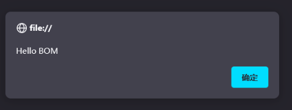

# 框架相关

## 前端Web

- HTML（HyperText Markup Language，超文本标记语言）：网页结构（页面元素和内容）		
  - u超文本：超越了文本的限制，比普通文本更强大。除了文字信息，还可以定义图片、音频、视频等内容。
  - 标记语言：由标签构成的语言
    - HTML标签都是预定义好的。例如：使用<a>展示超链接，使用展示图片，<video>展示视频。
    - HTML代码直接在浏览器中运行，HTML标签由浏览器解析。
- CSS（Cascading Style Sheet）：网页表现（页面元素外观、位置等页面样式，如：颜色、大小。）
  - 层叠样式表，用于控制页面的样式（表现）。
- JavaScript：网页行为（交互）


### 1-HTML&CSS

##### 结构标签

```html
<html>
	<head>    
		   <title>标题</title>
	</head>
	<body>
	</body>
</html>


```

基础结构标签

<title&gt;中定义标题显示在浏览器的标题位置，&lt;body&gt;中定义的内容会呈现在浏览器的内容区域


特点：

- HTML标签不区分大小写
- HTML标签属性值单双引号都可以
- HTML语法松散

##### 基础标签 & 样式

- 图片标签：
  - src：指定图像的url（绝对路径 / 相对路径）
  - width：图像的宽度（像素 / 相对于父元素的百分比）
  - height：图像的高度（像素 / 相对于父元素的百分比）
- 标题标签：<h1> - <h6>
- 水平线标签：<hr>


#### 

##### 引入方式

| 名称     | 语法描述                                          | 示例                                           |
| -------- | ------------------------------------------------- | ---------------------------------------------- |
| 行内样式 | 在标签内使用style属性，属性值是css属性键值对      | &lt;h1 style="xxx:xxx;">中国新闻网&lt;/h1>     |
| 内嵌样式 | 定义&lt;style&gt;标签，在标签内部定义css样式      | &lt;style> h1 {...} &lt;/style>                |
| 外联样式 | 定义&lt;link&gt;标签，通过href属性引入外部css文件 | &lt;link rel="stylesheet" href="css/news.css"> |

对于上述3种引入方式，企业开发的使用情况如下：

1. 内联样式会出现大量的代码冗余，不方便后期的维护，所以不常用。
2. 内部样式，通过定义css选择器，让样式作用于当前页面的指定的标签上。
3. 外部样式，html和css实现了完全的分离，企业开发常用方式。

##### 颜色表示

| **表示方式**   | **表示含义**                      | **取值**                                    |
| -------------- | --------------------------------- | ------------------------------------------- |
| 关键字         | 预定义的颜色名                    | red、green、blue...                         |
| rgb表示法      | 红绿蓝三原色，每项取值范围：0-255 | rgb(0,0,0)、rgb(255,255,255)、rgb(255,0,0)  |
| 十六进制表示法 | #开头，将数字转换成十六进制表示   | #000000、#ff0000、#cccccc，简写：#000、#ccc |

##### 标题字体颜色

```html
<!DOCTYPE html>
<html lang="en">
<head>
    <meta charset="UTF-8">
    <meta http-equiv="X-UA-Compatible" content="IE=edge">
    <meta name="viewport" content="width=device-width, initial-scale=1.0">
    <title>焦点访谈：中国底气 新思想夯实大国粮仓</title>
    <!-- 方式二: 内嵌样式 -->
    <style>
        h1 {
            /* color: red; */
            /* color: rgb(0, 0, 255); */
            color: #4D4F53;
        }
    </style>

    <!-- 方式三: 外联样式 -->
    <!-- <link rel="stylesheet" href="css/news.css"> -->
</head>
<body>
     新浪政务 > 正文

    <!-- 方式一: 行内样式 -->
    <!-- <h1 style="color: red;">焦点访谈：中国底气 新思想夯实大国粮仓</h1> -->
    
    <h1>焦点访谈：中国底气 新思想夯实大国粮仓</h1>

    <hr>
    2023年03月02日 21:50 央视网
    <hr>

</body>
</html>
```

要想拾取某一个网页中的颜色，我们可以借助于浏览器的拾色器插件来完成。

##### CSS选择器

顾名思义：选择器是选取需设置样式的元素（标签），但是我们根据业务场景不同，选择的标签的需求也是多种多样的，所以选择器有很多种，因为我们是做后台开发的，所以对于css选择器，我们只学习最基本的3种。

**选择器通用语法如下**：

```css
选择器名   {
    css样式名：css样式值;
    css样式名：css样式值;
}
```

3种选择器：

###### **1.元素（标签）选择器：** 

- 选择器的名字必须是标签的名字
- 作用：选择器中的样式会作用于所有同名的标签上

~~~
元素名称 {
    css样式名:css样式值；
}
~~~

例子如下：

~~~css
 div{
     color: red;
 }
~~~


###### **2.id选择器:**

- 选择器的名字前面需要加上#
- 作用：选择器中的样式会作用于指定id的标签上，而且有且只有一个标签（由于id是唯一的）

~~~
#id属性值 {
    css样式名:css样式值；
}
~~~

例子如下：

~~~css
#did {
    color: blue;
}
~~~


###### **3.类选择器：**

- 选择器的名字前面需要加上 .
- 作用：选择器中的样式会作用于所有class的属性值和该名字一样的标签上，可以是多个

~~~
.class属性值 {
    css样式名:css样式值；
}
~~~

例子如下：

~~~css
.cls{
     color: green;
 }
~~~


##### 发布时间字体颜色

```html
<!DOCTYPE html>
<html lang="en">
<head>
    <meta charset="UTF-8">
    <meta http-equiv="X-UA-Compatible" content="IE=edge">
    <meta name="viewport" content="width=device-width, initial-scale=1.0">
    <title>焦点访谈：中国底气 新思想夯实大国粮仓</title>
    <style>
        h1 {
            color: #4D4F53;
        }

        /* 元素选择器 */
        /* span {
            color: red;
        } */

        /* 类选择器 */
        /* .cls {
            color: green;
        } */
        
        /* ID选择器 */
        #time {
            color: #968D92;
            font-size: 13px; /* 设置字体大小 */
        }

    </style>
</head>
<body>

     新浪政务 > 正文

    <h1>焦点访谈：中国底气 新思想夯实大国粮仓</h1>

    <hr>
    <span class="cls" id="time">2023年03月02日 21:50</span>  <span class="cls">央视网</span>
    <hr>

</body>
</html>
```

上述我们还使用了一个css的属性 font-size , 用来设置字体的大小。 但是需要注意，在设置字体的大小时，单位px不能省略，否则不生效。


##### 超链接

- 标签: &lt;a href="..." target="...">央视网</a>
- 属性:
  - href: 指定资源访问的url
  - target: 指定在何处打开资源链接
    - _self: 默认值，在当前页面打开
    - _blank: 在空白页面打开

##### 标签

**1). 视频、音频标签**

- 视频标签: &lt;video>
  - 属性: 
    - src: 规定视频的url
    - controls: 显示播放控件
    - width: 播放器的宽度
    - height: 播放器的高度

- 音频标签: &lt;audio>
  - 属性:
    - src: 规定音频的url
    - controls: 显示播放控件


**2). 段落标签**

- 换行标签: &lt;br>
  - 注意: 在HTML页面中,我们在编辑器中通过回车实现的换行, 仅仅在文本编辑器中会看到换行效果, 浏览器是不会解析的, HTML中换行需要通过br标签

​	

- 段落标签: &lt;p>
  - 如: &lt;p> 这是一个段落 &lt;/p>


**3). 文本格式标签**

| 效果   | 标签 | 标签(强调) |
| ------ | ---- | ---------- |
| 加粗   | b    | strong     |
| 倾斜   | i    | em         |
| 下划线 | u    | ins        |
| 删除线 | s    | del        |

前面的标签 b、i、u、s 就仅仅是实现加粗、倾斜、下划线、删除线的效果，是没有强调语义的。 而后面的strong、em、ins、del在实现加粗、倾斜、下划线、删除线的效果的同时，还带有强调语义。


注意事项: 

- 在HTML页面中无论输入了多少个空格, 最多只会显示一个。 可以使用空格占位符（&nbsp；）来生成空格，如果需要多个空格，就使用多次占位符。

- 那在HTML中，除了空格占位符以外，还有一些其他的占位符(了解, 只需要知道空格的占位符写法即可)，如下：

  - | 显示结果 | 描述   | 占位符  |
    | :------- | :----- | :------ |
    |          | 空格   | \&nbsp; |
    | <        | 小于号 | \&lt;   |
    | >        | 大于号 | \&gt;   |
    | &        | 和号   | \&amp;  |
    | "        | 引号   | \&quot; |
    | '        | 撇号   | \&apos; |

##### 盒子模型

- 盒子：页面中所有的元素（标签），都可以看做是一个 盒子，由盒子将页面中的元素包含在一个矩形区域内，通过盒子的视角更方便的进行页面布局

- 盒子模型组成：内容区域（content）、内边距区域（padding）、边框区域（border）、外边距区域（margin）

盒子的大小，其实就包括三个部分： border、padding、content，而margin外边距是不包括在盒子之内的。

代码：

```html
<!DOCTYPE html>
<html lang="en">
<head>
    <meta charset="UTF-8">
    <meta http-equiv="X-UA-Compatible" content="IE=edge">
    <meta name="viewport" content="width=device-width, initial-scale=1.0">
    <title>盒子模型</title>
    <style>
        div {
            width: 200px;  /* 宽度 */
            height: 200px;  /* 高度 */
            box-sizing: border-box; /* 指定width height为盒子的高宽 */
            background-color: aquamarine; /* 背景色 */
            
            padding: 20px 20px 20px 20px; /* 内边距, 上 右 下 左 , 边距都一行, 可以简写: padding: 20px;*/ 
            border: 10px solid red; /* 边框, 宽度 线条类型 颜色 */
            margin: 30px 30px 30px 30px; /* 外边距, 上 右 下 左 , 边距都一行, 可以简写: margin: 30px; */
        }
    </style>
</head>

<body>
    
    <div>
        A A A A A A A A A A A A A A A A A A A A A A A A A A A A A A A A A A 
    </div>

</body>
</html>
```


##### 布局标签

- 布局标签：实际开发网页中，会大量频繁的使用 div 和 span 这两个没有语义的布局标签。

- 标签：<div> <span>

- 特点：

  - div标签：

    - 一行只显示一个（独占一行）

    - 宽度默认是父元素的宽度，高度默认由内容撑开

    - 可以设置宽高（width、height）

  - span标签：

    - 一行可以显示多个

    - 宽度和高度默认由内容撑开

    - 不可以设置宽高（width、height）

浏览器打开后的效果:

1). div会独占一行，默认宽度为父元素 body 的宽度

2). span一行会显示多个，用来组合行内元素，默认宽度为内容撑开的宽度


##### 表格标签

**场景：**在网页中以表格（行、列）形式整齐展示数据，我们在一些管理类的系统中，会看到数据通常都是以表格的形式呈现出来的，比如：班级表、学生表、课程表、成绩表等等。

**标签：**

- &lt;table> : 用于定义整个表格, 可以包裹多个 &lt;tr>， 常用属性如下： 
  - border：规定表格边框的宽度
  - width：规定表格的宽度
  - cellspacing: 规定单元之间的空间

- &lt;tr> : 表格的行，可以包裹多个 &lt;td>  
- &lt;td> : 表格单元格(普通)，可以包裹内容 , 如果是表头单元格，可以替换为 &lt;th>  

整合表格使用 table 标签包裹 , 其中的每一行数据都是一个 tr , 每一行中的每一个单元格都是一个 td , 而如果是表头单元格, 可以使用 th (具有加粗居中展示的效果)。


##### 表单标签

表单是一项一项的，这个我们称为表单项 或 表单元素。

- 表单场景: 表单就是在网页中负责数据采集功能的，如：注册、登录的表单。 

- 表单标签: &lt;form>
- 表单属性:
  - action: 规定表单提交时，向何处发送表单数据，表单提交的URL。
  - method: 规定用于发送表单数据的方式，常见为： GET、POST。
    - GET：表单数据是拼接在url后面的， 如： xxxxxxxxxxx?username=Tom&age=12，url中能携带的表单数据大小是有限制的。
    - POST： 表单数据是在请求体（消息体）中携带的，大小没有限制。

- 表单项标签: 不同类型的input元素、下拉列表、文本域等。
  - input: 定义表单项，通过type属性控制输入形式
  - select: 定义下拉列表
  - textarea: 定义文本域

表单中的所有表单项，要想能够正常的采集数据，在提交的时候能提交到服务端，表单项必须指定name属性。 否则，无法提交该表单项。

```html
用户名: <input type="text" name="username">
```

##### 表单项

在一个表单中，可以存在很多的表单项，而虽然表单项的形式各式各样，但是表单项的标签其实就只有三个，分别是：

- &lt;input>: 表单项 , 通过type属性控制输入形式。

  | type取值                 | **描述**                             |
  | ------------------------ | ------------------------------------ |
  | text                     | 默认值，定义单行的输入字段           |
  | password                 | 定义密码字段                         |
  | radio                    | 定义单选按钮                         |
  | checkbox                 | 定义复选框                           |
  | file                     | 定义文件上传按钮                     |
  | date/time/datetime-local | 定义日期/时间/日期时间               |
  | number                   | 定义数字输入框                       |
  | email                    | 定义邮件输入框                       |
  | hidden                   | 定义隐藏域                           |
  | submit / reset / button  | 定义提交按钮 / 重置按钮 / 可点击按钮 |

- &lt;select>: 定义下拉列表, &lt;option> 定义列表项

- &lt;textarea>: 文本域

##### 文档查阅

文档地址: https://www.w3school.com.cn/index.html


### 2-JavaScript-Vue

#### JavaScript

html完成了架子，css做了美化，但是网页是死的，我们需要给他注入灵魂，所以接下来我们需要学习JavaScript，这门语言会让我们的页面能够和用户进行交互。

##### 引入方式

**第一种方式：**内部脚本，将JS代码定义在HTML页面中

- JavaScript代码必须位于&lt;script&gt;&lt;/script&gt;标签之间
- 在HTML文档中，可以在任意地方，放置任意数量的&lt;script&gt;
- 一般会把脚本置于&lt;body&gt;元素的底部，可改善显示速度

例子：

~~~html
<script>
    alert("Hello JavaScript")
</script>
~~~


**第二种方式：**外部脚本将， JS代码定义在外部 JS文件中，然后引入到 HTML页面中

- 外部JS文件中，只包含JS代码，不包含&ltscript&gt;标签
- 引入外部js的&lt;script&gt;标签，必须是双标签

例子：

~~~html
<script src="js/demo.js"></script>
~~~

注意：demo.js中只有js代码，没有&lt;script&gt;标签


##### 基础语法

###### 书写语法

掌握了js的引入方式，那么接下来我们需要学习js的书写了，首先需要掌握的是js的书写语法，语法规则如下：

- 区分大小写：与 Java 一样，变量名、函数名以及其他一切东西都是区分大小写的

- 每行结尾的分号可有可无

- 大括号表示代码块

- 注释：

  - 单行注释：// 注释内容

  - 多行注释：/* 注释内容 */

    

我们需要借助js中3钟输出语句，来演示书写语法

| api              | 描述             |
| ---------------- | ---------------- |
| window.alert()   | 警告框           |
| document.write() | 在HTML 输出内容  |
| console.log()    | 写入浏览器控制台 |


###### 变量

在js中，变量的声明和java中还是不同的。首先js中主要通过如下3个关键字来声明变量的：

| 关键字 | 解释                                                         |
| ------ | ------------------------------------------------------------ |
| var    | 早期ECMAScript5中用于变量声明的关键字                        |
| let    | ECMAScript6中新增的用于变量声明的关键字，相比较var，let只在代码块内生效 |
| const  | 声明常量的，常量一旦声明，不能修改                           |

在js中声明变量还需要注意如下几点：

- JavaScript 是一门弱类型语言，变量可以存放不同类型的值 。
- 变量名需要遵循如下规则：
  - 组成字符可以是任何字母、数字、下划线（_）或美元符号（$）
  - 数字不能开头
  - 建议使用驼峰命名


###### 数据类型和运算符

虽然js是弱数据类型的语言，但是js中也存在数据类型，js中的数据类型分为 ：原始类型 和 引用类型，具体有如下类型

| 数据类型  | 描述                                               |
| --------- | -------------------------------------------------- |
| number    | 数字（整数、小数、NaN(Not a Number)）              |
| string    | 字符串，单双引皆可                                 |
| boolean   | 布尔。true，false                                  |
| null      | 对象为空                                           |
| undefined | 当声明的变量未初始化时，该变量的默认值是 undefined |

##### 函数

###### 第一种定义格式

第一种定义格式如下：

~~~js
function 函数名(参数1,参数2..){
    要执行的代码
}
~~~

因为JavaScript是弱数据类型的语言，所以有如下几点需要注意：

- 形式参数不需要声明类型，并且JavaScript中不管什么类型都是let或者var去声明，加上也没有意义。
- 返回值也不需要声明类型，直接return即可

如下示例：

~~~js
function add(a, b){
    return a + b;
}
~~~


###### 第二种定义格式

第二种可以通过var去定义函数的名字，具体格式如下：

~~~js
var functionName = function (参数1,参数2..){   
	//要执行的代码
}
~~~

##### JavaScript对象

###### 基本对象-Array对象

Array对象时用来定义数组的。常用语法格式有如下2种：

方式1：

~~~js
var 变量名 = new Array(元素列表); 
~~~

例如：

~~~js
var arr = new Array(1,2,3,4); //1,2,3,4 是存储在数组中的数据（元素）
~~~


方式2：

~~~js
var 变量名 = [ 元素列表 ]; 
~~~

例如：

~~~js
var arr = [1,2,3,4]; //1,2,3,4 是存储在数组中的数据（元素）
~~~


**属性和方法**

Array作为一个对象，那么对象是有属性和方法的，所以接下来我们介绍一下Array对象的属性和方法

官方文档中提供了Array的很多属性和方法，但是我们只学习常用的属性和方法，如下图所示：

属性：

| 属性   | 描述                         |
| :----- | :--------------------------- |
| length | 设置或返回数组中元素的数量。 |

方法：

| 方法方法  | 描述                                             |
| :-------- | :----------------------------------------------- |
| forEach() | 遍历数组中的每个有值得元素，并调用一次传入的函数 |
| push()    | 将新元素添加到数组的末尾，并返回新的长度         |
| splice()  | 从数组中删除元素                                 |

**length属性**

length属性可以用来获取数组的长度，所以我们可以借助这个属性，来遍历数组中的元素，添加如下代码：

~~~js
var arr = [1,2,3,4];
arr[10] = 50;
	for (let i = 0; i < arr.length; i++) {
	console.log(arr[i]);
}
~~~

**forEach()函数**

首先我们学习forEach()方法，顾名思义，这是用来遍历的，那么遍历做什么事呢？所以这个方法的参数，需要传递一个函数，而且这个函数接受一个参数，就是遍历时数组的值。修改之前的遍历代码如下：

~~~js
//e是形参，接受的是数组遍历时的值
arr.forEach(function(e){
     console.log(e);
})
~~~

当然了，在ES6中，引入箭头函数的写法，语法类似java中lambda表达式，修改上述代码如下：

~~~js
arr.forEach((e) => {
     console.log(e);
}) 
~~~

**push()函数**

push()函数是用于向数组的末尾添加元素的，其中函数的参数就是需要添加的元素，编写如下代码：向数组的末尾添加3个元素

~~~js
//push: 添加元素到数组末尾
arr.push(7,8,9);
console.log(arr);
~~~

**splice()函数**

splice()函数用来数组中的元素，函数中填入2个参数。

参数1：表示从哪个索引位置删除

参数2：表示删除元素的个数

如下代码表示：从索引2的位置开始删，删除2个元素

~~~js
//splice: 删除元素
arr.splice(2,2);
console.log(arr);
~~~


###### 基本对象-String对象

String对象的创建方式有2种：

方式1：

~~~js
var 变量名 = new String("…") ; //方式一
~~~

例如：

~~~js
var str = new String("Hello String");
~~~


方式2：

~~~js
var 变量名 = "…" ; //方式二
~~~

例如：

~~~js
var str = 'Hello String';
~~~

**属性和方法**

String对象也提供了一些常用的属性和方法，如下表格所示：

属性：

| 属性   | 描述           |
| ------ | -------------- |
| length | 字符串的长度。 |

方法：

| 方法        | 描述                                     |
| ----------- | ---------------------------------------- |
| charAt()    | 返回在指定位置的字符。                   |
| indexOf()   | 检索字符串。                             |
| trim()      | 去除字符串两边的空格                     |
| substring() | 提取字符串中两个指定的索引号之间的字符。 |

- length属性：

  length属性可以用于返回字符串的长度，添加如下代码：

  ~~~js
  //length
  console.log(str.length);
  ~~~

- charAt()函数：

  charAt()函数用于返回在指定索引位置的字符，函数的参数就是索引。添加如下代码：

  ~~~js
  console.log(str.charAt(4));
  ~~~

- indexOf()函数

  indexOf()函数用于检索指定内容在字符串中的索引位置的，返回值是索引，参数是指定的内容。添加如下代码：

  ~~~js
  console.log(str.indexOf("lo"));
  ~~~

- trim()函数

  trim()函数用于去除字符串两边的空格的。添加如下代码：

  ~~~js
  var s = str.trim();
  console.log(s.length);
  ~~~

- substring()函数

  substring()函数用于截取字符串的，函数有2个参数。

  参数1：表示从那个索引位置开始截取。包含

  参数2：表示到那个索引位置结束。不包含

  ~~~js
  console.log(s.substring(0,5));
  ~~~


###### 基本对象-JSON对象

**自定义对象**

在 JavaScript 中自定义对象特别简单，其语法格式如下：

~~~js
var 对象名 = {
    属性名1: 属性值1, 
    属性名2: 属性值2,
    属性名3: 属性值3,
    函数名称: function(形参列表){}
};

~~~

我们可以通过如下语法调用属性：

~~~js
对象名.属性名
~~~

通过如下语法调用函数：

~~~js
对象名.函数名()
~~~


**json对象**

JSON对象：**J**ava**S**cript **O**bject **N**otation，JavaScript对象标记法。是通过JavaScript标记法书写的文本。其格式如下：

~~~js
{
    "key":value,
    "key":value,
    "key":value
}
~~~

其中，**key必须使用引号并且是双引号标记，value可以是任意数据类型。**


上述是一个json字符串，不是json对象，所以我们需要借助如下函数来进行json字符串和json对象的转换。

~~~js
var obj = JSON.parse(jsonStr);
~~~

也可以通过如下函数将json对象再次转换成json字符串。

~~~js
var jsonStr = JSON.stringify(obj);
~~~


###### BOM对象-Window对象

BOM的全称是Browser Object Model,翻译过来是浏览器对象模型。也就是JavaScript将浏览器的各个组成部分封装成了对象。我们要操作浏览器的部分功能，可以通过操作BOM对象的相关属性或者函数来完成。例如：我们想要将浏览器的地址改为`http://www.baidu.com`,我们就可以通过BOM中提供的location对象的href属性来完成，代码如下：`location.href='http://www.baidu.com'`

BOM中提供了如下5个对象：

| 对象名称  | 描述           |
| :-------- | :------------- |
| Window    | 浏览器窗口对象 |
| Navigator | 浏览器对象     |
| Screen    | 屏幕对象       |
| History   | 历史记录对象   |
| Location  | d地址栏对象    |

**Window对象**

window对象指的是浏览器窗口对象，是JavaScript的全部对象，所以对于window对象，我们可以直接使用，并且对于window对象的方法和属性，我们可以省略window.例如：我们之前学习的alert()函数其实是属于window对象的,其完整的代码如下：

~~~
window.alert('hello');
~~~

其可以省略window.  所以可以简写成

~~~
alert('hello')
~~~

所以对于window对象的属性和方法，我们都是采用简写的方式。window提供了很多属性和方法，下表列出了常用属性和方法

window对象提供了获取其他BOM对象的属性：

| 属性      | 描述                  |
| --------- | --------------------- |
| history   | 用于获取history对象   |
| location  | 用于获取location对象  |
| Navigator | 用于获取Navigator对象 |
| Screen    | 用于获取Screen对象    |

也就是说我们要使用location对象，只需要通过代码`window.location`或者简写`location`即可使用

window也提供了一些常用的函数，如下表格所示：

| 函数          | 描述                                               |
| ------------- | -------------------------------------------------- |
| alert()       | 显示带有一段消息和一个确认按钮的警告框。           |
| comfirm()     | 显示带有一段消息以及确认按钮和取消按钮的对话框。   |
| setInterval() | 按照指定的周期（以毫秒计）来调用函数或计算表达式。 |
| setTimeout()  | 在指定的毫秒数后调用函数或计算表达式。             |


演示上述函数：

- alert()函数：弹出警告框，函数的内容就是警告框的内容

  ~~~html
  <script>
      //window对象是全局对象，window对象的属性和方法在调用时可以省略window.
      window.alert("Hello BOM");
      alert("Hello BOM Window");
  </script>
  ~~~

   

- confirm()函数：弹出确认框，并且提供用户2个按钮，分别是确认和取消。当用户点击确认时，返回true，点击取消时，返回false

  添加如下代码：

  ~~~js
  var flag = confirm("删除?");
  alert(flag);
  ~~~

  

- setInterval(fn,毫秒值)：定时器，用于周期性的执行某个功能，并且是**循环执行**。该函数需要传递2个参数：

  fn:函数，需要周期性执行的功能代码

  毫秒值：间隔时间

  注释掉之前的代码，添加代码如下：

  ~~~js
  //定时器 - setInterval -- 周期性的执行某一个函数
  var i = 0;
  setInterval(function(){
       i++;
       console.log("定时器执行了"+i+"次");
  },2000);
  ~~~

  刷新页面，浏览器每个一段时间都会在控制台输出 

- setTimeout(fn,毫秒值) ：定时器，只会在一段时间后**执行一次功能**。参数和上述setInterval一致

  注释掉之前的代码，添加代码如下：

  ~~~js
  //定时器 - setTimeout -- 延迟指定时间执行一次 
  setTimeout(function(){
  	alert("JS");
  },3000);
  ~~~

  浏览器打开，3s后弹框，关闭弹框，发现再也不会弹框了。


###### BOM对象-Location对象

location是指代浏览器的地址栏对象，对于这个对象，我们常用的是href属性，用于获取或者设置浏览器的地址信息，添加如下代码：

~~~js
//获取浏览器地址栏信息
alert(location.href);
//设置浏览器地址栏信息
location.href = "http://cccccyq.icu";
~~~

点击确定后，因为我们设置了地址栏信息，所以浏览器跳转到网页


###### DOM对象-DOM介绍

DOM：Document Object Model 文档对象模型。也就是 JavaScript 将 HTML 文档的各个组成部分封装为对象。

DOM 其实我们并不陌生，之前在学习 XML 就接触过，只不过 XML 文档中的标签需要我们写代码解析，而 HTML 文档是浏览器解析。封装的对象分为

- Document：整个文档对象
- Element：元素对象
- Attribute：属性对象
- Text：文本对象
- Comment：注释对象

如下图，左边是 HTML 文档内容，右边是 DOM 树

 

那么我们学习DOM技术有什么用呢？主要作用如下：

- 改变 HTML 元素的内容
- 改变 HTML 元素的样式（CSS）
- 对 HTML DOM 事件作出反应
- 添加和删除 HTML 元素


###### DOM对象-获取DOM对象

我们知道DOM的作用是通过修改HTML元素的内容和样式等来实现页面的各种动态效果，但是我们要操作DOM对象的前提是先获取元素对象，然后才能操作。所以学习DOM,主要的核心就是学习如下2点：

- 如何获取DOM中的元素对象（Element对象 ，也就是标签）
- 如何操作Element对象的属性,也就是标签的属性。

接下来我们先来学习如何获取DOM中的元素对象。

HTML中的Element对象可以通过Document对象获取，而Document对象是通过window对象获取的。document对象提供的用于获取Element元素对象的api如下表所示：

| 函数                              | 描述                                     |
| --------------------------------- | ---------------------------------------- |
| document.getElementById()         | 根据id属性值获取，返回单个Element对象    |
| document.getElementsByTagName()   | 根据标签名称获取，返回Element对象数组    |
| document.getElementsByName()      | 根据name属性值获取，返回Element对象数组  |
| document.getElementsByClassName() | 根据class属性值获取，返回Element对象数组 |

- document.getElementById()： 根据标签的id属性获取标签对象，id是唯一的，所以获取到是单个标签对象。

  添加如下代码：

  ~~~html
  <script>
  //1. 获取Element元素
  
  //1.1 获取元素-根据ID获取
   var img = document.getElementById('h1');
   alert(img);
  </script> 
  ~~~

- document.getElementsByTagName() :  根据标签的名字获取标签对象，同名的标签有很多，所以返回值是数组。

  添加如下代码:

  ~~~js
  //1.2 获取元素-根据标签获取 - div
  var divs = document.getElementsByTagName('div');
  for (let i = 0; i < divs.length; i++) {
       alert(divs[i]);
  } 
  ~~~

- document.getElementsByName() ：根据标签的name的属性值获取标签对象，name属性值可以重复，所以返回值是一个数组。

  添加如下代码：

  ~~~js
  //1.3 获取元素-根据name属性获取
  var ins = document.getElementsByName('hobby');
  for (let i = 0; i < ins.length; i++) {
      alert(ins[i]);
  }  
  ~~~

- document.getElementsByClassName() : 根据标签的class属性值获取标签对象，class属性值也可以重复，返回值是数组。

  添加如下图所示的代码：

  ~~~js
  //1.4 获取元素-根据class属性获取
  var divs = document.getElementsByClassName('cls');
  for (let i = 0; i < divs.length; i++) {
       alert(divs[i]);
  }
  ~~~


###### 案例

/

##### JavaScript事件

###### 介绍

什么是事件呢？HTML事件是发生在HTML元素上的 “事情”，例如：

- 按钮被点击
- 鼠标移到元素上
- 输入框失去焦点
- ........

而我们可以给这些事件绑定函数，当事件触发时，可以自动的完成对应的功能。这就是事件监听。例如：对于我们所说的百度注册页面，我们给用户名输入框的失去焦点事件绑定函数，当我们用户输入完内容，在标签外点击了鼠标，对于用户名输入框来说，失去焦点，然后执行绑定的函数，函数进行用户名内容的校验等操作。JavaScript事件是js非常重要的一部分，接下来我们进行事件的学习。那么我们对于JavaScript事件需要学习哪些内容呢？我们得知道有哪些常用事件，然后我们得学会如何给事件绑定函数。所以主要围绕2点来学习：

- 事件绑定
- 常用事件


###### 事件绑定

JavaScript对于事件的绑定提供了2种方式：

- 方式1：通过html标签中的事件属性进行绑定

  例如一个按钮，我们对于按钮可以绑定单机事件，可以借助标签的onclick属性，属性值指向一个函数。

  在VS Code中创建名为09. JS-事件-事件绑定.html，添加如下代码：

  ~~~html
  <input type="button" id="btn1" value="事件绑定1" onclick="on()">
  ~~~

  很明显没有on函数，所以我们需要创建该函数，代码如下：

  ~~~html
  <script>
      function on(){
          alert("按钮1被点击了...");
      }
  </script>
  ~~~

  方式2：通过DOM中Element元素的事件属性进行绑定

  依据我们学习过得DOM的知识点，我们知道html中的标签被加载成element对象，所以我们也可以通过element对象的属性来操作标签的属性。此时我们再次添加一个按钮，代码如下：

  ~~~html
  <input type="button" id="btn2" value="事件绑定2">
  ~~~

  我们可以先通过id属性获取按钮对象，然后操作对象的onclick属性来绑定事件，代码如下：

  ~~~js
  document.getElementById('btn2').onclick = function(){
      alert("按钮2被点击了...");
  }
  ~~~

  **需要注意的是：事件绑定的函数，只有在事件被触发时，函数才会被调用。**

  

###### 常见事件

上面案例中使用到了 `onclick` 事件属性，那都有哪些事件属性供我们使用呢？下面就给大家列举一些比较常用的事件属性

| 事件属性名  | 说明                     |
| ----------- | ------------------------ |
| onclick     | 鼠标单击事件             |
| onblur      | 元素失去焦点             |
| onfocus     | 元素获得焦点             |
| onload      | 某个页面或图像被完成加载 |
| onsubmit    | 当表单提交时触发该事件   |
| onmouseover | 鼠标被移到某元素之上     |
| onmouseout  | 鼠标从某元素移开         |

在代码中提供了10. JS-事件-常见事件.html的文件，我们可以通过浏览器打开来观察几个常用事件的具体效果：

- onfocus:获取焦点事件，鼠标点击输入框，输入框中光标一闪一闪的，就是输入框获取焦点了

   

- onblur:失去焦点事件，前提是输入框获取焦点的状态下，在输入框之外的地方点击，光标从输入框中消失了，这就是失去焦点。

   

###### 案例

```html
<!DOCTYPE html>
<html lang="en">
<head>
    <meta charset="UTF-8">
    <meta http-equiv="X-UA-Compatible" content="IE=edge">
    <meta name="viewport" content="width=device-width, initial-scale=1.0">
    <title>JS-案例</title>
</head>
<body>

     <br>

    <input type="button" value="点亮" onclick="on()"> 
    <input type="button"  value="熄灭" onclick="off()">

    <br> <br>

    <input type="text" id="name" value="CCCCCYQ" onfocus="fn()" onblur="ob()">
    <br> <br>

    <input type="checkbox" name="hobby"> 1
    <input type="checkbox" name="hobby"> 2
    <input type="checkbox" name="hobby"> 3
    <br>

    <input type="button" value="全选" onclick="all_choose()"> 
    <input type="button" value="反选" onclick="all_off_choose()">

</body>

<script>

    //1. 点按钮,切换图片; 
    function on(){
        var img = document.getElementById('light');
        img.src = 'img/on.gif';
    }

    function off(){
        var img = document.getElementById('light');
        img.src = 'img/off.gif';
    }

    //2. 输入框聚焦后, 展示小写; 输入框离焦后, 展示大写; 
    function fn(){
        var onv = document.getElementById("name");
        onv.value = onv.value.toLowerCase();
    }
    function ob(){
        var ofv = document.getElementById("name");
        ofv.value = ofv.value.toUpperCase();
    }


    //3. 点击 "全选" 按钮使所有的复选框呈现选中状态 ; 点击 "反选" 按钮使所有的复选框呈现取消勾选的状态 ; -- onclick
    function all_choose(){
        var ins = document.getElementsByName('hobby');
        for (let index = 0; index < ins.length; index++) {
        const check = ins[index];
        check.checked=true;
    }
    }
    function all_off_choose(){
        var ins = document.getElementsByName('hobby');
        for (let index = 0; index < ins.length; index++) {
        const check = ins[index];
        check.checked=false;
    }
    }


</script>
</html>
```


#### Vue

##### 概述

一个完整的html页面包括了视图和数据，数据是通过请求 从后台获取的，那么意味着我们需要将后台获取到的数据呈现到页面上，很明显， 这就需要我们使用DOM操作。正因为这种开发流程，所以我们引入了一种叫做**MVVM(Model-View-ViewModel)的前端开发思想**，即让我们开发者更加关注数据，而非数据绑定到视图这种机械化的操作。那么具体什么是MVVM思想呢？

MVVM:其实是Model-View-ViewModel的缩写，有3个单词，具体释义如下：

- Model: 数据模型，特指前端中通过请求从后台获取的数据
- View: 视图，用于展示数据的页面，可以理解成我们的html+css搭建的页面，但是没有数据
- ViewModel: 数据绑定到视图，负责将数据（Model）通过JavaScript的DOM技术，将数据展示到视图（View）上

如图所示就是MVVM开发思想的含义：

 

基于上述的MVVM思想，其中的Model我们可以通过Ajax来发起请求从后台获取;对于View部分，我们将来会学习一款ElementUI框架来替代HTML+CSS来更加方便的搭建View;而今天我们要学习的就是侧重于ViewModel部分开发的vue前端框架，用来替代JavaScript的DOM操作，让数据展示到视图的代码开发变得更加的简单。


Vue.js是一套构建用户界面的 **渐进式框架**。与其他重量级框架不同的是，Vue 采用自底向上增量开发的设计。Vue 的核心库只关注视图层，并且非常容易学习，非常容易与其它库或已有项目整合。Vue.js 的目标是通过尽可能简单的 API 实现**响应的数据绑定**和**组合的视图组件**。

框架即是一个半成品软件，是一套可重用的、通用的、软件基础代码模型。基于框架进行开发，更加快捷、更加高效。


##### 快速入门

第一步：在VS Code中创建名为12. Vue-快速入门.html的文件，并且在html文件同级创建js目录，将**资料/vue.js文件**目录下得vue.js拷贝到js目录，

第二步：然后编写&lt;script&gt;标签来引入vue.js文件，代码如下：

~~~html
<script src="js/vue.js"></script>
~~~

第三步：在js代码区域定义vue对象,代码如下：

~~~html
<script>
    //定义Vue对象
    new Vue({
        el: "#app", //vue接管区域
        data:{
            message: "wtf"
        }
    })
</script>
~~~

在创建vue对象时，有几个常用的属性：

- el:  用来指定哪儿些标签受 Vue 管理。 该属性取值 `#app` 中的 `app` 需要是受管理的标签的id属性值
- data: 用来定义数据模型
- methods: 用来定义函数。这个我们在后面就会用到

第四步：在html区域编写视图，其中{{}}是插值表达式，用来将vue对象中定义的model展示到页面上的

~~~html
<body>
    <div id="app">
        <input type="text" v-model="message">
        {{message}}
    </div>
</body>
~~~


##### Vue指令

在上述的快速入门中，我们发现了html中输入了一个没有学过的属性`v-model`，这个就是vue的**指令**。

**指令：**HTML 标签上带有 v- 前缀的特殊属性，不同指令具有不同含义。例如：v-if，v-for…

在vue中，通过大量的指令来实现数据绑定到视图的，所以接下来我们需要学习vue的常用指令，如下表所示：

| **指令**  | **作用**                                            |
| --------- | --------------------------------------------------- |
| v-bind    | 为HTML标签绑定属性值，如设置  href , css样式等      |
| v-model   | 在表单元素上创建双向数据绑定                        |
| v-on      | 为HTML标签绑定事件                                  |
| v-if      | 条件性的渲染某元素，判定为true时渲染,否则不渲染     |
| v-else    |                                                     |
| v-else-if |                                                     |
| v-show    | 根据条件展示某元素，区别在于切换的是display属性的值 |
| v-for     | 列表渲染，遍历容器的元素或者对象的属性              |


###### v-bind&v-model

v-bind指令和v-model指令。

| **指令** | **作用**                                       |
| -------- | ---------------------------------------------- |
| v-bind   | 为HTML标签绑定属性值，如设置  href , css样式等 |
| v-model  | 在表单元素上创建双向数据绑定                   |

- v-bind:  为HTML标签绑定属性值，如设置  href , css样式等。当vue对象中的数据模型发生变化时，标签的属性值会随之发生变化。

  通过代码来演示。

  我们需要给&lt;a&gt;标签的href属性赋值，并且值应该来自于vue对象的数据模型中的url变量。所以编写如下代码：

  ~~~html
  <a v-bind:href="url">链接1</a>
  ~~~

  在上述的代码中，v-bind指令是可以省略的，但是:不能省略，所以第二个超链接的代码编写如下：

  ~~~html
  <a :href="url">链接2</a>
  ~~~

  浏览器打开，2个超链接都可以点击，然后跳转到百度去！

- **注意：html属性前面有:表示采用的vue的属性绑定！**

- v-model： 在表单元素上创建双向数据绑定。什么是双向？

  -  vue对象的data属性中的数据变化，视图展示会一起变化
  -  视图数据发生变化，vue对象的data属性中的数据也会随着变化。

  data属性中数据变化，我们知道可以通过赋值来改变，但是视图数据为什么会发生变化呢？**只有表单项标签！所以双向绑定一定是使用在表单项标签上的**。编写如下代码：

  ~~~html
  <input type="text" v-model="url">
  ~~~

  打开浏览器，我们修改表单项标签，发现vue对象data中的数据也发生了变化

**双向绑定的作用：可以获取表单的数据的值，然后提交给服务器**

###### v-on

v-on: 用来给html标签绑定事件的。**需要注意的是如下2点**：

- v-on语法给标签的事件绑定的函数，必须是vue对象种声明的函数

- v-on语法绑定事件时，事件名相比较js中的事件名，没有on

  例如：在js中，事件绑定demo函数

  ~~~html
  <input onclick="demo()">
  ~~~

  vue中，事件绑定demo函数

  ~~~html
  <input v-on:click="demo()">
  ~~~


然后我们需要在vue对象的methods属性中定义事件绑定时需要的handle()函数，代码如下：

~~~js
 methods: {
        handle: function(){
           alert("你点我了一下...");
        }
}
~~~

然后我们给第一个按钮，通过v-on指令绑定单击事件，代码如下：

~~~html
 <input type="button" value="点我一下" v-on:click="handle()">
~~~

同样，v-on也存在简写方式，即v-on: 可以替换成@，所以第二个按钮绑定单击事件的代码如下：

~~~html
<input type="button" value="点我一下" @click="handle()">
~~~


###### v-if&v-show

| 指令      | 描述                                                |
| --------- | --------------------------------------------------- |
| v-if      | 条件性的渲染某元素，判定为true时渲染,否则不渲染     |
| v-if-else |                                                     |
| v-else    |                                                     |
| v-show    | 根据条件展示某元素，区别在于切换的是display属性的值 |

###### v-for

v-for: 从名字我们就能看出，这个指令是用来遍历的。其语法格式如下：

~~~html
<标签 v-for="变量名 in 集合模型数据">
    {{变量名}}
</标签>
~~~

需要注意的是：需要循环那个标签，v-for 指令就写在那个标签上。

有时我们遍历时需要使用索引，那么v-for指令遍历的语法格式如下：

~~~html
<标签 v-for="(变量名,索引变量) in 集合模型数据">
    <!--索引变量是从0开始，所以要表示序号的话，需要手动的加1-->
   {{索引变量 + 1}} {{变量名}}
</标签>
~~~


###### 案例

/

##### 生命周期

vue的生命周期：指的是vue对象从创建到销毁的过程。vue的生命周期包含8个阶段：每触发一个生命周期事件，会自动执行一个生命周期方法，这些生命周期方法也被称为钩子方法。其完整的生命周期如下图所示：

| 状态          | 阶段周期 |
| ------------- | -------- |
| beforeCreate  | 创建前   |
| created       | 创建后   |
| beforeMount   | 挂载前   |
| mounted       | 挂载完成 |
| beforeUpdate  | 更新前   |
| updated       | 更新后   |
| beforeDestroy | 销毁前   |
| destroyed     | 销毁后   |


下图是 Vue 官网提供的从创建 Vue 到效果 Vue 对象的整个过程及各个阶段对应的钩子函数：


其中我们需要重点关注的是**mounted,**其他的我们了解即可。

mounted：挂载完成，Vue初始化成功，HTML页面渲染成功。**以后我们一般用于页面初始化自动的ajax请求后台数据**

### 3-Vue-Element

#### 		Ajax

##### 	Ajax介绍

###### 概述

Ajax: 全称Asynchronous JavaScript And XML，异步的JavaScript和XML。其作用有如下2点：

- 与服务器进行数据交换：通过Ajax可以给服务器发送请求，并获取服务器响应的数据。
- 异步交互：可以在**不重新加载整个页面**的情况下，与服务器交换数据并**更新部分网页**的技术，如：搜索联想、用户名是否可用的校验等等。

###### 作用

Ajax技术的2个作用

- 与服务器进行数据交互
  前端可以通过Ajax技术，向后台服务器发起请求，后台服务器接受到前端的请求，从数据库中获取前端需要的资源，然后响应给前端，前端在通过我们学习的vue技术，可以将数据展示到页面上，这样用户就能看到完整的页面了。
- 异步交互：可以在**不重新加载整个页面**的情况下，与服务器交换数据并**更新部分网页**的技术。
  当我们在百度搜索java时，下面的联想数据是通过Ajax请求从后台服务器得到的，在整个过程中，我们的Ajax请求不会导致整个百度页面的重新加载，并且只针对搜索栏这局部模块的数据进行了数据的更新，不会对整个页面的其他地方进行数据的更新，这样就大大提升了页面的加载速度，用户体验高。

###### 同步异步

针对于上述Ajax的局部刷新功能是因为Ajax请求是异步的，与之对应的有同步请求。接下来我们介绍一下异步请求和同步请求的区别。

- 同步请求发送过程如下图所示：

  

  浏览器页面在发送请求给服务器，在服务器处理请求的过程中，浏览器页面不能做其他的操作。只能等到服务器响应结束后才能，浏览器页面才能继续做其他的操作。 

- 异步请求发送过程如下图所示：

   

  浏览器页面发送请求给服务器，在服务器处理请求的过程中，浏览器页面还可以做其他的操作。

##### 	原生Ajax

因为Ajax请求是基于客户端发送请求，服务器响应数据的技术。所以为了完成快速入门案例，我们需要提供服服务器端和编写客户端。

服务器端

因为我们暂时还没学过服务器端的代码，所以此处已经直接提供好了服务器端的请求地址，我们前端直接通过Ajax请求访问该地址即可。**后台服务器地址**：http://yapi.smart-xwork.cn/mock/169327/emp/list


客户端

客户端的Ajax请求代码如下有如下4步，接下来我们跟着步骤一起操作一下。

第一步：首先我们再VS Code中创建AJAX的文件夹，并且创建名为01. Ajax-原生方式.html的文件，提供如下代码，主要是按钮绑定单击事件，我们希望点击按钮，来发送ajax请求

~~~html
<!DOCTYPE html>
<html lang="en">
<head>
    <meta charset="UTF-8">
    <meta http-equiv="X-UA-Compatible" content="IE=edge">
    <meta name="viewport" content="width=device-width, initial-scale=1.0">
    <title>原生Ajax</title>
</head>
<body>
    
    <input type="button" value="获取数据" onclick="getData()">

    <div id="div1"></div>
    
</body>
<script>
    function getData(){
     
    }
</script>
</html>
~~~

第二步：创建XMLHttpRequest对象，用于和服务器交换数据，也是原生Ajax请求的核心对象，提供了各种方法。代码如下：

~~~js
//1. 创建XMLHttpRequest 
var xmlHttpRequest  = new XMLHttpRequest();
~~~

第三步：调用对象的open()方法设置请求的参数信息，例如请求地址，请求方式。然后调用send()方法向服务器发送请求，代码如下：

~~~js
//2. 发送异步请求
xmlHttpRequest.open('GET','http://yapi.smart-xwork.cn/mock/169327/emp/list');
xmlHttpRequest.send();//发送请求
~~~

第四步：我们通过绑定事件的方式，来获取服务器响应的数据。

~~~js
//3. 获取服务响应数据
xmlHttpRequest.onreadystatechange = function(){
    //此处判断 4表示浏览器已经完全接受到Ajax请求得到的响应， 200表示这是一个正确的Http请求，没有错误
    if(xmlHttpRequest.readyState == 4 && xmlHttpRequest.status == 200){
        document.getElementById('div1').innerHTML = xmlHttpRequest.responseText;
    }
}
~~~


  最后我们通过浏览器打开页面，请求点击按钮，发送Ajax请求

并且通过浏览器的f12抓包，我们点击网络中的XHR请求，发现可以抓包到我们发送的Ajax请求。XHR代表的就是异步请求

##### 	Axios

上述原生的Ajax请求的代码编写起来还是比较繁琐的，所以接下来我们学习一门更加简单的发送Ajax请求的技术Axios 。Axios是对原生的AJAX进行封装，简化书写。Axios官网是：`https://www.axios-http.cn`

**Axios基本使用**

Axios的使用比较简单，主要分为2步：

- 引入Axios文件

  ~~~html
  <script src="js/axios-0.18.0.js"></script>
  ~~~

- 使用Axios发送请求，并获取响应结果，官方提供的api很多，此处给出2种，如下

  - 发送 get 请求

    ~~~js
    axios({
        method:"get",
        url:"http://localhost:8080/ajax-demo1/aJAXDemo1?username=zhangsan"
    }).then(function (resp){
        alert(resp.data);//成功回调函数
    })
    ~~~

  - 发送 post 请求

    ```js
    axios({
        method:"post",
        url:"http://localhost:8080/ajax-demo1/aJAXDemo1",
        data:"username=zhangsan"
    }).then(function (resp){
        alert(resp.data);
    });
    ```

  axios()是用来发送异步请求的，小括号中使用 js的JSON对象传递请求相关的参数：

  - method属性：用来设置请求方式的。取值为 get 或者 post。
  - url属性：用来书写请求的资源路径。如果是 get 请求，需要将请求参数拼接到路径的后面，格式为： url?参数名=参数值&参数名2=参数值2。
  - data属性：作为请求体被发送的数据。也就是说如果是 post 请求的话，数据需要作为 data 属性的值。

  then() 需要传递一个匿名函数。我们将 then()中传递的匿名函数称为 **回调函数**，意思是该匿名函数在发送请求时不会被调用，而是在成功响应后调用的函数。而该回调函数中的 resp 参数是对响应的数据进行封装的对象，通过 resp.data 可以获取到响应的数据。

**Axios快速入门**

- 后端实现

  查询所有员工信息服务器地址：http://yapi.smart-xwork.cn/mock/169327/emp/list 

  根据员工id删除员工信息服务器地址：http://yapi.smart-xwork.cn/mock/169327/emp/deleteById

- 前端实现

  首先在VS Code中创建js文件夹，与html同级，然后将**资料/axios-0.18.0.js** 文件拷贝到js目录下，然后创建名为02. Ajax-Axios.html的文件，工程结果如图所示：

   

   

  然后在html中引入axios所依赖的js文件，并且提供2个按钮，绑定单击事件，分别用于点击时发送ajax请求，完整代码如下：

  ~~~html
  <!DOCTYPE html>
  <html lang="en">
  <head>
      <meta charset="UTF-8">
      <meta http-equiv="X-UA-Compatible" content="IE=edge">
      <meta name="viewport" content="width=device-width, initial-scale=1.0">
      <title>Ajax-Axios</title>
      <script src="js/axios-0.18.0.js"></script>
  </head>
  <body>
      
      <input type="button" value="获取数据GET" onclick="get()">
  
      <input type="button" value="删除数据POST" onclick="post()">
  
  </body>
  <script>
      function get(){
          //通过axios发送异步请求-get
      }
  
      function post(){
          //通过axios发送异步请求-post
      }
  </script>
  </html>
  ~~~

  然后分别使用Axios的方法，完整get请求和post请求的发送

  get请求代码如下：

  ~~~js
  //通过axios发送异步请求-get
   axios({
       method: "get",
       url: "http://yapi.smart-xwork.cn/mock/169327/emp/list"
   }).then(result => {
       console.log(result.data);
   })
  ~~~

  post请求代码如下：

  ~~~js
  //通过axios发送异步请求-post
   axios({
       method: "post",
       url: "http://yapi.smart-xwork.cn/mock/169327/emp/deleteById",
       data: "id=1"
   }).then(result => {
       console.log(result.data);
   })
  ~~~

  浏览器打开，f12抓包，然后分别点击2个按钮，查看控制台效果

  

  完整代码：

  ```html
  <!DOCTYPE html>
  <html lang="en">
  <head>
      <meta charset="UTF-8">
      <meta http-equiv="X-UA-Compatible" content="IE=edge">
      <meta name="viewport" content="width=device-width, initial-scale=1.0">
      <title>Ajax-Axios</title>
      <script src="js/axios-0.18.0.js"></script>
  </head>
  <body>
      
      <input type="button" value="获取数据GET" onclick="get()">
  
      <input type="button" value="删除数据POST" onclick="post()">
  
  </body>
  <script>
      function get(){
          //通过axios发送异步请求-get
          axios({
              method: "get",
              url: "http://yapi.smart-xwork.cn/mock/169327/emp/list"
          }).then(result => {
              console.log(result.data);
          })
  
  
      }
  
      function post(){
         // 通过axios发送异步请求-post
          axios({
              method: "post",
              url: "http://yapi.smart-xwork.cn/mock/169327/emp/deleteById",
              data: "id=1"
          }).then(result => {
              console.log(result.data);
          })
  
      }
  </script>
  </html>
  ```

  

**请求方法的别名**

Axios还针对不同的请求，提供了别名方式的api,具体如下：

| 方法                               | 描述           |
| ---------------------------------- | -------------- |
| axios.get(url [, config])          | 发送get请求    |
| axios.delete(url [, config])       | 发送delete请求 |
| axios.post(url [, data[, config]]) | 发送post请求   |
| axios.put(url [, data[, config]])  | 发送put请求    |

我们目前只关注get和post请求，所以在上述的入门案例中，我们可以将get请求代码改写成如下：

~~~js
axios.get("http://yapi.smart-xwork.cn/mock/169327/emp/list").then(result => {
    console.log(result.data);
})
~~~

post请求改写成如下：

~~~js
axios.post("http://yapi.smart-xwork.cn/mock/169327/emp/deleteById","id=1").then(result => {
    console.log(result.data);
})
~~~


**案例**

需求：基于Vue及Axios完成数据的动态加载展示

#### 		前后端分离开发

##### 	介绍

前端开发有2种方式：**前后台混合开发**和**前后台分离开发**。

前后台混合开发，顾名思义就是前台后台代码混在一起开发，这种开发模式有如下缺点：

- 沟通成本高：后台人员发现前端有问题，需要找前端人员修改，前端修改成功，再交给后台人员使用
- 分工不明确：后台开发人员需要开发后台代码，也需要开发部分前端代码。很难培养专业人才
- 不便管理：所有的代码都在一个工程中
- 不便维护和扩展：前端代码更新，和后台无关，但是需要整个工程包括后台一起重新打包部署。


所以我们目前基本都是采用的前后台分离开发方式

我们将原先的工程分为前端工程和后端工程这2个工程，然后前端工程交给专业的前端人员开发，后端工程交给专业的后端人员开发。前端页面需要数据，可以通过发送异步请求，从后台工程获取。但是，我们前后台是分开来开发的，那么前端人员怎么知道后台返回数据的格式呢？后端人员开发，怎么知道前端人员需要的数据格式呢？所以针对这个问题，我们前后台统一指定一套规范！我们前后台开发人员都需要遵循这套规范开发，这就是我们的**接口文档**。接口文档有离线版和在线版本，接口文档示可以查询今天提供**资料/接口文档示例**里面的资料。那么接口文档的内容怎么来的呢？是我们后台开发者根据产品经理提供的产品原型和需求文档所撰写出来的，产品原型示例可以参考今天提供**资料/页面原型**里面的资料。

具体流程：

1. 需求分析：首先我们需要阅读需求文档，分析需求，理解需求。
2. 接口定义：查询接口文档中关于需求的接口的定义，包括地址，参数，响应数据类型等等
3. 前后台并行开发：各自按照接口文档进行开发，实现需求
4. 测试：前后台开发完了，各自按照接口文档进行测试
5. 前后段联调测试：前段工程请求后端工程，测试功能

##### 	

##### 	YAPI

###### YAPI介绍

前后台分离开发中，我们前后台开发人员都需要遵循接口文档，所以接下来我们介绍一款撰写接口文档的平台。

YApi 是高效、易用、功能强大的 api 管理平台，旨在为开发、产品、测试人员提供更优雅的接口管理服务。

其官网地址：http://yapi.smart-xwork.cn/

YApi主要提供了2个功能：

- API接口管理：根据需求撰写接口，包括接口的地址，参数，响应等等信息。
- Mock服务：模拟真实接口，生成接口的模拟测试数据，用于前端的测试。

###### 接口文档管理

YAPI接口平台中对于接口的配置步骤:

- 登录YAPI的官网，然后使用github或者百度账号登录
- 登录进去后，在个人空间中，选择项目列表->添加测试项目
- 点击创建的项目，进入到项目中，紧接着先添加接口的分类
- 选择当前创建的分类，创建接口信息
- 来到接口的编辑界面，对接口做生层次的定制，例如：接口的参数，接口的返回值等等
- 添加接口的请求参数
- 添加接口的返回值
- 保存上述设置，紧接着我们可以来到接口的预览界面，查询接口的信息
- 最后还可以设置接口的mock信息
- 来到接口的Mock设置窗口
- 来到接口的预览界面，直接点击Mock地址

#### 		前端工程化

##### 	介绍

我们目前的前端开发中，当我们需要使用一些资源时，例如：vue.js，和axios.js文件，都是直接再工程中导入的

但是上述开发模式存在如下问题：

- 每次开发都是从零开始，比较麻烦
- 多个页面中的组件共用性不好
- js、图片等资源没有规范化的存储目录，没有统一的标准，不方便维护


所以现在企业开发中更加讲究前端工程化方式的开发，主要包括如下4个特点

- 模块化：将js和css等，做成一个个可复用模块
- 组件化：我们将UI组件，css样式，js行为封装成一个个的组件，便于管理
- 规范化：我们提供一套标准的规范的目录接口和编码规范，所有开发人员遵循这套规范
- 自动化：项目的构建，测试，部署全部都是自动完成

所以对于前端工程化，说白了，就是在企业级的前端项目开发中，把前端开发所需要的工具、技术、流程、经验进行规范化和标准化。从而提升开发效率，降低开发难度等等。接下来我们就需要学习vue的官方提供的脚手架帮我们完成前端的工程化。

##### 	入门

###### 环境准备

我们的前端工程化是通过vue官方提供的脚手架Vue-cli来完成的，用于快速的生成一个Vue的项目模板。Vue-cli主要提供了如下功能：

- 统一的目录结构
- 本地调试
- 热部署
- 单元测试
- 集成打包上线

我们需要运行Vue-cli，需要依赖NodeJS，NodeJS是前端工程化依赖的环境。所以我们需要先安装NodeJS，然后才能安装Vue-cli

- NodeJS安装和Vue-cli安装

###### Vue项目简介

环境准备好了，接下来我们需要通过Vue-cli创建一个vue项目，然后再学习一下vue项目的目录结构。Vue-cli提供了如下2种方式创建vue项目:

- 命令行：直接通过命令行方式创建vue项目

  ~~~
  vue create vue-project01
  ~~~

  

- 图形化界面：通过命令先进入到图形化界面，然后再进行vue工程的创建

  ~~~
  vue ui
  ~~~

  

**创建vue项目**

- 首先，我们再桌面创建vue文件夹，然后双击进入文件夹，来到地址目录，输入cmd，然后进入到vue文件夹的cmd窗口界面
- 当前目录下，直接输入命令`vue ui`进入到vue的图形化界面
- 选择创建按钮，在vue文件夹下创建项目
- 预设模板选择手动
- 功能页面开启路由功能
- 配置页面选择语言版本和语法检查规范
- 创建项目,进入到创建创建成功的界面

**vue项目目录结构**

vue项目的标准目录结构以及目录对应的解释如下图所示:


其中我们平时开发代码就是在**src目录**下

**运行vue项目**

那么vue项目开发好了，我们应该怎么运行vue项目呢？主要提供了2种方式

- 第一种方式：通过VS Code提供的图形化界面 ，如下图所示：（注意：NPM脚本窗口默认不显示，可以参考本节的最后调试出来）
  点击之后，我们等待片刻，即可运行，在终端界面中，我们发现项目是运行在本地服务的8080端口，我们直接通过浏览器打开地址
  其实此时访问的是 **src/App.vue**这个根组件，此时我们打开这个组件，修改代码：添加内容Vue
  只要我们保存更新的代码，我们直接打开浏览器，不需要做任何刷新，发现页面呈现内容发生了变化

  这就是我们vue项目的热更新功能 

  对于8080端口，经常被占用，所以我们可以去修改默认的8080端口。我们修改vue.config.js文件的内容，添加如下代码：

  ~~~json
  devServer:{
      port:7000
  }
  ~~~

  如下图所示，然后我们关闭服务器，并且重新启动
  端口更改成功，可以通过浏览器访问7000端口来访问我们之前的项目

- 第二种方式：命令行方式

  直接基于cmd命令窗口，在vue目录下，执行输入命令`npm run serve`即可补充：NPM脚本窗口调试出来

  通过**设置/用户设置/扩展/MPM**更改NPM默认配置
  重启VS Code，并且**双击打开package.json文件**，然后点击**资源管理器处的3个小点**，**勾选npm脚本选项**
  然后就能都显示NPM脚本小窗口了

###### Vue开发流程

对于vue项目，index.html文件默认是引入了入口函数main.js文件，我们找到**src/main.js**文件，其代码如下：

~~~js
import Vue from 'vue'
import App from './App.vue'
import router from './router'

Vue.config.productionTip = false

new Vue({
  router,
  render: h => h(App)
}).$mount('#app')

~~~

上述代码中，包括如下几个关键点：

- import: 导入指定文件，并且重新起名。例如上述代码`import App from './App.vue'`导入当前目录下得App.vue并且起名为App
- new Vue(): 创建vue对象
- $mount('#app');将vue对象创建的dom对象挂在到id=app的这个标签区域中，作用和之前学习的vue对象的le属性一致。
- router:  路由，详细在后面的小节讲解
- render: 主要使用视图的渲染的。


来到**public/index.html**中，我们**删除div的id=app属性**，打开浏览器，发现之前访问的首页一片空白，如下图所示，这样就证明了，我们main.js中通过代码挂在到index.html的id=app的标签区域的。


vue的组件文件包含3个部分：

- template: 模板部分，主要是HTML代码，用来展示页面主体结构的
- script: js代码区域，主要是通过js代码来控制模板的数据来源和行为的
- style: css样式部分，主要通过css样式控制模板的页面效果的


我们可以打开App.vue，观察App.vue的代码，其中可以发现，App.vue组件的template部分内容，和我们浏览器访问的首页内容是一致的

我们可以简化模板部分内容，添加script部分的数据模型，删除css样式，完整代码如下：

~~~html
<template>
  <div id="app">
    {{message}}
  </div>
</template>

<script>
export default {
  data(){
    return {
      "message":"hello world"
    }
  }
}
</script>
<style>

</style>
~~~

保存直接，回到浏览器，我们发现首页展示效果发生了变化

#### 		Vue组件库-Element

##### 	Element介绍

ElementUI就是一款侧重于V开发的前端框架，主要用于开发美观的页面的。

Element：是饿了么公司前端开发团队提供的一套基于 Vue 的网站组件库，用于快速构建网页。

Element 提供了很多组件（组成网页的部件）供我们使用。例如 超链接、按钮、图片、表格等等。如下图所示就是我们开发的页面和ElementUI提供的效果对比：可以发现ElementUI提供的各式各样好看的按钮

ElementUI的学习方式和我们之前的学习方式不太一样，对于ElementUI，我们作为一个后台开发者，只需要**学会如何从ElementUI的官网拷贝组件到我们自己的页面中，并且做一些修改即可**。其官网地址：https://element.eleme.cn/#/zh-CN，我们主要学习的是ElementUI中提供的常用组件

##### 	快速入门

首先，我们先要安装ElementUI的组件库，打开VS Code，停止之前的项目，然后在命令行输入如下命令：

~~~
npm install element-ui@2.15.3 
~~~

在main.js这个入口js文件中引入ElementUI的组件库，其代码如下：

~~~js
import ElementUI from 'element-ui';
import 'element-ui/lib/theme-chalk/index.css';

Vue.use(ElementUI);
~~~

按照vue项目的开发规范，在**src/views**目录下创建一个vue组件文件，注意组件名称后缀是.vue，并且在组件文件中编写之前介绍过的基本组件语法，代码如下：

~~~html
<template>

</template>

<script>
export default {

}
</script>

<style>

</style>
~~~

去ElementUI的官网，找到组件库，然后找到按钮组件，抄写代码即可，复制组件代码到我们的vue组件文件中

在默认访问的根组件**src/App.vue**中引入我们自定义的组件

App.vue组件中的具体代码如下，**代码是我们通过上述步骤引入element-view组件时自动生成的**

后运行我们的vue项目，浏览器直接访问之前的7000端口


##### 	Element组件

###### Table表格-演示&属性

**组件演示**

Table 表格：用于展示多条结构类似的数据，可对数据进行排序、筛选、对比或其他自定义操作。

复制代码到我们之前的ElementVue.vue组件中，需要注意的是，我们组件包括了3个部分，如果官方有除了template部分之外的style和script都需要复制

**组件属性详解**

主要通过如下几个属性：

- data: 主要定义table组件的数据模型
- prop: 定义列的数据应该绑定data中定义的具体的数据模型
- label: 定义列的标题
- width: 定义列的宽度

**Element组件的所有属性都可以在组件页面的最下方找到**


###### Pagination分页-演示、属性、事件

**组件演示**

Pagination: 分页组件，主要提供分页工具条相关功能。

在官网找到分页组件，我们选择带背景色分页组件，复制代码到我们的ElementView.vue组件文件的template中

**组件属性详解**

对于分页组件我们需要关注的是如下几个重要属性（可以通过查阅官网组件中最下面的组件属性详细说明得到）：

- background: 添加北京颜色，也就是上图蓝色背景色效果。
- layout: 分页工具条的布局，其具体值包含`sizes`, `prev`, `pager`, `next`, `jumper`, `->`, `total`, `slot` 这些值
- total: 数据的总数量

**组件事件详解**

对于分页组件，除了上述几个属性，还有2个非常重要的事件我们需要去学习：

- size-change ： pageSize 改变时会触发 
- current-change ：currentPage 改变时会触发 

###### Dialog对话框

**组件演示**

Dialog: 在保留当前页面状态的情况下，告知用户并承载相关操作。

在ElementUI官方找到Dialog组件，复制如下代码到我们的组件文件的template模块中，并且复制数据模型script模块中

**组件属性详解**

对话框的显示与隐藏通过如下属性：

- visible.sync ：是否显示 Dialog 

visible属性绑定的dialogTableVisble属性一开始默认是false，所以对话框隐藏；然后我们点击按钮，触发事件，修改属性值为true，然后对话框visible属性值为true，所以对话框呈现出来。

###### Form表单

Form 表单：由输入框、选择器、单选框、多选框等控件组成，用以收集、校验、提交数据。 

找到对应的组件，针对这个新的对话框，我们需要在data中声明新的变量dialogFormVisible来控制对话框的隐藏与显示，**复制官网提供的template部分代码到我们的vue组件文件的Dialog组件中**，官方提供的表单项标签太多，所以我们只需要保留前面3个表单项组件，其他多余的删除


其中表单项标签使用了v-model双向绑定，所以我们需要在vue的数据模型中声明变量，同样可以从官方提供的代码中复制粘贴，但是我们需要去掉我们不需要的属性，通过观察上述代码，我们发现双向绑定的属性有4个，分别是form.name,form.region,form.date1,form.date2

官方的代码中，在script部分中，还提供了onSubmit函数，表单的立即创建按钮绑定了此函数，我们可以输入表单的内容，而表单的内容是双向绑定到form对象的，所以我们修改官方的onSubmit函数如下即可，而且我们还需要关闭对话框

##### 	案例

/

#### 		Vue路由

##### 	路由介绍

将资代码/vue-project(路由)/vue-project/src/views/tlias/DeptView.vue拷贝到我们当前EmpView.vue同级

前端路由：URL中的hash(#号之后的内容）与组件之间的对应关系

vue官方提供了路由插件Vue Router,其主要组成如下：

- VueRouter：路由器类，根据路由请求在路由视图中动态渲染选中的组件
- &lt;router-link&gt;：请求链接组件，浏览器会解析成&lt;a&gt;
- &lt;router-view&gt;：动态视图组件，用来渲染展示与路由路径对应的组件

首先VueRouter根据我们配置的url的hash片段和路由的组件关系去维护一张路由表;

然后我们页面提供一个&lt;router-link&gt;组件,用户点击，发出路由请求;

接着我们的VueRouter根据路由请求，在路由表中找到对应的vue组件；

最后VueRouter会切换&lt;router-view&gt;中的组件，从而进行视图的更新

##### 	路由入门

安装vue-router插件，可以通过如下命令

~~~
npm install vue-router@3.5.1
~~~

**但是我们不需要安装，因为当初我们再创建项目时，已经勾选了路由功能，已经安装好了。**

然后我们需要在**src/router/index.js**文件中定义路由表，根据其提供的模板代码进行修改，最终代码如下：

~~~js
import Vue  'vue'
import VueRouter  'vue-router'

Vue.use(VueRouter)

const routes = [
  {
    path: '/emp',  //地址hash
    name: 'emp',
    component:  () => import('../views/tlias/EmpView.vue')  //对应的vue组件
  },
  {
    path: '/dept',
    name: 'dept',
    component: () => import('../views/tlias/DeptView.vue')
  }
]

const router = new VueRouter({
  routes
})

export default router

~~~

注意需要去掉没有引用的import模块。

在main.js中，我们已经引入了router功能


路由基本信息配置好了，路由表已经被加载，此时我们还缺少2个东西，就是&lt;router-lin&gt;和&lt;router-view&gt;,所以我们需要修改2个页面（EmpView.vue和DeptView.vue）我们左侧栏的2个按钮为router-link,其代码如下：

~~~html
<el-menu-item index="1-1">
    <router-link to="/dept">部门管理</router-link>
</el-menu-item>
<el-menu-item index="1-2">
    <router-link to="/emp">员工管理</router-link>
</el-menu-item>
~~~

然后我们还需要在内容展示区域即App.vue中定义route-view，作为组件的切换，其App.vue的完整代码如下：

~~~html
<template>
  <div id="app">
    <!-- {{message}} -->
    <!-- <element-view></element-view> -->
    <!-- <emp-view></emp-view> -->
    <router-view></router-view>
  </div>
</template>

<script>
// import EmpView  './views/tlias/EmpView.vue'
// import ElementView  './views/Element/ElementView.vue'
export default {
  components: { },
  data(){
    return {
      "message":"hello world"
    }
  }
}
</script>
<style>

</style>

~~~

但是我们浏览器打开地址： http://localhost:7000/ ，发现一片空白，因为我们默认的路由路径是/,但是路由配置中没有对应的关系，

所以我们需要在路由配置中/对应的路由组件，代码如下：

~~~js
const routes = [
  {
    path: '/emp',
    name: 'emp',
    component:  () => import('../views/tlias/EmpView.vue')
  },
  {
    path: '/dept',
    name: 'dept',
    component: () => import('../views/tlias/DeptView.vue')
  },
  {
    path: '/',
    redirect:'/emp' //表示重定向到/emp即可
  },
]
~~~

此时我们打开浏览器，访问http://localhost:7000 发现直接访问的是emp的页面，并且能够进行切换了

#### 		打包部署

主要分为2步：

1. 前端工程打包
2. 通过nginx服务器发布前端工程

##### 	前端工程打包

直接通过VS Code的NPM脚本中提供的build按钮来完成，会在工程目录下生成一个dist目录，用于存放需要发布的前端资源

##### 	部署前端工程

###### nginx

nginx: Nginx是一款轻量级的Web服务器/反向代理服务器及电子邮件（IMAP/POP3）代理服务器。其特点是占有内存少，并发能力强，在各大型互联网公司都有非常广泛的使用。

niginx在windows中的安装是比较方便的，直接解压即可。所以我们直接将资料中的nginx-1.22.0.zip压缩文件拷贝到**无中文的目录下**，直接解压即可

**很明显，如果要发布，直接将资源放入到html目录中。**

###### 部署

将之前打包的前端工程dist目录下得内容拷贝到nginx的html目录下，然后通过双击nginx下得nginx.exe文件来启动nginx

nginx服务器的端口号是80，所以启动成功之后，我们浏览器直接访问http://localhost:80 即可，其中80端口可以省略

如果80端口被占用，我们需要通过**conf/nginx.conf**配置文件来修改端口号。


# 后端Web

### 4-Maven-SpringBootWeb入门


### 5-SpringBootWeb请求响应

### 6-MySQL

### 7-MySQL

### 8-MySQL-Mybatis入门

### 9-Mybatis

### 10-SpringBootWeb案例

### 11-SpringBootWeb案例

### 12-SpringBootWeb登录认证

### 13-SpringBootWeb AOP

### 14-SpringBoot原理

### 15-maven高级


